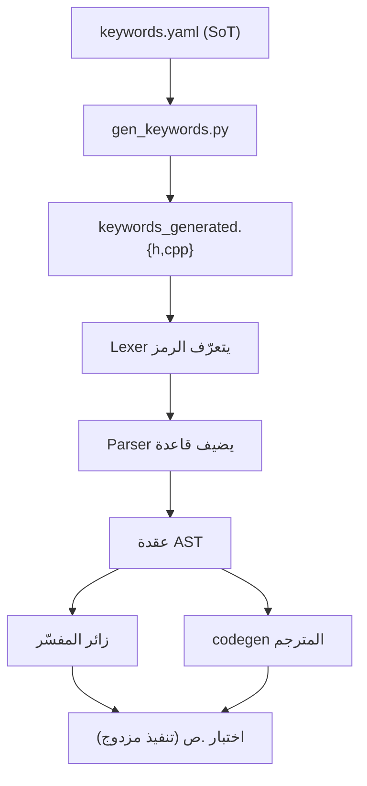

# الأنظمة المتشابكة

> **ماذا ستتعلّم:** لماذا لا يوجد «تغيير معزول» في لغة ص، وأيّ ملفّات يَمَسّها كل نوع تغيير.

كل ميزة تعبر عدّة أنظمة: مصدر الحقيقة + المُولَّد + المعجمي/النحوي + المفسّر + المترجم +
الأخطاء + التوثيق + الاختبارات. تجاهل أحدها يكسر CI أو تجربة المستخدم.

## جدول الأثر (File List) حسب التغيير
| التغيير | الملفّات المتأثّرة عادةً |
|---------|--------------------------|
| **كلمة مفتاحيّة** | `language-truth/keywords.yaml` → `shared/lexer/generated/keywords_generated.{h,cpp}` (مُولَّد) + `shared/parser/src/<dir>/` + `shared/ast/include/` + `interpreter/src/visitors/` + `compiler/src/frontend/` (+opcode في `sir_types.h`) + اختبار `.ص` |
| **دالة مضمنة** | `language-truth/builtins/<domain>.yaml` (+`_index.yaml`) → مُولَّد `builtin_registry_generated.h` + `interpreter/src/builtins/` + `compiler/src/backend/llvm/builders/builtins/` + اختبار |
| **رمز خطأ** | `language-truth/errors/<cat>.yaml` (مصدر) + `shared/errors/include/error_codes.h` + مُولَّد + اختبار |
| **توجيه `@`** | `language-truth/directives.yaml` + مُولَّد + parser + AST + visitors + codegen + اختبار |
| **قاعدة نحويّة** | `language-truth/grammar/*.yaml` (SoT) + `shared/parser/src/` + توثيق مُولَّد `docs/parser_rule/_generated/` |
| **opcode SIR** | `compiler/include/frontend/sir_types.h` + `SIRBuilder` + `compiler/src/backend/llvm/` + اختبار |

## مخطّط التشابك (مثال: كلمة مفتاحيّة)

## القاعدة الذهبيّة
> ابدأ من **مصدر الحقيقة**، أعد التوليد، اعبر **كل** الطبقات، وأثبت بـ**اختبار مزدوج**.
> الكود «المتكامل» يعبرها كلها — وإلا فشل CI أو انكسرت التجربة.

---
**اقرأ بعده:** [فلسفة مصدر الحقيقة](../sot/philosophy.md).
