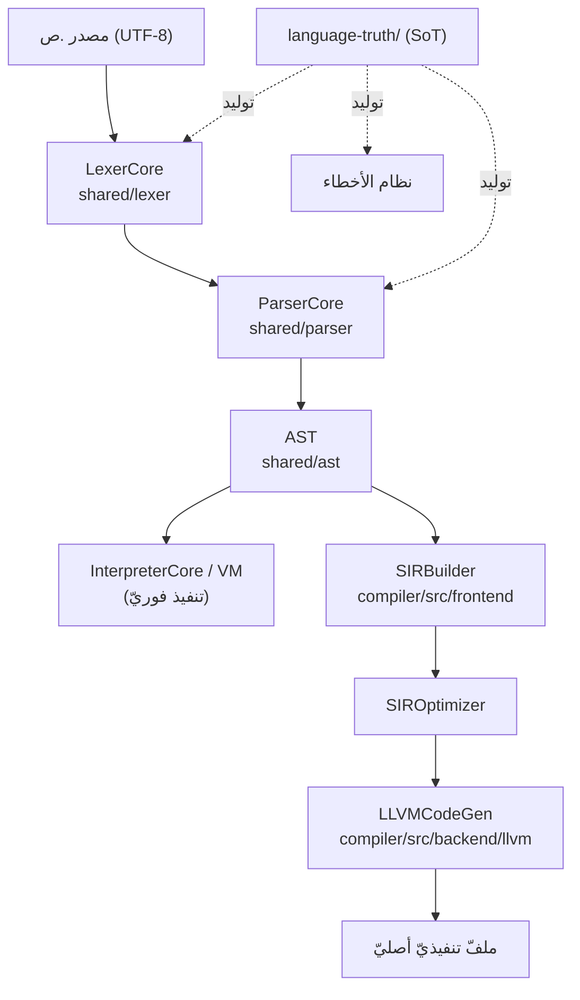

# نظرة عامّة على الطبقات

> **ماذا ستتعلّم:** الطبقات الكبرى للغة ص ومسؤوليّة كلٍّ منها والحدود بينها.

## المكوّنات

| المكوّن | المجلد | الدور |
|--------|--------|------|
| النواة المشتركة | `shared/` | معجمي، نحوي، AST، نظام الأنواع `Value`، نظام الأخطاء |
| المفسّر | `interpreter/` | مفسّر شجريّ؛ `InterpreterCore` يدير المتغيّرات والدوال والنطاقات والتقييم |
| المترجم | `compiler/` | AST → SIR → LLVM IR → ملفّ تنفيذيّ (SIR يدعم تعليمات ملكية) |
| الآلة الافتراضية | `vm/` | بايت كود مرتبط مباشرةً بالمفسّر |
| المكتبة القياسية | `stdlib/` | وحدات عربية: core/io/math/string/network/graphics |
| الأدوات | `tools/` | lsp · formatter · pkg · repl · sadc CLI · sadinfo |
| مصدر الحقيقة | `language-truth/` | YAML SoT لكل بيانات اللغة + القواعد |

## القاعدة الطبقيّة (CW-02)
الترتيب صارم: **`Lexer → Parser → AST → SIR → LLVM`**. كل طبقة تعتمد فقط على
الطبقة التي تحتها. يُمنع الاعتماد العكسيّ أو القفز بين الطبقات. هذا يضمن:
- **عزل الأخطاء:** خطأ معجميّ يُصلَح في المعجمي، خطأ ترتيب حقول في `SIRBuilder`، إلخ (BF-10).
- **قابليّة الاستبدال:** يمكن تغيير الواجهة الخلفيّة (مفسّر/مترجم) دون مسّ الأماميّة.

## مخطّط الطبقات

## مبدأان عابران للطبقات
1. **مصدر الحقيقة أولًا:** أي بيان لغويّ (كلمة/عامل/نوع/خطأ/دالة مضمنة) يبدأ من `language-truth/` ثم يُولَّد. راجع [الجزء الثالث](../sot/philosophy.md).
2. **التنفيذ المزدوج:** كل ميزة تعمل في المفسّر **والمترجم**؛ إن عملت في أحدهما فقط فالمشكلة في SIR/LLVM (BF-08).

---
**اقرأ بعده:** [خطّ الأنابيب](pipeline.md).
