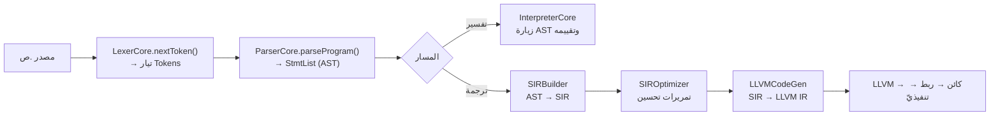

# خطّ الأنابيب: من المصدر إلى التنفيذ

> **ماذا ستتعلّم:** رحلة برنامج `.ص` خطوةً بخطوة عبر الطبقات، بفرعَي التفسير والترجمة.

## المسار الكامل

## المرحلة 1 — التحليل المعجمي
`LexerCore` يحوّل النصّ (UTF-8) إلى `Token`ات (نوع + قيمة + `Position`). يتخطّى
المسافات والتعليقات، ويجمّع تعليقات التوثيق `##`. الكلمات المحجوزة الأربعون تُعرَّف
في `lexer_keywords.cpp`. → [المعجمي](../frontend/lexer.md).

## المرحلة 2 — التحليل النحوي
`ParserCore` (نزوليّ تعاوديّ) يبني AST. نقطة الدخول `parseProgram()` تكرّر
`parseDeclaration()`، الذي يوزّع حسب الرمز إلى تصريحات/جمل/تعابير. سلسلة أسبقيّة
التعابير تُعرّف العوامل. → [النحوي](../frontend/parser.md) و[قواعد المحلل SoT](../sot/grammar-sot.md).

## المرحلة 3 — AST
شجرة من عقد (`StmtPtr`/`ExprPtr`) يزورها المستهلِكون عبر `ASTVisitor` (نمط Visitor).
→ [AST](../frontend/ast.md).

## المرحلة 4أ — التفسير
`InterpreterCore` يزور AST مباشرةً: يدير النطاقات والمتغيّرات والدوال، ويقيّم التعابير،
وينفّذ الجمل. سريع للتطوير والاختبار.

## المرحلة 4ب — الترجمة (sadc)
1. **`SIRBuilder`**: AST → **SIR** (تمثيل وسيط بتعليمات ملكية، `sir_types.h`).
2. **`SIROptimizer`**: تمريرات على SIR.
3. **`LLVMCodeGen`**: SIR → LLVM IR، ثم LLVM يُنتج كائنًا يُربَط لملفّ تنفيذيّ.

> **لماذا SIR وسيط؟** يفصل دلالة الملكية/الأنواع عن تفاصيل LLVM، ويسهّل التحسين والتشخيص (`--emit-llvm`, SIR dumps).

## نقاط تشخيص مفيدة
- اختلاف سلوك المفسّر عن المترجم ⇒ المشكلة في `SIRBuilder` أو `LLVMCodeGen` (BF-08).
- ولّد LLVM IR بـ`--emit-llvm` وافحص: الكتلة الأولى، تطابق أنواع الحقول، ترتيب التعليمات، `getelementptr`.

---
**اقرأ بعده:** [الأنظمة المتشابكة](interconnected.md).
