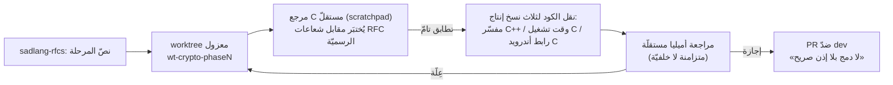

# دراسة حالة: توسيع مكتبة التشفير (٥ مراحل + Argon2id)

بعد [توحيد هاش/شفّر](crypto-unification.md) (`هاش`/`شفّر`/`فك_تشفير` في وحدة `تأكيدات`)، وُسِّعت
اللغة بمكتبة تشفير حديثة كاملة في وحدة منفصلة `تشفير` — عبر RFC كامل
(`sadlang-rfcs/text/0000-توسيع-مكتبة-التشفير.md`) نُفِّذ على ٥ مراحل + مرحلة
إضافيّة (Argon2id) بطلب صريح من المالك رغم تأجيلها في نصّ RFC الأصليّ. المرجع
اللغويّ للمستخدم في
[sadlang-docs](https://github.com/sadlang/sadlang-docs/blob/main/src/language/security.md#وحدة-تشفير--المكتبة-الموسَّعة)؛
هذه الصفحة للمساهم في **التنفيذ والمنهجيّة**. (نصّ RFC نفسه موجود على فرع
`rfc/expand-crypto-library` في `sadlang-rfcs` — لم يُدمَج إلى `main` بعد.)

## المراحل

| المرحلة | الدوال | المعيار | PR |
|---|---|---|---|
| ٠ | `عشوائي_آمن` | CSPRNG النظام | مدموج |
| ١ | `بلايك3` / `هاش_مفتاح` | BLAKE3 (keyed mode) | مدموج |
| ٢ | `اشتق_مفتاح_مرور` / `اشتق_مفتاح` | PBKDF2-HMAC-SHA256 (RFC 2898/8018) / HKDF-SHA256 (RFC 5869) | #217 |
| — | `أرجون2` | Argon2id (RFC 9106) — مؤجَّلة أصلًا، أُدرِجت بطلب صريح | #219 |
| ٣ | `شفر_موثق` / `فك_تشفير_موثق` | ChaCha20-Poly1305 AEAD (RFC 8439) | #220 |
| ٤ | `ولّد_مفتاح_خاص_x25519` وعائلتها (7 دوال) | X25519 (RFC 7748) + Ed25519 (RFC 8032) + SHA-512 ذاتيّ | #221 |

كل الدوال ذاتيّة التنفيذ (self-rolled، بلا OpenSSL/libsodium) حفاظًا على قابليّة
العمل على هدف الوضع الحرّ (نفس قيد [[crypto-unification|توحيد هاش/شفّر]])، وسطح
اللغة لكل دالّة **سلسلة تدخل ⇒ سلسلة تخرج** حصرًا على كلا المحرِّكين — لا كائنات
مركَّبة عابرة للحدود.

## المنهجيّة: كل مرحلة عبر worktree معزول

كل مرحلة استُنسِخت بنفس القالب: (1) مرجع C مستقلّ في scratchpad يُختبَر بايتًا
بايت مقابل شعاعات الاختبار **الرسميّة** للمعيار (لا بيانات اختبار مؤلَّفة يدويًّا)؛
(2) بعد التطابق التامّ فقط، نقل نفس المنطق إلى **ثلاث** نسخ إنتاج متطابقة —
المفسّر (`interpreter/src/builtins/builtin_module_crypto.cpp`)، وقت تشغيل
المترجم (`tools/compiler/runtime/sad_embedded_runtime.c`)، ورابط أندرويد
(`tools/compiler/compiler_driver_android_linker.cpp` — نسخة ثالثة منفصلة لأنّ
هذا الهدف [لا يشارك رابط سطح المكتب](crypto-unification.md)؛ يصطدم عادةً بحدّ
سلاسل MSVC الخام، انظر أدناه)؛ (3) مراجعة أميليا مستقلّة **متزامنة إلزاميّة** قبل
أيّ `git push` (لا خلفيّة — راجع فخّ التوقّف الموثَّق في الذاكرة الداخليّة)؛ (4)
PR ضدّ `dev` بلا دمج تلقائيّ، وسطر «لا دمج بلا إذن صريح» حرفيًّا في كل PR.

## الدرس الأهمّ: تحيّز اختيار شعاعات الاختبار (Argon2id)

أثناء Argon2id، طابق المرجع المستقلّ `libargon2` الرسميّة (عبر `argon2-cffi`)
تطابقًا تامًّا عبر 12 حالة اختبار اخترتُها بنفسي. رغم ذلك كشفت مراجعة أميليا
المستقلّة عِلَّة حقيقيّة: التجزئة الأوّليّة H0 (RFC 9106 §3.2) كانت تُطعَم بقيمة
تكلفة الذاكرة **المقرَّبة داخليًّا** لمضاعِف 4 (`m'`) بدل القيمة **الخام** —
والسبب أنّ **كل الحالات الاثنتَي عشرة صدفةً استعملت تكلفة ذاكرة مضاعِفة لـ4**
(8/1024/2048/4096)، فكان `m'==m` دومًا وأخفى العلّة رغم "التطابق التامّ" المُعلَن.

> **الدرس:** اختيار حالات الاختبار بنفسك — حتى مع تنويع البارامترات — قد يحمل
> تحيّزًا غير واعٍ ينبع من نفس سوء الفهم الذي قد يكون وقع فيه التنفيذ نفسه.
> "طابق تنفيذًا مرجعيًّا مستقلًّا" ليس كافيًا وحده لكود تشفيريّ حسّاس — لازم أيضًا
> مراجعة تقرأ الخوارزميّة سطرًا سطرًا مقابل نصّ المعيار مباشرة، لا تكتفِ بالثقة
> بنتائج الاختبار. لخوارزميّة فيها تقريب/تقليم داخليّ، اختبر **عمدًا** حالة لا
> تقع على حدود التقريب.

## فخّ الدمج المتسلسل: دالّة مشتركة الجسم مختلفة الاسم

تفرّعت PR #219 (Argon2id) وPR #220 (AEAD) وPR #221 (X25519/Ed25519) من نفس
القاعدة (قبل #219) وتمسّ نفس الملفّات المشتركة (SIR opcode enum، مولّدات LLVM،
المفسّر، وقت تشغيل C، رابط أندرويد، YAML SoT). دمج كلّ فرع لاحق كشف جولة تعارض
جديدة، والقاعدة المتّبعة دومًا: **أبقِ إضافات الجانبين معًا، لا تُسقِط أيًّا
منهما**. الفخّ: كل فرع أضاف دالّة توليد عشوائيّة مساعدة باسم مختلف
(`sadx_random_bytes` مقابل `sad_crypto_random_bytes`) لكن جسمها شبه متطابق —
والنصّ "المشترك" الظاهر بعد علامة `>>>>>>>` في تعارض git ثلاثيّ ينتمي في
الحقيقة لدالّة واحدة فقط. محاولة حلّ هذا بتحرير واحد ضخم يفترض إعادة استخدام
هذا النصّ لكلتا الدالّتين تنتج **فسادًا صامتًا**: دالّة مكرَّرة، تعليق مبتور،
جسم دالّة ناقص — دون أيّ خطأ بناء فوريّ يكشفه.

**الاكتشاف:** فحص توازن الأقواس (`python -c "text.count('{')==text.count('}')"`)
ثمّ إعادة الملفّ لحالته المتعارضة (`git checkout --conflict=merge -- <path>`)
والبدء من جديد بتحريرات صغيرة متسلسلة على حدود كل علامة تعارض على حدة، مع كتابة
جسم كل دالّة كاملًا صراحة (تكرار المنطق بدل محاولة مشاركته نصّيًّا). طُبِّق هذا
الدرس بنجاح من المحاولة الأولى على الملفّ التالي المصاب بنفس النمط.

## فخّ ما بعد الدمج: حدّ MSVC C2026 لسلاسل C الخام

رابط أندرويد يُصدِر runtime التشفير كسلسلة C++ خام (`R"( ... )"`) مقسَّمة
استباقيًّا لتفادي حدّ MSVC (٦٥٥٣٥ بايت لكل حرفيّ سلسلة). كل فرع (PR #220 وPR
#221) قسَّم محتواه الخاصّ تحت الحدّ بمعزل عن الآخر — لكن دمج X25519/Ed25519 مع
AEAD في **نفس** القطعة بعد حلّ التعارض أعاد تجاوز الحدّ، وهذا **لا يكشفه أيّ
حارس ساكن أو مولِّد** — يظهر فقط كخطأ بناء `C2026: string too big` وقت الترجمة
الفعليّة على MSVC.

> **القاعدة العامّة:** أيّ دمج لسلاسل C/C++ خام مقسَّمة مسبقًا بسبب حدّ حجم
> يحتاج تحقّقًا من الحدّ **من جديد بعد الدمج** — لا تفترض بقاء التقسيم الأصليّ
> كافيًا لمجرّد أنّ كل فرع وحده كان تحته. الحلّ: إغلاق `)";` بعد حدّ دالّة نظيف
> وفتح `R"(` جديدة، فيتحوّل تقسيم كل فرع (قطعتان) إلى ثلاث/أربع قطع بعد الدمج.

## قرار تصميميّ: X25519/Ed25519 بدوال مقسَّمة لا كائن {عام، خاص}

نصّ RFC اقترح دالّة توليد زوج مفاتيح تُرجع كائنًا بحقلين (عامّ وخاصّ). التصميم
الفعليّ استعمل **دالّتين منفصلتين** بدلًا من ذلك (`ولّد_مفتاح_خاص_x25519` +
`اشتق_مفتاح_عام_x25519`) — تجنّبًا لبناء آليّة تمرير كائنات مركَّبة جديدة عابرة
للمحرِّكين حين يكفي عقد "سلسلة ⇒ سلسلة" الموجود أصلًا لكل دالّة أخرى في
المكتبة. لا خسارة أمنيّة: المفتاح العامّ دومًا دالّة حتميّة للخاصّ (تقييد سلميّ +
ضرب بالنقطة الأساس)، فالفصل بلا أثر جانبيّ.

## قرار تصميميّ: تباعُد فشل مقصود بين AEAD ونظيراتها

`فك_تشفير_موثق` (AEAD) يفشل **مُغلَقًا** (fail-closed) دومًا على فشل مصادقة —
بخلاف `فك_تشفير` (وحدة `تأكيدات`، تشفير بلا مصادقة) الذي [يُرجع مدخله كما هو
صامتًا](crypto-unification.md#نقطة-الحسم-هل-يُذكَر-خطأ-فكّ_تشفير-على-مدخل-غير-صالح)
على خطأ تنسيق. لكن آليّة **الإبلاغ** عن هذا الفشل المُغلَق تتباعد بين
المحرِّكين، بنفس السبب الجذريّ الموثَّق سلفًا: المفسّر يرمي استثناءً قابلًا
للالتقاط بـ`حاول`/`امسك`؛ المترجم يطبع رسالة عامّة على `stderr` (لا تُسرّب
الوسم/المفتاح) ثمّ `exit(1)`، لأنّه لا يوجد اليوم مسار استثناء C-callable من
وقت تشغيل المترجم إلى LLVM. بناء هذا المسار العامّ **عمل لاحق موثَّق، خارج
نطاق هذه الحملة** — لكن الفشل نفسه مُغلَق على الحالتين، فلا يُرجع أيّ محرّك نصًّا
مُحرَّفًا صامتًا أبدًا (أأمن من تباعُد `فك_تشفير` غير الموثَّق فيه فشل مفتوح).

## الاختبار

كل مرحلة أضافت ملفّات إلى
`tests/behavior/sections/09_المكتبة_القياسية/04_تشفير/` (**20 ملفًّا** في `dev` اليوم؛
كانت 14 عند كتابة الفصل)،
كلّ واحد يُشغَّل عبر `sad-run.exe` **و**`sadc.exe` ويُقارَن الناتج حرفيًّا —
شعاعات RFC/مسابقة رسميّة لكل معيار (BLAKE3-team، RFC 2898/5869/7748/8032/8439/
9106)، إضافة إلى حالات رفض صريحة (سرّ مشترك كلّه أصفار في X25519، توقيع/مفتاح
مُعبَث بهما في Ed25519، بارامترات خارج الحدود الآمنة في KDFs).

---
**اقرأ بعده:** [توحيد هاش/شفّر/فك_تشفير](crypto-unification.md) ·
[دوال مضمنة ووحدات](../systems/builtins.md) ·
[نظام معالجة الأخطاء](../systems/errors.md).
