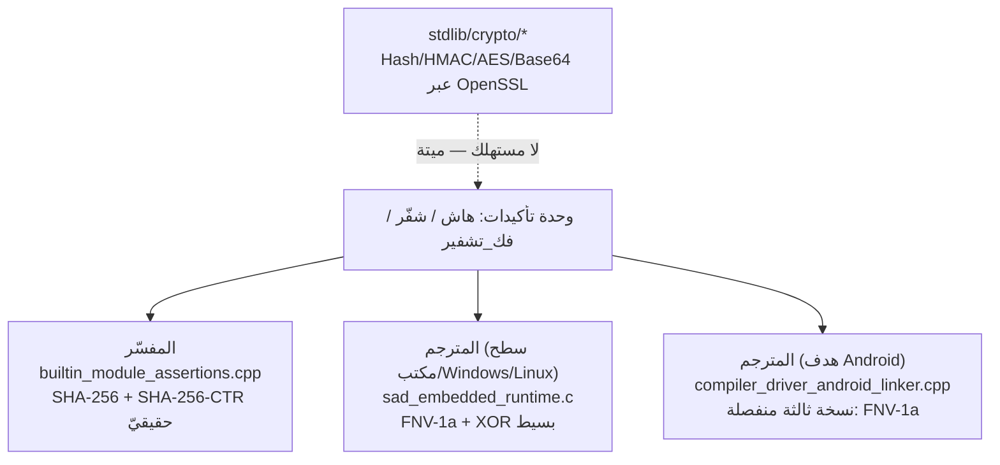
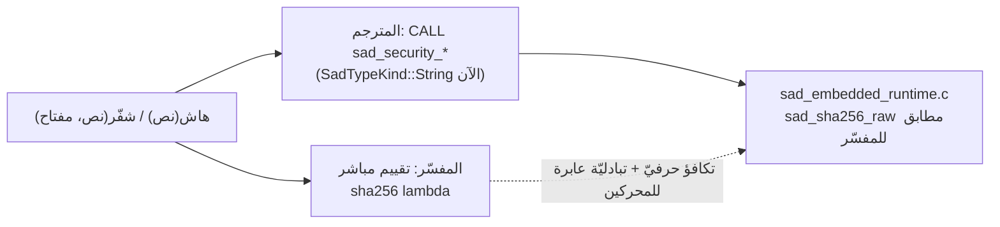

# دراسة حالة: توحيد هاش/شفّر/فك_تشفير بين المحرّكين

مثال متكامل على **إزالة تباعُد** بين المفسّر والمترجم (لا إضافة ميزة جديدة): دالّتا
`هاش`/`شفّر`/`فك_تشفير` في وحدة `تأكيدات` كانتا مُنفَّذتين مرّتين بخوارزميّتين
مختلفتين تمامًا — والمترجم كان يملك **نسخة ثالثة** منفصلة لهدف Android لم يمسّها أحد.
المرجع اللغويّ للمستخدم في
[sadlang-docs](https://github.com/sadlang/sadlang-docs/blob/main/src/language/security.md)؛
هذه الصفحة للمساهم في **التنفيذ**.

> **المبدأ الأهمّ:** التوحيد بين المحرّكين لا يعني «اختيار نسخة والحذف» فقط —
> يعني أيضًا **البحث عن كل نسخة**. النسخة الثالثة في مُصدِّر Android كانت لتبقى
> متباعدة لو لم تكشفها مراجعة مستقلّة قبل الدفع (انظر «الفخّ» أدناه).

## الوضع قبل التوحيد

ثلاث حقائق متزامنة سبّبت الالتباس:
1. **`هاش("نفس النص")` يُعطي قيمتين مختلفتين** حسب المحرّك المُشغِّل — FNV-1a
   (عدد صحيح) في المترجم مقابل SHA-256 حقيقيّ (نصّ ست عشريّ) في المفسّر.
2. **`شفّر`/`فك_تشفير` غير متبادلين عبر المحرّكين** — XOR بسيط في المترجم لا
   يفكّه SHA-256-CTR الذي شفّر به المفسّر، والعكس.
3. **`stdlib/crypto/` كانت تبدو الحلّ الصحيح** (OpenSSL كامل: Hash/HMAC/AES/
   Base64) لكن بلا أيّ مستهلك في المفسّر أو المترجم — بُنِيت واختُبِرت (هدف
   CMake `crypto_tests`) دون أن تُربَط بأيّ مسار تنفيذ فعليّ.

## القرار: SHA-256 هو المصدر الحقيقيّ، لا OpenSSL

الخيار الأول (ربط `stdlib/crypto` بالمترجم) يعمّق الانقسام بدل إغلاقه: لا يزال
يترك FNV-1a قائمًا في مسارات لا تستورد `stdlib/crypto` صراحةً، ويكسر **هدف
الوضع الحرّ** (freestanding) الذي لا يمكنه الربط بـOpenSSL أو أيّ مكتبة نظام
تشغيل مضيف — قيد قائم أصلًا على
[`tools/compiler/runtime/sad_embedded_runtime.c`](https://github.com/sadlang/s-programming-language/blob/dev/tools/compiler/runtime/sad_embedded_runtime.c)
(راجع تعليقات SEM019 فيه). القرار: **حذف `stdlib/crypto` كليًّا**، ونقل خوارزميّة
SHA-256/SHA-256-CTR **الذاتيّة التنفيذ** (self-rolled، بلا اعتماديّات) من المفسّر
إلى وقت تشغيل المترجم — لا العكس.

## التنفيذ عبر الطبقات

| الطبقة | قبل | بعد |
|---|---|---|
| **المفسّر** ([`builtin_module_assertions.cpp`](https://github.com/sadlang/s-programming-language/blob/dev/interpreter/src/builtins/builtin_module_assertions.cpp)) | SHA-256 حقيقيّ (بلا تغيير — هو المرجع) | — |
| **وقت تشغيل المترجم** ([`sad_embedded_runtime.c`](https://github.com/sadlang/s-programming-language/blob/dev/tools/compiler/runtime/sad_embedded_runtime.c)) | `sad_security_hash` يُرجع `long long` (FNV-1a)؛ XOR بسيط | `sad_sha256_raw`/`sad_sha256_rotr` + `sad_security_hash` يُرجع `const char *` (سلسلة ست عشريّة 64 حرفًا)؛ CTR بنفس بنية nonce+عدّاد للمفسّر |
| **واجهة SIR الأماميّة** ([`builtins_security.cpp`](https://github.com/sadlang/s-programming-language/blob/dev/compiler/src/frontend/builders/builtins_security.cpp)) | نوع الإرجاع `SadTypeKind::Integer` لـHASH | `SadTypeKind::String` |
| **مولِّد LLVM** ([`security_builtins_ops.cpp`](https://github.com/sadlang/s-programming-language/blob/dev/compiler/src/backend/llvm/builders/builtins/security_builtins_ops.cpp)) | توقيع `sad_security_hash`: `(i8*) -> i64` | `(i8*) -> i8*` |
| **مُصدِّر Android** ([`compiler_driver_android_linker.cpp`](https://github.com/sadlang/s-programming-language/blob/dev/tools/compiler/compiler_driver_android_linker.cpp)) | نسخة ثالثة FNV-1a منفصلة تمامًا | نفس SHA-256 (`sad_sha256_rotr`/`sad_sha256_raw`/`sad_security_hash`) — هذا الهدف لا يملك `sad_security_encrypt`/`decrypt` أصلًا |

`sad_security_encrypt`/`decrypt` نُقِلا بنفس بنية المفسّر: مقطع `nonce` عشوائيّ
8 بايت في بداية الناتج، وكل كتلة 32 بايت تُخفى بـ`SHA-256(مفتاح ‖ nonce ‖ عدّاد)`
كتيّار مفاتيح XOR.

## الفخّ: نسخة ثالثة كادت تفوت المراجعة

التغيير الأوّلي مسّ `sad_embedded_runtime.c` فقط (المسار المشترك لسطح
المكتب/Windows/Linux). مراجعة مستقلّة قبل الدفع (وفق سياسة الفريق: مراجع مستقلّ
إلزاميّ قبل أيّ `git push`) كشفت أنّ
[`compiler_driver_android_linker.cpp`](https://github.com/sadlang/s-programming-language/blob/dev/tools/compiler/compiler_driver_android_linker.cpp)
يحمل **نسخة كاملة منفصلة** من دوال وقت التشغيل لهدف Android — بما فيها FNV-1a
القديمة — لم يكن `grep` الأوّلي على `sad_security_hash` عبر شجرة الكود قد
شملها لأنّها بحث لم يُعَد على كامل الشجرة. الدرس: **البحث عن كل نسخة يسبق
حذف/توحيد أيّ منطق مكرَّر** — لا يكفي تتبّع نقطة تسجيل الدالّة المضمنة الواحدة
(`compiler_strategy: RUNTIME_CALL` في SoT) لأنّ نقطة **الربط الفعليّ**
(linker) قد تتفرّع حسب الهدف.

كما كُشِف تسريب أمنيّ ثانويّ في نفس المراجعة: تشفير/فكّ التشفير كانا يستعملان
مخزنًا ثابت الحجم على المكدس (`unsigned char input[8+8+256]`) يقتطع المفاتيح
الأطول من 256 بايت **صامتًا** بدل رفضها أو دعمها — أُصلح بتخصيص ديناميكيّ
(`malloc(klen + 16)`).

## نقطة الحسم: هل يُذكَر خطأ فكّ_تشفير على مدخل غير صالح؟

بقي تباعُد واحد **موثَّق عمدًا لا مُصلَح**: عند مدخل ست عشريّ غير صالح، المفسّر
يرمي استثناء لغويًّا قابلًا للالتقاط بـ`حاول`/`امسك`، بينما وقت تشغيل المترجم
(دالّة C خالصة) يطبع رسالة على `stderr` ويُعيد النصّ الأصليّ دون رمي استثناء —
لأنّ ربط دالّة C خارجيّة بآليّة الاستثناءات المبنيّة على LLVM
([`exception_ops.cpp`](https://github.com/sadlang/s-programming-language/blob/dev/compiler/src/backend/llvm/builders/arithmetic/exception_ops.cpp))
تغيير معماريّ أعمق من نطاق التوحيد الحاليّ. مُوثَّق في وصف `DECRYPT` بـ
[`language-truth/builtins/assertions.yaml`](https://github.com/sadlang/s-programming-language/blob/dev/language-truth/builtins/assertions.yaml)
وفي `RISK.md` الخاصّ بقسم اختبارات المكتبة القياسيّة، بدل إخفائه خلف اختبار
لا يغطّي مسار الخطأ.

## الاختبار (تكافؤ مزدوج)

`tests/behavior/sections/09_المكتبة_القياسية/04_تشفير/` — أربعة ملفّات:
شعاعات FIPS 180-4 الرسميّة لـ`هاش("")`/`هاش("abc")`، تبادليّة `شفّر`/`فك_تشفير`
عبر نصوص عربيّة/مختلطة/متعدّدة الكتل، شعاع ثابت مُسجَّل يدويًّا كمرساة انحدار،
واختبار مفتاح أطول من 256 بايت (يرصد رجوع باغ الاقتطاع الصامت). كلّ ملفّ يُشغَّل
عبر `sad-run.exe` **و**`sadc.exe` ويُقارَن الناتج حرفيًّا (ADR-03) — هذا ما
يضمن ألّا يعود التباعُد.

---
**اقرأ بعده:** [دوال مضمنة ووحدات](../systems/builtins.md) · [نظام معالجة الأخطاء](../systems/errors.md).
