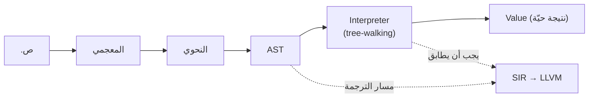
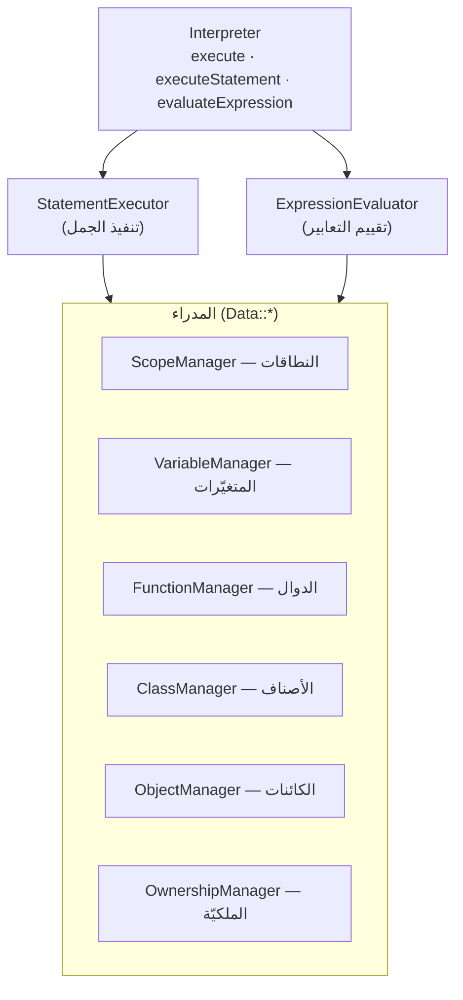
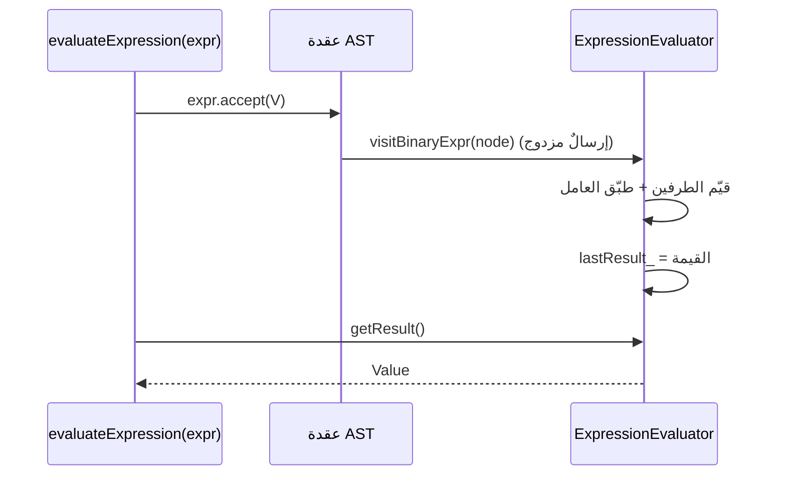

# المفسّر الشجري (Interpreter)

> **ماذا ستتعلّم:** كيف يزور `Interpreter` شجرة AST ويقيّمها فورًا (tree‑walking) —
> نمط الزائر بحامل النتيجة، تنسيق المدراء (نطاقات · متغيّرات · دوال · كائنات · ملكيّة)،
> دورة التقييم من البرنامج إلى القيمة، ونموذج التزامن (goroutines).

> 📎 المصدر: [`interpreter/include/core/interpreter_core.h`](https://github.com/sadlang/s-programming-language/blob/dev/interpreter/include/core/interpreter_core.h) · [`visitors/expression_evaluator.h`](https://github.com/sadlang/s-programming-language/blob/dev/interpreter/include/visitors/expression_evaluator.h) · [`shared/ast/include/ast_visitor.h`](https://github.com/sadlang/s-programming-language/blob/dev/shared/ast/include/ast_visitor.h)

## الدور: المرجع الدلاليّ

المفسّر يزور AST ويقيّمه مباشرةً دون توليد كودٍ وسيط — **الأسرع للتطوير والـREPL**، وهو
**المرجع الدلاليّ** الذي يجب أن يطابقه [المترجم](llvm.md): إن طابق المفسّر وخالف المترجم،
فالعيب في SIR/LLVM لا في الدلالة (BF‑08).



## ① التنسيق: `Interpreter` والمدراء

الصنف [`Interpreter`](https://github.com/sadlang/s-programming-language/blob/dev/interpreter/include/core/interpreter_core.h) منسِّقٌ نحيف: واجهته `execute(program)` /
`executeStatement` / `evaluateExpression`، ويفوّض العمل إلى مدراء متخصّصين وزائرَين:



| المدير | يدير |
|--------|------|
| `ScopeManager` | سلسلة النطاقات (دخول/خروج، البحث الهرميّ) |
| `VariableManager` | ربط الأسماء بالقيم داخل النطاق |
| `FunctionManager` | تعريفات الدوال (مشترَكٌ **للقراءة فقط** بين الخيوط) |
| `ClassManager` / `ObjectManager` | الأصناف ومثيلاتها (OOP) |
| `OwnershipManager` | تتبّع الملكيّة/الاستعارة — يربط [نظام الذاكرة](../systems/memory.md) |

## ② نمط الزائر بحامل النتيجة

كلّ عقدة AST تَقبل زائرًا (`node.accept(visitor)`)، والزائر [`ExpressionEvaluator`](https://github.com/sadlang/s-programming-language/blob/dev/interpreter/include/visitors/expression_evaluator.h)
يرث `BaseASTVisitor` ويُنفّذ `visitXxxExpr` لكلّ نوع. لأن `visit*` تُرجع `void`، تُخزَّن
النتيجة في `lastResult_` وتُسحَب بـ`getResult()`:



> 💡 **الإرسال المزدوج (double dispatch):** العقدة تعرف نوعها، فتستدعي `visitBinaryExpr`
> الصحيحة دون `switch` على نوعٍ مُعدَّد — إضافة عقدةٍ جديدة = دالة `visit` جديدة في الزائر.

الزائر مقسَّمٌ على ملفّات حسب العائلة (تخفيفًا للترجمة): `expression_evaluator_binary_ops`،
`..._calls_*`، `..._members_*`، `..._oop_*`، `..._overloads`، `..._ui`. ومثلها للجمل:
`statement_executor`، `..._control`، `..._control_exceptions`، `..._functions*`،
`..._modules`، `..._oop*`.

## ③ دورة التقييم الكاملة

```mermaid
flowchart TD
  P["execute(program: جمل)"] --> LOOP{"لكلّ جملة"}
  LOOP --> ES["executeStatement → StatementExecutor"]
  ES --> KIND{"نوع الجملة"}
  KIND -->|تعبيريّة| EVAL["evaluateExpression → accept → getResult"]
  KIND -->|تحكّم (إذا/طالما/لكل)| CTRL["statement_executor_control"]
  KIND -->|دالة/صنف| DEF["تسجيل في FunctionManager/ClassManager"]
  KIND -->|استثناء (حاول/أمسك)| EXC["statement_executor_control_exceptions"]
  EVAL --> R["ExecutionResult{success, Value, error}"]
  CTRL --> R
  DEF --> R
  EXC --> R
```

العمليّات الثنائيّة تُفرَّق داخل الزائر حسب الصنف:
[`evaluateArithmeticOp`](https://github.com/sadlang/s-programming-language/blob/dev/interpreter/include/visitors/expression_evaluator.h) ·
`evaluateComparisonOp` · `evaluateLogicalOp` (قِصَر دائرة) · `evaluateBitwiseOp` — كلّها تأخذ
`(left, TokenType op, right, Position)` وتتشاور مع [نظام الأنواع](../systems/types.md) للتحميل
الزائد والإكراه.

## ④ التزامن (Goroutines)

نموذج التزامن يقوم على **العزل**: كلّ goroutine يعمل بـ`StatementExecutor` مستقلّ مع
`ScopeManager` / `VariableManager` / `OwnershipManager` خاصّةٍ به، ويُشارَك `FunctionManager`
**للقراءة فقط**:

```mermaid
flowchart LR
  MAIN["الخيط الرئيسيّ"] -->|اذهب func() | SNAP["captureVisibleVariables()<br/>(لقطة من المتغيّرات المرئيّة)"]
  SNAP --> G1["goroutine #1<br/>Executor + مدراء خاصّون"]
  SNAP --> G2["goroutine #2<br/>Executor + مدراء خاصّون"]
  FM["FunctionManager<br/>(مشترَك — قراءة فقط)"] --- G1
  FM --- G2
  G1 <-->|قناة| CH["SadChannel<br/>(mutex داخليّ)"]
  G2 <-->|قناة| CH
```

> ⚠️ المتغيّرات تُلتقَط **لقطةً** عبر `captureVisibleVariables()` لا بالمرجع — فلا سباق على
> نطاق المنشئ. `FunctionManager` مشترَكٌ لكنّه للقراءة فقط، والقنوات (`SadChannel`) آمنةٌ
> بـmutex داخليّ.

## ملاحظات للمطوّر

- القيم كلّها `Value` (`std::variant` على `ValueType`)؛ `OBJECT` يحمل `shared_ptr<ObjectInstance>`
  ⇒ **تمرير الكائنات بالمرجع** → [نظام الأنواع](../systems/types.md).
- شغّل `.ص` مباشرةً بـ`sad.exe` لاختبارٍ سريع — لا حاجة لخطوة ترجمة.
- إن طابق المفسّر وخالف المترجم ⇒ المشكلة في SIR/LLVM لا في الدلالة (BF‑08).
- لإضافة عقدة AST جديدة: أضف `visit<Node>` إلى `BaseASTVisitor` ونفّذها في الزائرَين.

---
**اقرأ بعده:** [التمثيل الوسيط SIR](sir.md).
