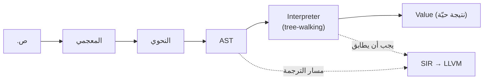
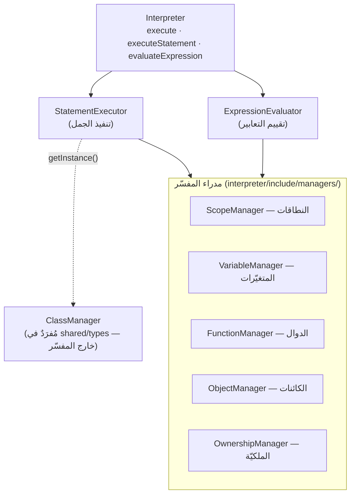
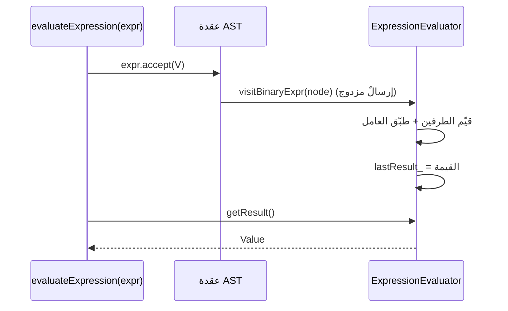
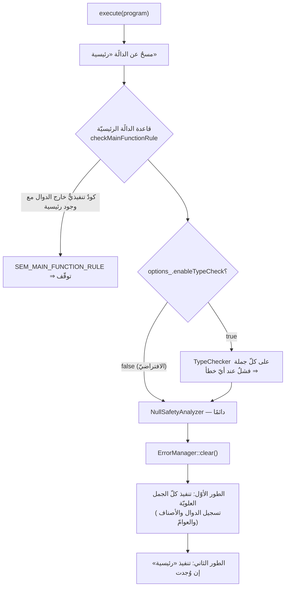

# المفسّر الشجري (Interpreter)

> **ماذا ستتعلّم:** كيف يزور `Interpreter` شجرة AST ويقيّمها فورًا (tree‑walking) —
> نمط الزائر بحامل النتيجة، تنسيق المدراء (نطاقات · متغيّرات · دوال · كائنات · ملكيّة)،
> **الطور الساكن الذي يسبق أوّل جملة**، دورة التقييم من البرنامج إلى القيمة، ونموذج
> التزامن (goroutines) وحدودُ عزله.

> 📎 المصدر: [`interpreter/include/core/interpreter_core.h`](https://github.com/sadlang/s-programming-language/blob/dev/interpreter/include/core/interpreter_core.h) · [`visitors/expression_evaluator.h`](https://github.com/sadlang/s-programming-language/blob/dev/interpreter/include/visitors/expression_evaluator.h) · [`shared/ast/include/ast_visitor.h`](https://github.com/sadlang/s-programming-language/blob/dev/shared/ast/include/ast_visitor.h)

## الدور: المرجع الدلاليّ

المفسّر يزور AST ويقيّمه مباشرةً دون توليد كودٍ وسيط — **الأسرع للتطوير والـREPL**، وهو
**المرجع الدلاليّ** الذي يجب أن يطابقه [المترجم](llvm.md): إن طابق المفسّر وخالف المترجم،
فالعيب في SIR/LLVM لا في الدلالة (BF‑08).

```mermaid
flowchart LR
  SRC[".ص"] --> LEX["المعجمي"] --> PAR["النحوي"] --> AST["AST"]
  AST --> INT["Interpreter<br/>(tree-walking)"]
  INT --> VAL["Value (نتيجة حيّة)"]
  AST -. "مسار الترجمة" .-> SIR["SIR → LLVM"]
  INT -. "يجب أن يطابق" .-> SIR
```

## ① التنسيق: `Interpreter` والمدراء

الصنف [`Interpreter`](https://github.com/sadlang/s-programming-language/blob/dev/interpreter/include/core/interpreter_core.h) منسِّقٌ نحيف: واجهته `execute(program)` /
`executeStatement` / `evaluateExpression`، ويفوّض العمل إلى مدراء متخصّصين وزائرَين:

```mermaid
flowchart TB
  INT["Interpreter<br/>execute · executeStatement · evaluateExpression"]
  INT --> SE["StatementExecutor<br/>(تنفيذ الجمل)"]
  INT --> EE["ExpressionEvaluator<br/>(تقييم التعابير)"]
  subgraph MGR["مدراء المفسّر (interpreter/include/managers/)"]
    SM["ScopeManager — النطاقات"]
    VM["VariableManager — المتغيّرات"]
    FM["FunctionManager — الدوال"]
    OM["ObjectManager — الكائنات"]
    OW["OwnershipManager — الملكيّة"]
  end
  SE --> MGR
  EE --> MGR
  SE -.->|"getInstance()"| CM["ClassManager<br/>(مُفرَدٌ في shared/types — خارج المفسّر)"]
```

| المدير | يدير | أين |
|--------|------|-----|
| `ScopeManager` | سلسلة النطاقات (دخول/خروج، البحث الهرميّ) | `managers/scope_manager.h` |
| `VariableManager` | ربط الأسماء بالقيم داخل النطاق | `managers/variable_manager.h` |
| `FunctionManager` | تعريفات الدوال (مشترَكٌ **للقراءة فقط** بين الخيوط) | `managers/function_manager.h` |
| `ObjectManager` | مثيلات الكائنات (OOP) | `managers/object_manager.h` |
| `OwnershipManager` | تتبّع الملكيّة/الاستعارة — يربط [نظام الذاكرة](../systems/memory.md) | `managers/ownership_manager.h` |
| `GoroutineManager` | دورة حياة الخيوط المتزامنة | `interpreter/include/channel.h` |
| `UIStateManager` | حالة عناصر الواجهة أثناء التفسير | `interpreter/include/ui/ui_state_manager.h` |

> ⚠️ **`ClassManager` ليس من مدراء المفسّر.** هو **مُفرَدٌ (singleton)** يعيش في
> [`shared/types/include/class_manager.h`](https://github.com/sadlang/s-programming-language/blob/dev/shared/types/include/class_manager.h#L128)
> ويُنادى بـ`ClassManager::getInstance()` من المحلّل والمفسّر والمترجم جميعًا —
> فسجلُّ الأصناف **عابرٌ للمحرّكين وعمليّةٌ واحدة**، لا حالةٌ مملوكةٌ لمثيل `Interpreter`.
> راجع أثرَ ذلك على التزامن في §⑤.

## ② نمط الزائر بحامل النتيجة

كلّ عقدة AST تَقبل زائرًا (`node.accept(visitor)`)، والزائر [`ExpressionEvaluator`](https://github.com/sadlang/s-programming-language/blob/dev/interpreter/include/visitors/expression_evaluator.h)
يرث `BaseASTVisitor` ويُنفّذ `visitXxxExpr` لكلّ نوع. لأن `visit*` تُرجع `void`، تُخزَّن
النتيجة في `lastResult_` وتُسحَب بـ`getResult()`:

```mermaid
sequenceDiagram
  participant C as evaluateExpression(expr)
  participant N as عقدة AST
  participant V as ExpressionEvaluator
  C->>N: expr.accept(V)
  N->>V: visitBinaryExpr(node)  (إرسالٌ مزدوج)
  V->>V: قيّم الطرفين + طبّق العامل
  V->>V: lastResult_ = القيمة
  C->>V: getResult()
  V-->>C: Value
```

> 💡 **الإرسال المزدوج (double dispatch):** العقدة تعرف نوعها، فتستدعي `visitBinaryExpr`
> الصحيحة دون `switch` على نوعٍ مُعدَّد — إضافة عقدةٍ جديدة = دالة `visit` جديدة في الزائر.

الزائران مقسَّمان على **٣٠ ملفًّا** في `interpreter/src/visitors/` (تخفيفًا لزمن الترجمة):
`expression_evaluator_core` · `..._binary_ops`/`..._binary_logic` ·
`..._calls`/`..._calls_dispatch`/`..._calls_invoke`/`..._calls_user_func`/`..._calls_macro` ·
`..._members`/`..._members_advanced`/`..._members_assign` ·
`..._oop`/`..._oop_new`/`..._oop_array_methods`/`..._oop_string_map_methods`/`..._oop_concurrency` ·
`..._overloads` · `..._ui`. ومثلها للجمل: `statement_executor` · `..._control` ·
`..._control_exceptions` · `..._functions`/`..._functions_templates` · `..._modules` ·
`..._oop`/`..._oop_types`/`..._oop_struct_test`. ومعها `sem045_report`
(تقرير SEM045 — عقد الغياب) وجسرا الواجهة `ui_eval_bridge_core` و`ui_widget_expr_dispatch`.

## ③ الطور الساكن: `execute` لا يبدأ بالتنفيذ

> 🔑 **المفسّر ليس «مشيًا على الشجرة» فقط.** قبل تنفيذ أوّل جملة يمسح
> [`execute()`](https://github.com/sadlang/s-programming-language/blob/dev/interpreter/src/core/interpreter_core.cpp)
> **البرنامجَ كلَّه** — **مرّتين افتراضيًّا، وثلاثًا إن فُعِّل فحصُ الأنواع** (فهو مطفأٌ
> افتراضيًّا، انظر أدناه) — ويشمل المسحُ الدوالَّ غيرَ المُنادَاة والفروعَ الميّتة.
> مَن ظنّه محضَ مُقيِّمٍ كسولٍ فوجئ بتشخيصٍ يخرج من كودٍ لا يُنفَّذ أبدًا.

```mermaid
flowchart TD
  S0["execute(program)"] --> S1["مسحٌ عن الدالّة «رئيسية»"]
  S1 --> S2{"قاعدة الدالّة الرئيسيّة<br/>checkMainFunctionRule"}
  S2 -->|"كودٌ تنفيذيٌّ خارج الدوال مع وجود رئيسية"| ERR1["SEM_MAIN_FUNCTION_RULE ⇒ توقّف"]
  S2 --> S3{"options_.enableTypeCheck؟"}
  S3 -->|"false (الافتراضيّ)"| S4
  S3 -->|"true"| TC["TypeChecker على كلّ جملة ⇒ فشلٌ عند أيّ خطأ"]
  TC --> S4["NullSafetyAnalyzer — دائمًا"]
  S4 --> CLR["ErrorManager::clear()"]
  CLR --> P1["الطور الأوّل: تنفيذ كلّ الجمل العلويّة<br/>(تسجيل الدوال والأصناف والعوامّ)"]
  P1 --> P2["الطور الثاني: تنفيذ «رئيسية» إن وُجدت"]
```

| الطور | متى يعمل | إن فشل |
|---|---|---|
| قاعدة الدالّة الرئيسيّة | حين توجد `رئيسية` | `SEM_MAIN_FUNCTION_RULE` وتوقّفٌ قبل التنفيذ |
| فحص الأنواع (`TypeChecker`) | **مطفأٌ افتراضيًّا**: `enableTypeCheck = false` | توقّفٌ بعدّ الأخطاء |
| تحليل أمان العدم | **دائمًا**، وصرامتُه مشتقّةٌ من سياسة الذاكرة عبر `strictnessFromOwnershipMode` | تحذيراتٌ دائمًا؛ وتوقّفٌ عند الصرامة القاتلة |

> ⚠️ **العَلَمُ الافتراضيّ يكذبُ على القارئ.**
> [`enableTypeCheck = false`](https://github.com/sadlang/s-programming-language/blob/dev/interpreter/include/core/interpreter_core.h#L78)
> — فالمفسّر يعمل بفاحصِ الأنواع **مُطفأً** ما لم يُطلَب صراحةً. فإن جرى برنامجٌ على
> `sad-run` وسقط على `sad-build`، فليس بالضرورة تباعُدَ محرّكين: قد يكون طورًا ساكنًا
> شغّله المترجمُ ولم يشغّله المفسّر.

> ⚠️ الأطوارُ الساكنة كلُّها محجوبةٌ بـ`#if !defined(__EMSCRIPTEN__) && !defined(SAD_PLATFORM_ANDROID)`
> — فبناءُ wasm أو أندرويد **لا يفحص شيئًا** قبل التنفيذ. لا تَقِس دلالةَ اللغة على أيٍّ منهما.

## ④ دورة التقييم الكاملة

```mermaid
flowchart TD
  P["الطور الأوّل/الثاني: تنفيذ الجمل"] --> LOOP{"لكلّ جملة"}
  LOOP --> ES["executeStatement → StatementExecutor"]
  ES --> KIND{"نوع الجملة"}
  KIND -->|تعبيريّة| EVAL["evaluateExpression → accept → getResult"]
  KIND -->|تحكّم (إذا/طالما/لكل)| CTRL["statement_executor_control"]
  KIND -->|دالة/صنف| DEF["تسجيل في FunctionManager/ClassManager"]
  KIND -->|استثناء (حاول/أمسك)| EXC["statement_executor_control_exceptions"]
  EVAL --> R["ExecutionResult{success, Value, error}"]
  CTRL --> R
  DEF --> R
  EXC --> R
```

العمليّات الثنائيّة تُفرَّق داخل الزائر حسب الصنف:
[`evaluateArithmeticOp`](https://github.com/sadlang/s-programming-language/blob/dev/interpreter/include/visitors/expression_evaluator.h) ·
`evaluateComparisonOp` · `evaluateLogicalOp` (قِصَر دائرة) · `evaluateBitwiseOp` — كلّها تأخذ
`(left, TokenType op, right, Position)` وتتشاور مع [نظام الأنواع](../systems/types.md) للتحميل
الزائد والإكراه.

## ⑤ التزامن (Goroutines)

نموذج التزامن يقوم على **العزل**: كلّ goroutine يعمل بـ`StatementExecutor` مستقلّ مع
`ScopeManager` / `VariableManager` / `OwnershipManager` خاصّةٍ به، ويُشارَك `FunctionManager`
**للقراءة فقط**:

```mermaid
flowchart LR
  MAIN["الخيط الرئيسيّ"] -->|اذهب func() | SNAP["captureVisibleVariables()<br/>(لقطة من المتغيّرات المرئيّة)"]
  SNAP --> G1["goroutine #1<br/>Executor + مدراء خاصّون"]
  SNAP --> G2["goroutine #2<br/>Executor + مدراء خاصّون"]
  FM["FunctionManager<br/>(مشترَك — قراءة فقط)"] --- G1
  FM --- G2
  G1 <-->|قناة| CH["SadChannel<br/>(mutex داخليّ)"]
  G2 <-->|قناة| CH
```

> ⚠️ المتغيّرات تُلتقَط **لقطةً** عبر `captureVisibleVariables()` لا بالمرجع — فلا سباق على
> نطاق المنشئ. `FunctionManager` مشترَكٌ لكنّه للقراءة فقط، والقنوات (`SadChannel`) آمنةٌ
> بـmutex داخليّ.

> 🔑 **حدُّ العزل: `ClassManager` خارجه.** العزلُ أعلاه يغطّي مدراءَ المفسّر، لا المُفرَدَ
> العابرَ للمحرّكين. وقياسُ [`class_manager.cpp`](https://github.com/sadlang/s-programming-language/blob/dev/shared/types/src/class_manager.cpp)
> يقول: **`getInstance` و`resetInstance` وحدهما يقفلان `instanceMutex_`** — أمّا
> `registerClass` و`getClass` و`hasClass` و`registerTrait` وسائرُ الخريطة **فبلا قفل**.
> فالتعليقُ الذي يصف الصنفَ بأنّه «آمنٌ للخيوط المتعدّدة» يصفُ **إنشاءَ المُفرَد** لا
> **محتواه**. عمليًّا: `أطلق` على شيفرةٍ تُصرِّح صنفًا (أو تحمِّل وحدةً تُصرِّحه) يكتبُ
> في خريطةٍ عامّةٍ غيرِ متزامنة. هذا **عقدٌ معلَنٌ لا يقيسه أحد**، لا حكمٌ بأنّه عطبٌ
> مرصود — قِسه قبل أن تبنيَ عليه.

## ملاحظات للمطوّر

- القيم كلّها `Value` (`std::variant` على `ValueType`)؛ `OBJECT` يحمل `shared_ptr<ObjectInstance>`
  ⇒ **تمرير الكائنات بالمرجع** → [نظام الأنواع](../systems/types.md).
- شغّل `.ص` مباشرةً بـ`sad-run` لاختبارٍ سريع — لا حاجة لخطوة ترجمة.
- إن طابق المفسّر وخالف المترجم ⇒ المشكلة في SIR/LLVM لا في الدلالة (BF‑08).
- لإضافة عقدة AST جديدة: أضف `visit<Node>` الصرفة إلى `ASTVisitor` وتطبيقًا فارغًا في
  `BaseASTVisitor`، ثمّ نفّذها في الزائرَين → [شجرة AST](../frontend/ast.md).
- الأصنافُ تُسجَّل في `ClassManager::getInstance()` (مُفرَدُ `shared/types`)، لا في مديرٍ
  يملكه المفسّر.

---
**اقرأ بعده:** [التمثيل الوسيط SIR](sir.md).
