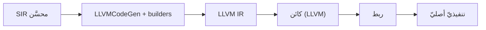

# توليد LLVM (المترجم sadc)

> **ماذا ستتعلّم:** كيف يحوّل `LLVMCodeGen` تمثيل SIR إلى LLVM IR ثم ملفّ تنفيذيّ أصليّ.

## الدور
`compiler/src/backend/llvm/` يأخذ SIR المحسَّن ويُنتج LLVM IR، ثم يستخدم LLVM لتوليد
كائن ثم ربطه في ملفّ تنفيذيّ. هذا قلب المترجم `sadc`.

## الاعتماد على LLVM
- **LLVM 18** — مفعّل بشرط `ENABLE_LLVM_BACKEND=ON`؛ راجع `cmake/llvm.cmake` و`#ifdef HAS_LLVM`.
- واجهة `sadc` تعيش في `tools/compiler/` (`compiler_driver_*.cpp`).

## البناة (builders)
`compiler/src/backend/llvm/builders/` — مولّدات لكل بنية (تعابير، تحكّم، دوال،
كائنات، الدوال المضمنة في `builders/builtins/`).

## مخطّط

## التشخيص (BF-07)
عند خطأ في المترجم، ولّد IR بـ`--emit-llvm` وافحص:
- هل الكتلة الأولى (entry block) صحيحة؟
- هل أنواع الحقول والمعاملات متّسقة؟
- هل ترتيب التعليمات يحترم تبعيّات البيانات؟
- هل `getelementptr` يستخدم الفهارس الصحيحة؟

## قواعد codegen مهمّة
- **أسماء كتل واصفة:** `precond_fail`, `loop_body`, `then_block` — لا `bb1`/`label2` (CW-11).
- **الترتيب يكسر الدلالة:** ترتيب أبجديّ لأسماء الكتل يكسر ترتيب التنفيذ — استخدم `std::vector` محافظًا على ترتيب الإدراج (CW-27).
- **أصلِح في الطبقة الصحيحة:** خطأ تحويل أنواع يُصلَح في codegen؛ خطأ ترتيب حقول في `SIRBuilder` (BF-10).

---
**اقرأ بعده:** [الآلة الافتراضية](vm.md).
