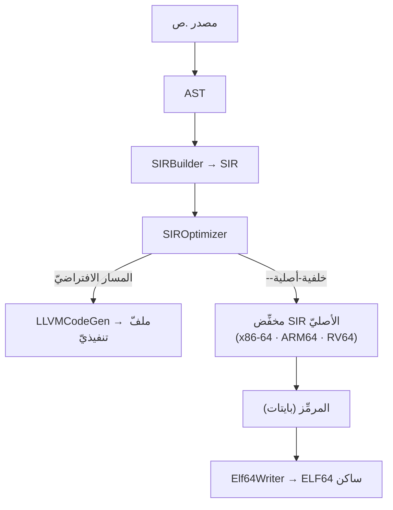
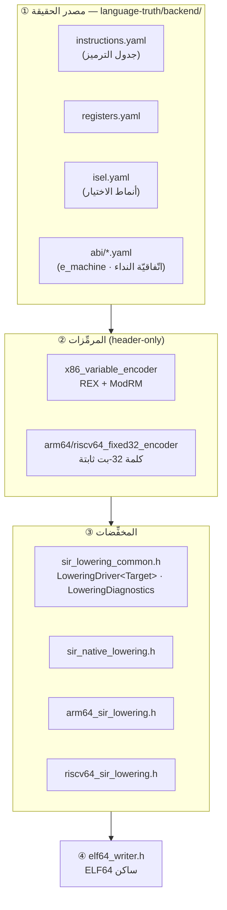
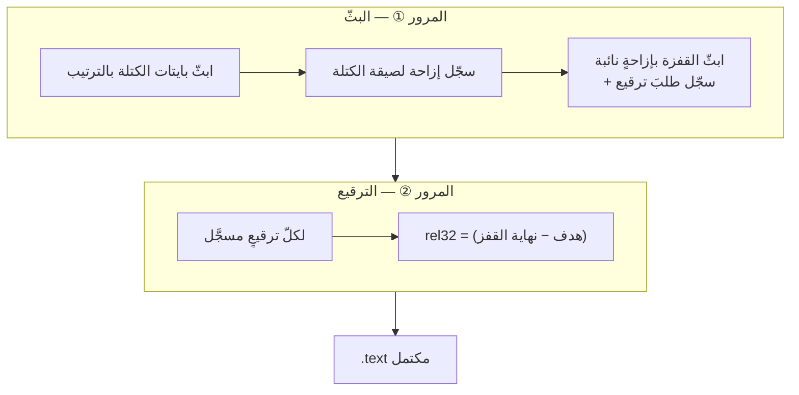

# الخلفيّة الأصليّة بلا LLVM (SIR → ELF64)

> **ماذا ستتعلّم:** كيف تُترجَم لغة ص إلى شيفرة آلة **بلا LLVM ولا رابطٍ أجنبيّ**؛ طبقات
> الخلفيّة الأربع (جداول SoT · المرمِّزات · المخفِّضات · كاتب ELF)؛ كيف تُقاس صحّتها
> بدرجتَين متمايزتَين (التصريف والتنفيذ)؛ وأين تبدأ إن أردت إضافة أوپكود أو معماريّة.

> 📎 **المصدر:** [`compiler/include/backend/native/`](https://github.com/sadlang/s-programming-language/tree/dev/compiler/include/backend/native) ·
> [`language-truth/backend/`](https://github.com/sadlang/s-programming-language/tree/dev/language-truth/backend) ·
> [`tools/compiler/compiler_driver_native.cpp`](https://github.com/sadlang/s-programming-language/blob/dev/tools/compiler/compiler_driver_native.cpp) ·
> [`scripts/native_backend/`](https://github.com/sadlang/s-programming-language/tree/dev/scripts/native_backend)

> 📌 **الخلاصة في ثلاثة أسطر:** ثلاثُ معماريّاتٍ لها مخفِّضٌ موصولٌ اليوم — x86-64 وARM64
> بـ**١٠٤** أوپكودات، وRV64 بـ**٧** — واثنتان مخطَّطتان؛ والخانةُ المضمونة عبرها جميعًا هي
> **ELF على لينكس/الوضع الحرّ** لا غير، فماك وويندوز يبقيان على LLVM. والصحّةُ تُقاس
> **بدرجتَين** لا بواحدة (بصمةُ التصريف · التشغيل الحيّ)، وجداولُ اختيار التعليمات ما تزال
> بذرةً والتخفيضُ الفعليّ يعيش في C++.
>
> **جئتَ لتُسهم؟** اقفز إلى [«أين تبدأ»](#أين-تبدأ). **جئتَ لسؤالٍ بعينه؟**
> [كيف يُبلَّغ عن فشل التخفيض](#التشخيص-لا-نصَّ-رسالةٍ-في-الخلفيّة) ·
> [كيف تُقاس الخلفيّة](#كيف-تُقاس-الخلفيّة-درجتان-لا-واحدة) ·
> [ما الحدودُ والدَّينُ المُعلَن](#مزالق-مقيسة-لا-تكرّرها).

## لماذا خلفيّةٌ ثالثة؟
للغة ص ثلاثة مسارات تنفيذ: [المفسّر الشجريّ](interpreter.md)، و[SIR → LLVM](llvm.md)،
وهذا. المسار الثالث ليس تحسينَ أداء بل **سيادةً**: أن تُنتَج شيفرةُ الآلة من مصدر ص
دون أن يمرّ البرنامج بأيّ أداةٍ لا نملكها — لا `clang` ولا `ld` ولا `lld` ولا `as`.

عقدُ السيادة مكتوبٌ في مصدر الحقيقة لا في نيّة أحد
([`targets.yaml`](https://github.com/sadlang/s-programming-language/blob/dev/language-truth/backend/targets.yaml)):
**خمس معماريّات فأكثر بلا LLVM إطلاقًا**، والخانة الإلزاميّة عبرها جميعًا هي
**ELF + لينكس/الوضع الحرّ** (freestanding). أمّا Mach-O/darwin وPE/Win64 فخارج نواة
السيادة صراحةً — يبقيان على LLVM حتّى قرارٍ لاحق.

## الموضع في خطّ الأنابيب

الفارق الجوهريّ: مسار LLVM يسلّم IR إلى مكتبةٍ أجنبيّة تتولّى الترميز والربط، والمسار
الأصليّ **يكتب البايتات بنفسه** ثمّ يلفّها في حاويةِ ELF بنفسه.

## الأهداف الخمسة — والفجوة التي لا تُكتَم
> 📎 **المصدر:** [`targets.yaml`](https://github.com/sadlang/s-programming-language/blob/dev/language-truth/backend/targets.yaml)

عمود «المعلم» أدناه يستعمل الترقيم `م٠ … م٨` — و«م-» اختصارُ **معلَمٍ** في خارطة الخلفيّة.

| الهدف | المعلم | الحالة | أوپكودات مخفَّضة |
|---|---|---|---|
| x86-64 | م٠–م٣ | `lowered` | **104** |
| AArch64/ARM64 | م٥ | `lowered` | **104** |
| RISC-V RV64GC | م٦ | `lowered` | **7** |
| ARMv7-A/Thumb-2 | م٧ | `planned` | — |
| x86 i686 | م٨ | `planned` | — |
| استخراج الطبقة الجدوليّة | م٤ | `in_progress` | (طبقةٌ مشترَكة لا هدف) |

> ⚠️ **«مدعوم» ≠ «يترجم كلّ برنامج».** `lowered` تعني «له مخفِّضٌ موصولٌ ومُبرهَنٌ
> بالتشغيل» فحسب. الفارق مقيسٌ لا مخفيّ: حقل `native_lowered` في
> [`sir_opcodes.yaml`](https://github.com/sadlang/s-programming-language/blob/dev/language-truth/backend/sir_opcodes.yaml)
> يسجّل لكلّ أوپكود مَن يخفّضه فعلًا، وكتلة `stats` تجمعه:
> `native_lowered_x86_64: 104` · `native_lowered_arm64: 104` · `native_lowered_riscv64: 7`.
> وRV64 **يرفض ما عدا مجموعتَه صراحةً** لا يُنتِج ثنائيًّا مبتورًا.

وثمّة موضعٌ واحدٌ في الشجرة ما يزال يقول غيرَ هذا الرقم، فلا تأخذه عنه:

> 📌 **ترويسةُ `sir_native_lowering.h` أقدمُ من هذا الرقم:** ما تزال تصف «مجموعةً دنيا
> من الأوپكودات (MOVE/ADD_I64/SUB_I64/المقارنات/BR/BR_COND/RET)» و«بلا انسكابٍ ولا
> PHI/ذاكرة» — وهو وصفُ م٠. المقيسُ اليومَ ١٠٤، وفي المستودع `prove_sir_spill.sh`
> و`prove_sir_memory.sh`. الحقيقةُ هنا كتلةُ `stats` المُولَّدة في `sir_opcodes.yaml`،
> لا نصُّ الترويسة.

وحقلٌ ثانٍ متمايزٌ عمدًا: `isel_declared` — مَن يُعلن نمطًا في `backend/*/isel.yaml`
(٣ لكلٍّ من x86_64 وarm64، ٠ لـriscv64). **الفجوة بين الحقلَين هي الرسالة:** جداولُ
اختيار التعليمات ما تزال بذرةً، والتخفيضُ الفعليُّ يعيش في C++.

## المدخل من سطر الأوامر
العَلَم `--خلفية-أصلية` مُعرَّف في مصدر الحقيقة
([`cli_flags.yaml:211-218`](https://github.com/sadlang/s-programming-language/blob/dev/language-truth/cli_flags.yaml#L211-L218))
ويقود إلى [`compiler_driver_native.cpp`](https://github.com/sadlang/s-programming-language/blob/dev/tools/compiler/compiler_driver_native.cpp).
والمعماريّة **تُشتقّ من ثالوث `--هدف` لا من عَلَمٍ ثانٍ** — الهدف مصدرٌ واحد:

| ثالوث الهدف | المخفِّض | ملاحظة |
|---|---|---|
| `aarch64-*` / `arm64-*` | `arm64_sir_lowering.h` | مطابقةٌ تامّة على حقل architecture بعد تفكيك الثالوث، لا مطابقةُ بادئة على نصّ خام |
| `riscv64-*` | `riscv64_sir_lowering.h` | م٦ |
| `x86_64-*` | `sir_native_lowering.h` | الافتراض؛ وبلا `--هدف` يكون الثالوث ثالوثَ المضيف |

وما عدا هذه الثلاث **يُرفَض** لا يُخفَّض افتراضًا: `targetIsSupported` تشترط معماريّةً
مخفَّضةً *و*نظامًا حاويتُه ELF معًا، كي لا يخرج ELF x86-64 لهدفِ wasm أو ويندوز صامتًا.

نظام التشغيل يُفحَص أيضًا: `linux` و`none` (معدنٌ عارٍ/الوضع الحرّ) وحدهما يصلحان
لكاتب ELF64 — وثالوثٌ بلا نظامٍ مذكور (`aarch64` مجرّدًا) يُعامَل معاملةَ `none`؛
ويندوز وماك حاويتان مختلفتان لا يكتبهما هذا المسار.

## الطبقات الأربع

### ① الجداول (SoT)
`instructions.yaml` يصف الترميز بيانًا (`form` · `operands` · `encode`)، و`isel.yaml`
يصف النمط (`sir → match → emit + cost`). **بنية النمط مشتركة عبر ISAs والمحتوى مختلف**:
x86 يدمّر الوجهة (`add dst, src`) بينما ARM64/RISC-V ثلاثيّةُ المعاملات.

### ② المرمِّزات
محرّكٌ عامٌّ واحد لكلّ عائلة: **المنطق الضيّق يُكتَب مرّةً، والاختلاف بين التعليمات
بياناتٌ (`EncSpec`) لا كود**. `x86_variable_encoder.h` يكتب بادئة REX وModRM؛ ونظيراه
`arm64_fixed32_encoder.h` و`riscv64_fixed32_encoder.h` يبنيان كلمةً ثابتة الطول.
والصحّة **مقيسةٌ بايتًا ببايت ضدّ `llvm-mc`** في `test_native_backend_m1.cpp` — أي أنّ
LLVM حاضرٌ في *القياس* وغائبٌ عن *المنتَج*.

### ③ المخفِّضات والطبقة المشتركة
م٤ تستخرج ما لا يخصّ معماريّةً بعينها إلى
[`sir_lowering_common.h`](https://github.com/sadlang/s-programming-language/blob/dev/compiler/include/backend/native/sir_lowering_common.h):

- **مسندات تحليل SIR عديمة الحالة:** `isComparison` · `isConstInt` · `findFusedComparison`
  · `hasResultAndArity` · عقد الشكل (نتيجةٌ موجودة + عدد معامِلات متوقَّع).
- **`LoweringDiagnostics`** — قاعدةُ **تركيبٍ لا تعدّدِ أشكال**: مُدمِّرٌ محميٌّ غير
  افتراضيّ عمدًا، فلا حذفَ عبر مؤشّر قاعدة. (وما الذي يُبلَّغ به فعلًا حين يفشل تخفيضٌ؟
  انظر [§التشخيص](#التشخيص-لا-نصَّ-رسالةٍ-في-الخلفيّة).)
- **`LoweringDriver<Target>`** بنمط CRTP — تتابعُ التخفيض يعيش **مرّةً واحدة**، والهدفُ
  يقدّم خطّافاته الثلاثة: الثنائيّ · الأحاديّ · المقارنة.

> ✅ **عقدُ الاستخراج مقيسٌ لا مُدَّعًى:** بصمةُ `sha256` لمخرَج ELF — وهي بصمةُ درجةِ
> التصريف، تُشرَح في §«كيف تُقاس الخلفيّة» — عبر مصفوفة القواعد × `{x86_64, arm64}` ⇒
> **صفرُ بايتةٍ مختلفة**. ومع ذلك نطاقُ البرهان محدودٌ ومُعلَن: المصفوفة لا تمثّل معامِل
> `Any` في عمليّةٍ عشريّة، فبرهانُ تلك الحالة منفصلٌ (`prove_any_float.sh`). البصمةُ
> حارسٌ ضدّ تغييرٍ غير مقصود، لا بديلٌ عن مراجعة.

**تدفّق التحكّم بمرورين:** إزاحةُ اللصيقة لا تكون معروفةً ساعةَ بثّ القفزة التي تقصدها،
فيُقسَم العمل مرورَين ينتهيان بترقيع كلّ `rel32`:

والمقارنةُ المُغذِّية لـ`BR_COND` تُدمَج أو لا تُدمَج بحسب نوعها:

| المقارنة المُغذِّية | تُدمَج؟ | التفصيل |
|---|---|---|
| صحيحة | ✅ | `cmp` ثمّ `jCC` ثمّ `jmp` — فلا حاجة إلى `setcc`/`movzx` |
| عوائم | ❌ | لأجل NaN |
| معامِلٌ **معلَّب** (ملفوفٌ في تمثيلٍ عامٍّ يحمل وسمَ نوعه) | ❌ | لأنّ نوعها لا يُعرَف إلّا زمنَ التشغيل |

### ④ كاتب ELF64
[`elf64_writer.h`](https://github.com/sadlang/s-programming-language/blob/dev/compiler/include/backend/native/elf64_writer.h)
يبني تنفيذيًّا ساكنًا دنيا: رأس ELF (64 بايت) + `program header` واحد `PT_LOAD` (R+X) +
`.text`، ونقطةُ الدخول عند `vbase + 0x78`. وهو **محايدُ المعماريّة**: بنيةُ التنفيذيّ
الساكن واحدةٌ عبر الأهداف، والفارقُ حقلٌ واحد (`e_machine`: ٦٢ لـx86-64، ١٨٣ لـAArch64، ٢٤٣ لـRV64)
**يُمرَّر من جدول الـABI — بيانًا لا كودًا**.

## التشخيص: لا نصَّ رسالةٍ في الخلفيّة
كلّ فشلِ تخفيضٍ يحمل `ErrorCode` من كتالوج SoT + حمولةَ `{detail}` = **وسمُ سياق** +
قيمةٌ تُحسَب زمنَ التشغيل. الوسوم مُوحَّدةٌ ثوابتَ مسمّاة في
[`native_diagnostics.yaml`](https://github.com/sadlang/s-programming-language/blob/dev/language-truth/backend/native_diagnostics.yaml)
يولّدها `gen_native_diagnostics.py` إلى هيدر C++ يستهلكه المخفِّضان — بدل حرفيّاتٍ خام.
ووسمُ السياق **ليس نصًّا يراه المستخدم**؛ الرسالةُ من الكتالوج، والوسمُ سياقٌ لمطوّر
الخلفيّة. أمثلة: `kMoveKind` · `kArrayGetBoxed` · `kEnumPayloadDyn` · `kObjectUnknownClass`.

وبالمنطق نفسه يوحّد
[`value_repr.yaml`](https://github.com/sadlang/s-programming-language/blob/dev/language-truth/backend/value_repr.yaml)
وسومَ `SadDyn` ونصوصَ عرض القيم بين المحرّكات الثلاثة — وهذه **وسومُ نوعٍ زمنَ التشغيل،
لا وسومُ السياق التشخيصيّ أعلاه**. جاء التوحيد بعد عيبٍ حقيقيّ: كان العدم يُعرَض «عدم»
في الخلفيّة الأصليّة و«لاشيء» في المفسّر وLLVM.

## كيف تُقاس الخلفيّة: درجتان لا واحدة
صحّةُ الخلفيّة تُقاس بدرجتَين متمايزتَين: **أن تخرج البايتاتُ كما يجب** (التصريف)،
و**أن يعمل الثنائيُّ الخارج** (التنفيذ).

| الدرجة | ما تقيسه | الأداة | أين تعمل |
|---|---|---|---|
| ① التصريف (emit) | أنّ صورة ELF لمصدرٍ وهدفٍ بعينهما **واحدةٌ بايتًا بايتًا عبر المنصّات الثلاث** | [`prove_elf_emit_fingerprint.py`](https://github.com/sadlang/s-programming-language/blob/dev/scripts/native_backend/prove_elf_emit_fingerprint.py) + `elf_emit_fingerprints.json` | المنصّات الثلاث، التكوينان |
| ② التنفيذ (run) | أنّ الثنائيّ المُخرَج **يعمل** ويطابق المفسّر | [`run_native_proofs.sh`](https://github.com/sadlang/s-programming-language/blob/dev/scripts/native_backend/run_native_proofs.sh) + 21 سكربت `prove_*.sh` | لينكس (+ `qemu-user-static` لـARM64 وRV64) |

> ⚠️ **خلطُ الدرجتَين هو مكمنُ الأخضر الكاذب:** خطوةٌ تُسمّى «براهين الخلفيّة الأصليّة»
> على ماك ولا تقيس إلّا وجودَ الملفّ **أسوأُ من غيابها**.

البصمةُ **سِقّاطةٌ ثنائيّة الاتّجاه**: بصمةٌ تخالف المسجَّل ⇒ أحمر، وبصمةٌ مسجَّلةٌ لمدخلٍ
لم يعد يُقاس ⇒ أحمر أيضًا. وهي تكشف ما لا يكشفه اختبار «هل خرج بـ٤٢»: اعتمادٌ على ترتيب
جدول تجزئة، أو على حجم `size_t` المضيف، أو مسارٌ يتسرّب إلى الصورة.

### حرّاسُ المُنادي الأربعة
**المُنادي** هو السكربت الجامع `run_native_proofs.sh` الذي يشغّل سكربتاتِ البرهان كلَّها.
كُتب لسدّ فجوةٍ بنيويّة: كانت البراهين موجودةً **بلا مُنادٍ**، فعاشت في الخلفيّة عيوبٌ
حيّةٌ شهورًا. وهو يفعل أربعةً لا يفعلها تشغيلٌ يدويّ:

1. **الإنتاجُ ثمّ البرهان** في مجلّدٍ **يُمحى أوّلًا** — مُنتِجٌ ينهار قبل الكتابة يترك
   ثنائيَّ التشغيلة الماضية فيُبرهَن عليه ويخضرّ. **البقيّةُ أخطرُ من الغياب، لأنّ
   الغيابَ يُرى.** ويُحكَم برمز خروج المُنتِج أيضًا.
2. **حارسُ التغطية** — سكربتُ برهانٍ جديدٌ غيرُ مُصرَّحٍ به في المُنادي يُخفِق البوّابة،
   فلا تعود فجوةُ «سكربتٌ بلا مُنادٍ» بالتسلّل.
3. **التخطّي إخفاقٌ افتراضيًّا** — مجموعُ `SKIP` أصفارًا يُقرأ «نجح الكلّ» وهو أخضرُ بلا
   قياس (يُرفَع بـ`SAD_PROOFS_ALLOW_SKIP=1` صراحةً).
4. **غيابُ `qemu-aarch64` إخفاق** — وإلّا حُذف نصفُ البراهين (AArch64) من الحساب بلا
   أثرٍ في المخرَج. (ما عداه يُلتقَط نصًّا: `SKIP` يُعدّ ولو خرج السكربتُ بصفر.)

وفي CI تظهر الدرجتان كذلك: خطوة «🔬 براهين الخلفيّة الأصليّة (تنفيذٌ حيّ)» على لينكس،
وبصمةُ التصريف **غيرُ مشروطةٍ بالتكوين** في الخانات الستّ كلّها. وسببُ تعميمها مقيس:
كانت الخلفيّة محبوسةً داخل هدفٍ لا يُعرَّف إلّا مع LLVM، فعاش عيبٌ واحد **ستَّ جولات CI**
لأنّ الخانة الكاشفة واحدة.

## مزالق مقيسة (لا تكرّرها)
كلُّ بندٍ أدناه أثرُ عطبٍ **قِيس** لا عطبٍ يُخشى — وهذه القائمةُ محضرُ ما التقطته الدرجتان
أعلاه. وهي تخلط نوعَين: ما **سُدَّ** وبقي مكتوبًا كي لا يُعاد، وما هو **قيدٌ مُعلَنٌ باقٍ**
يُرفَض صراحةً ولا يُبتَر صامتًا. والتمييزُ منصوصٌ في كلّ بند:

- **حارسٌ مبنيٌّ على الأوپكود والفرقُ في النوع لا يراه:** طُبع `طبيعي` على RV64 **`-1`**
  بينما المفسّر وx86-64 يطبعان القيمة الصحيحة — لأنّ الطابع موقَّعٌ حصرًا ولم يوزّع أحدٌ
  على النوع.
- **حالةٌ مشروطةٌ بالمُحسِّن دون أن يقول ذلك أحد:** `MOVE` لم يكن مخفَّضًا على RV64، فمرّ
  الهدفُ في `-O2` (حيث يحذفه DCE) و**أخفق في `-O0`**. كشفه اختبارُ الجسر الوحدويّ (يبني
  SIR بلا مُحسِّن) لا البرهانُ الحيّ الذي كان يقيس `-O2` وحده.
- **قيدٌ باقٍ مُعلَن:** إزاحات الإطار على RV64 فوريٌّ ١٢-بت موقَّع ⇒ سقف ٢٠٤٧ بايتًا؛
  ما فوقه **يُرفَض صراحةً** (`kFrameTooLarge`) لا يُبتَر صامتًا.
- **دَينٌ موثَّق قبل تشغيل isel:** صيغةُ المركم القصيرة (`add=05` · `sub=2D` · `cmp=3D`
  بلا ModRM) تخالف الشكلَ العامّ `81 /r id` بايتًا، فتفشل المطابقةُ التفاضليّة ضدّ
  `llvm-mc` **صامتةً** إن اختارت isel المركمَ وجهةً للفوريّ.
- **أوپكوداتٌ مقيَّدةٌ بمعماريّة** (`rdtsc` · `cli` · `outb` · `mov %crN`): كانت تُبَثّ
  **لأيّ هدفٍ يُطلَب** بخروجٍ صفريّ — `عداد_الدورات()` بـ`--هدف=aarch64-unknown-elf` كان
  يخرج بصفرٍ ويبثّ `rdtsc` — فيقع الإخفاق عند المُجمِّع برسالةٍ لا تدلّ على السبب، أو لا
  يقع فيخرج ثنائيٌّ لا يعمل. **سُدَّ ذلك**: بوّابةٌ في `emitInstruction` تقرأ الجردَ من
  [`arch_specific_opcodes.yaml`](https://github.com/sadlang/s-programming-language/blob/dev/language-truth/backend/arch_specific_opcodes.yaml)
  عبر `findArchConstraint()` وتردّ `SEM_TARGET_ARCH_UNSUPPORTED_BUILTIN`. ودَينان
  مُعلَنان باقيان: البوّابةُ في مسار LLVM (وهذه الأوپكودات `native_lowered: []` فلا
  يخفّضها المسارُ الأصليّ أصلًا)، وكتلةُ «تجميع … نهاية» لا تمرّ بها.
- **البرهانُ الذي لا يُعيد أحدٌ إنتاجَه دعوى** مهما صدق قائلُه: كان أحدُ حقول `targets.yaml`
  يسوق تشغيلًا نصًّا بلا سكربتٍ يُعيده، فاستُبدل بسكربتٍ مُصرَّحٍ به في المُنادي.

## أين تبدأ
هذا الجدول هو بابُ المُسهِم: صفٌّ لكلّ نيّة، وكلُّ صفٍّ ينتهي بما يجعل الإسهامَ **مقيسًا**
لا مُدَّعًى — سكربتَ برهانٍ مُصرَّحًا به، أو اختبارَ تطابقٍ، أو حقلًا في مصدر الحقيقة.

| تريد أن… | ابدأ من |
|---|---|
| تضيف أوپكودًا مخفَّضًا | `sir_native_lowering.h` (أو نظيره) + حدّث `native_lowered` في `sir_opcodes.yaml` + سكربت برهانٍ مُصرَّحٍ به في المُنادي |
| تضيف تعليمةً أو صيغةَ ترميز | `language-truth/backend/<arch>/instructions.yaml` ثمّ اختبارُ التطابق ضدّ `llvm-mc` |
| تضيف معماريّةً | `targets.yaml` أوّلًا — وانتظر م٤ (استخراج الطبقة الجدوليّة)، فإضافتُها قبلها تعني **مخفِّضًا يدويًّا ثالثًا** |
| تفهم لماذا فشل تخفيضٌ عندك | وسمُ السياق في `native_diagnostics.yaml` + رسالةُ الكتالوج |

---
**اقرأ بعده:** [دراسة حالة: توحيد هاش/شفّر/فك_تشفير](crypto-unification.md) —
الفصلُ التالي في الفهرس، وهو أخفُّ ويُري التوحيدَ نفسَه من زاويةِ مكتبةٍ لا خلفيّة ·
أو اقفز إلى [نظام الأنواع وفاحص الأنواع](../systems/types.md).
