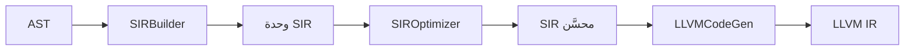

# التمثيل الوسيط SIR

> **ماذا ستتعلّم:** ما هو SIR، ولماذا طبقة وسيطة بين AST وLLVM، وأين تعليماته.

## ما هو SIR؟
**SIR (Sad Intermediate Representation)** تمثيل وسيط يبنيه `SIRBuilder` من AST قبل
توليد LLVM IR. يفصل دلالة لغة ص (الملكية، الأنواع، تدفّق التحكّم) عن تفاصيل LLVM.

## لماذا طبقة وسيطة؟
- **تحسين مستقلّ:** `SIROptimizer` يطبّق تمريرات على SIR.
- **تشخيص أسهل:** SIR dumps أوضح من LLVM IR الخام.
- **عزل:** تغيير الواجهة الخلفيّة (LLVM) لا يَمَسّ منطق بناء SIR.
- **دلالة الملكية:** SIR يدعم تعليمات ملكية (ownership) خاصّة بلغة ص.

## الملفّات
| الملف | المحتوى |
|------|---------|
| `compiler/include/frontend/sir_types.h` | تعداد `SIROpcode` + أنواع SIR (الملكية) |
| `compiler/src/frontend/` | `SIRBuilder` (AST → SIR) + `SIROptimizer` |

## الموضع في الخطّ

## إضافة opcode (الإجراء)
1. أضف `SIROpcode::NEW_OP` إلى `sir_types.h` (**إضافة** فقط — لا تغيّر معنى موجود، CW-24).
2. أنتجه في `SIRBuilder` من العقدة المعنيّة.
3. ترجمه في `compiler/src/backend/llvm/`.
4. اختبار مزدوج (مفسّر + مترجم بنفس المخرَج).

## قواعد دقيقة
- **ترتيب الحقول:** يُحدَّد في `SIRBuilder` (حيث تُبنى البنية) — أصلِح أخطاء الترتيب هنا، لا في codegen (BF-10).
- **لا اقتطاع صامت:** كل تحويل نوع يمرّ عبر دالة مُسمّاة (CW-14).

## تخفيض مطابقة الأنماط (`طابق`)

يُخفَّض `طابق` في الواجهة الأماميّة (`sir_builder_match_patterns.cpp` +
`builders/statement_match.cpp`) — **لا** في الواجهة الخلفيّة. الملفّ الخلفيّ
`pattern_codegen*.cpp` (`generateMatchCode`) **ميّتٌ تمامًا (صفر مستدعٍ)** رغم بقائه في
البناء؛ لا تُضِف إليه.

**مساران للنمط حسب تعقيده:**
- **النمط البسيط** (حرفيّ/متغيّر/شامل/قائمة أحاديّة المستوى): يُحسَب **شرطٌ منطقيٌّ
  مسطّح** لكلّ ذراع (كتلة اختبار تُنتج `condReg`)، ثمّ `br condReg → الجسم / الذراع
  التالي`. الاستخراجات المؤجَّلة (`MatchDeferredField`) تُنفَّذ في كتلة الجسم **بعد**
  التفرّع (آمنة الطول).
- **النمط المركّب المتداخل** (قائمة داخل قائمة، حقل بنية بنمطٍ مركّب): يُوجَّه إلى
  المُطابِق **قاصر الدائرة بالتفريع** `emitPatternMatchShortCircuit` — يفحص الطول/النوع
  ويتفرّع إلى `failLabel` عند الفشل، ثمّ (بعد التحقّق ⇒ آمن) يستخرج الأبناء متعاوِدًا.
  يُفعَّل فقط عند وجود ابنٍ مركّب (`patternHasCompositeChild`) فيبقى كلّ نمطٍ بسيطٍ على
  المسار المسطّح ⇒ صفر انحدار.

> ⚠️ **المترجم بلا وسوم نوعٍ تشغيليّة.** `BUILTIN_IS_ARRAY` ساكنٌ (يفحص نوع LLVM وقت
> الترجمة)، وقراءة خارج الحدود **تُجهِض**. فمطابقة نمطٍ مركّب على قيمةٍ لا يُثبِت نوعها
> ساكنًا كانت تُصدر `ARRAY_LEN` على عددٍ مُعامَلٍ كمؤشّر ⇒ **Segfault**. الحلّ:
> **بوّابات نوعٍ ساكنة صارمة** — لا نزول في ابنٍ مركّب إلّا بنوعٍ مُثبَت (مصفوفة
> للقائمة، كائن للبنية)؛ المجهول (`Void`) ⇒ فشلٌ ساكن ⇒ سقوطٌ آمن إلى `افتراضي`.
> النطاق العامل المؤكَّد: **القوائم المتداخلة المتجانسة النوع**؛ المتباين/العميق/حقل
> البنية حدٌّ معماريّ (`ISSUE-070`) يحتاج وسوم نوعٍ تشغيليّة كـ`ISSUE-045/052`.

> 💡 **فخّ استنتاج نوع العنصر:** المصفوفة الحرفيّة **غير المتجانسة** يجب أن تستنتج
> `elementType=Void` (لا نوع العنصر-الأوّل) وإلّا مرّ عنصرٌ عدديّ من بوّابة القائمة
> فعاود `ARRAY_LEN` عليه (`expression_collections.cpp`). ونمط الباقي `[أ، *بقية]` يُخفَّض
> على أوبكود `BUILTIN_ARRAY_SLICE` المُضمَّن (كـ`م[أ..]`) لا على `CALL` لرمزٍ خارجيّ
> غير معرَّف (`ISSUE-068`).

---
**اقرأ بعده:** [توليد LLVM](llvm.md).
