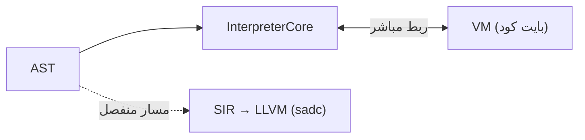

# الآلة الافتراضية (VM)

> **ماذا ستتعلّم:** دور الـVM في لغة ص وعلاقتها بالمفسّر.

## الدور
`vm/` آلة **بايت كود** مرتبطة مباشرةً بالمفسّر — مسار تنفيذ بديل يجمع بين سرعة أعلى من
المشي الشجريّ الصرف ومرونة التفسير، دون المرور بـLLVM/الترجمة الكاملة.

## الموضع

## وقت التشغيل والربط
- `runtime/` يوفّر ABI/FFI مستقلّ (freestanding) + ربط VM.
- القنوات/الخيوط الخفيفة (goroutines) آمنة للتزامن عبر mutex داخليّ في `SadChannel`.

> هذه الطبقة أقلّ سطحًا للمساهمات الجديدة من المفسّر/المترجم؛ ابدأ منهما عادةً.
> هذا الفصل **قيد التوسعة** — ساهم بتفاصيل بنية البايت كود إن عملت عليها.

---
**اقرأ بعده:** [نظام الأنواع](../systems/types.md).
