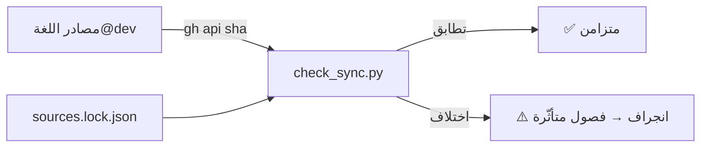

# مزامنة الدليل مع تطوّر اللغة (Freshness)

> **ماذا ستتعلّم:** كيف يبقى هذا الدليل مطابقًا للكود مع تطوّر لغة ص — آليّة كشف
> الانجراف (drift)، بيان الربط، والعقد التعاقديّ على كل مساهمة.

الدليل مرجعٌ داخليّ، وأخطر ما يصيب مرجعًا أن «يكذب بثقة»: شرحٌ أنيق لكودٍ تغيّر.
نُعالج هذا بثلاث طبقات: **بيان ربط** يَصِل كل فصل بمصادره، **كاشف انجراف** يقارن
بصمات المصادر آليًّا، و**عقد مساهمة** يجعل تحديث الدليل جزءًا من تغيير اللغة لا أثرًا
لاحقًا.

## 1) بيان الربط — `sync/sources.yaml`
لكلّ فصلٍ تقنيّ قائمةُ مصادره الحقيقيّة في مستودع اللغة (`sadlang/s-programming-language@dev`):

```yaml
chapters:
  - file: src/frontend/lexer.md
    sources:
      - shared/lexer/src/lexer_core.cpp
      - shared/lexer/include/token.h
      - language-truth/keywords.yaml
```

المسار قد يكون ملفًّا أو مجلدًا (يُرصد أي تغيّر تحته). الحقل `covers_version` يوثّق
نسخة اللغة التي رُوجِع الدليل تجاهها آخر مرّة.

## 2) كاشف الانجراف — `scripts/check_sync.py`
يجلب **بصمة (sha)** كل مصدرٍ من المستودع الرئيسيّ عبر `gh api` (لا يلزم استنساخ)،
ويقارنها بالبصمات المثبَّتة في `sync/sources.lock.json`:

| الأمر | الأثر |
|-------|-------|
| `python scripts/check_sync.py` | يفحص ويُبلّغ؛ يفشل (خروج 1) عند الانجراف |
| `python scripts/check_sync.py --json` | تقرير JSON للأتمتة |
| `python scripts/check_sync.py --update` | يثبّت البصمات الحاليّة بعد مراجعة الدليل |

عند تغيّر مصدر، يطبع الكاشف **الفصول المتأثّرة** (عكسيًّا من البيان)، فتعرف مباشرةً
ما يحتاج مراجعة.



## 3) الأتمتة — `.github/workflows/sync-check.yml`
يعمل **أسبوعيًّا** (الاثنين) و**يدويًّا** (`workflow_dispatch`). عند رصد انجراف
يفتح — أو يحدّث — قضيّةً واحدة بعنوان «🔄 انجراف الدليل عن كود اللغة» تُلخّص المصادر
المتغيّرة والفصول المتأثّرة. هكذا لا يمرّ تطوّرٌ في اللغة دون إشارةٍ مرئيّة.

## 4) العقد على المساهم
- **غيّرتَ سلوكًا في اللغة؟** راجع الفصل المرتبط في الدليل ضمن نفس المراجعة، ثم
  `--update` لتثبيت البصمات. هذا بندٌ في [معيار الإنجاز](definition-of-done.md).
- **أضفتَ نظامًا/ملفًّا مرجعيًّا؟** أضِف فصلًا وسجّل مصادره في `sources.yaml`.
- **بعد كل إصدار لغة:** راجعة شاملة وارفع `covers_version`.

> 💡 القاعدة الذهبيّة: **الكود هو الحقيقة**؛ والدليل بصمةٌ متعقَّبة لتلك الحقيقة، لا
> ذاكرةٌ تتقادم. إن اختلف الشرح عن الكود فالكود هو المرجع — والكاشف يكفل ألّا يدوم
> الاختلاف صامتًا.

---
**اقرأ بعده:** [مسرد المصطلحات](../glossary.md).
