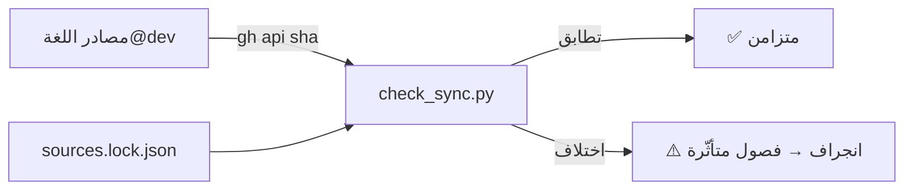

# مزامنة الدليل مع تطوّر اللغة (Freshness)

> **ماذا ستتعلّم:** كيف يبقى هذا الدليل مطابقًا للكود مع تطوّر لغة ص — آليّة كشف
> الانجراف (drift)، بيان الربط، والعقد التعاقديّ على كل مساهمة.

الدليل مرجعٌ داخليّ، وأخطر ما يصيب مرجعًا أن «يكذب بثقة»: شرحٌ أنيق لكودٍ تغيّر.
نُعالج هذا بثلاث طبقات: **بيان ربط** يَصِل كل فصل بمصادره، **كاشف انجراف** يقارن
بصمات المصادر آليًّا، و**عقد مساهمة** يجعل تحديث الدليل جزءًا من تغيير اللغة لا أثرًا
لاحقًا.

## 1) بيان الربط — `sync/sources.yaml`
لكلّ فصلٍ تقنيّ قائمةُ مصادره الحقيقيّة في مستودع اللغة:

```yaml
chapters:
  - file: src/frontend/lexer.md
    sources:
      - { path: shared/lexer/src/lexer_core.cpp, lines: "100-1770" }  # نطاق فقط
      - shared/lexer/include/token.h                                  # ملف كامل
      - language-truth/keywords.yaml
```

المصدر إمّا **مسارٌ كامل** (ملف أو مجلد، يُرصد أيّ تغيّر تحته) أو **كائن `{path, lines}`**
يبصم **نطاقًا بعينه** فقط. النطاق يقلّل **الإنذارات الكاذبة** في الملفّات الكبيرة
(تعديلٌ خارج المنطقة الموثَّقة لا يُطلِق إنذارًا) ويرصد **تعفّن** المنطقة المقصودة تحديدًا.
الحقل `covers_version` يوثّق نسخة اللغة التي رُوجِع الدليل تجاهها (يُرفَع آليًّا عند
مراجعة إصدار: `--update --set-version`).

## 2) كاشف الانجراف — `scripts/check_sync.py`
يجلب **بصمة (sha)** كل مصدرٍ من المستودع الرئيسيّ عبر `gh api` (لا يلزم استنساخ)،
ويقارنها بالبصمات المثبَّتة في `sync/sources.lock.json`:

| الأمر | الأثر |
|-------|-------|
| `python scripts/check_sync.py` | يفحص ويُبلّغ؛ يفشل (خروج 1) عند الانجراف |
| `python scripts/check_sync.py --json` | تقرير JSON للأتمتة |
| `python scripts/check_sync.py --update` | يثبّت البصمات الحاليّة بعد مراجعة الدليل |

عند تغيّر مصدر، يطبع الكاشف **الفصول المتأثّرة** (عكسيًّا من البيان)، فتعرف مباشرةً
ما يحتاج مراجعة.



## 3) الأتمتة — مربوطة بالإصدارات
`.github/workflows/sync-check.yml` يقيس الانجراف تجاه **آخر وسم إصدار** للغة (لا تجاه
`dev` المتقلّب)، فتعني النتيجة «هل يطابق الدليلُ الإصدارَ المنشور؟». يعمل:
- **عند إصدار لغة جديد** (`repository_dispatch: language-release` يطلقه مستودع اللغة)،
- **أسبوعيًّا** (شبكة أمان)، و**يدويًّا** (مع تحديد ref اختياريّ).

عند الانجراف يفتح/يحدّث قضيّةً واحدة «🔄 انجراف الدليل» تُلخّص المصادر المتغيّرة والفصول
المتأثّرة وأمرَ التثبيت الصحيح (مع رفع النسخة إن كان إصدارًا).

## 4) الحُرّاس — ضدّ الكتم الصامت وتعفّن البيان
الكشف وحده لا يكفي؛ يلزم منعُ الالتفاف عليه. حارسان في CI (`ci.yml`) على كل PR:
- **حارس القفل (لا كتم صامت):** يرفض تقدّم أيّ بصمةٍ في `sources.lock.json` **ما لم
  يُعدَّل الفصل المرتبط بها في نفس الـPR**. فلا يصير `--update` زرَّ إسكاتٍ بلا مراجعة.
- **حارس البيان:** يتحقّق (بلا شبكة) من وجود ملفّات الفصول، صحّة نطاقات الأسطر، وأنّ
  **كل فصل تقنيّ في `SUMMARY` مسجَّلٌ** مصادرُه — فلا يَفلت فصلٌ جديد من المظلّة.

## 5) العقد عبر المستودعين
العقد يجب أن يصل لمن **يغيّر اللغة فعلًا** (في مستودع اللغة، لا هنا):
- workflow `dev-guide-sync-reminder` في مستودع اللغة يرصد — على كل PR — تقاطع الملفّات
  المعدَّلة مع المصادر المسجَّلة هنا، فيعلّق تذكيرًا بالفصول المتأثّرة.
- عند نشر إصدار، يطلق المستودعُ `repository_dispatch` لتشغيل فحص المزامنة هنا فورًا.
- وبندٌ في [معيار الإنجاز](definition-of-done.md): راجع الفصل المرتبط ثم ثبّت البصمات.

> 💡 القاعدة الذهبيّة: **الكود هو الحقيقة**؛ والدليل بصمةٌ متعقَّبة لها، لا ذاكرةٌ
> تتقادم. الكاشف يرصد الاختلاف، والحُرّاس يمنعان دفنه صامتًا، والعقد يوصِل المسؤوليّة
> لمصدرها.

---
**اقرأ بعده:** [مسرد المصطلحات](../glossary.md).
