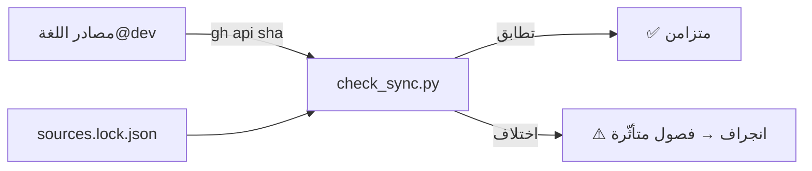

# مزامنة الدليل مع تطوّر اللغة (Freshness)

> **ماذا ستتعلّم:** كيف يبقى هذا الدليل مطابقًا للكود مع تطوّر لغة ص — آليّة كشف
> الانجراف (drift)، بيان الربط، والعقد التعاقديّ على كل مساهمة.

الدليل مرجعٌ داخليّ، وأخطر ما يصيب مرجعًا أن «يكذب بثقة»: شرحٌ أنيق لكودٍ تغيّر.
نُعالج هذا بثلاث طبقات: **بيان ربط** يَصِل كل فصل بمصادره، **كاشف انجراف** يقارن
بصمات المصادر آليًّا، و**عقد مساهمة** يجعل تحديث الدليل جزءًا من تغيير اللغة لا أثرًا
لاحقًا.

## 1) بيان الربط — `sync/sources.yaml`
لكلّ فصلٍ تقنيّ قائمةُ مصادره الحقيقيّة في مستودع اللغة:

```yaml
chapters:
  - file: src/frontend/lexer.md
    sources:
      - { path: shared/lexer/src/lexer_core.cpp, lines: "100-1770" }  # نطاق فقط
      - shared/lexer/include/token.h                                  # ملف كامل
      - language-truth/keywords.yaml
```

للمصدر **أربعةُ أنماطِ بصم**، ولكلٍّ دعوًى يطابقها:

| النمط | الصيغة | يرصد | لا يرصد |
|---|---|---|---|
| مسارٌ كامل | `path/to/file` | أيّ تغيّرٍ في الملفّ/المجلّد | — |
| نطاقُ أسطر | `{path, lines: "10-90"}` | تعفّنَ المنطقة الموثَّقة | تعديلًا خارجها |
| **أسماءُ المدخلات** | `{path, names: true}` | ظهورَ مدخلٍ أو اختفاءَه أو تبدّلَ نوعه | تعديلَ محتوًى داخل المجلّد |
| **مصدرٌ داخليّ** | `self:path` | تغيّرَ أدواتِ الدليل نفسِها (بلا شبكة، ويُقاس في الـPR) | — |

> بصمةُ `self:` تُحسب على الأسطر مُطبَّعةً (`\n`)، فلا تنقلب بتبديل CRLF/LF بين
> ويندوز ولينكس — مقيسٌ لا مفترَض. وبصمةُ `names` الداخليّة **تُشتقّ من `git
> ls-tree` لا من مسحِ القرص**، فلا تدخلها مخرجاتُ البناء ولا `.venv` ولا ملفّاتُ
> خطوةِ الحارسِ نفسِها (قِيس: جذرُ مستودعِ اللغة ٤٣ مدخلًا في git و٧٠ على القرص).
>
> وقاعدةٌ تسري على الأنماط كلِّها: **العدمُ ليس قياسًا.** مجلّدٌ فارغ · نطاقٌ خارجَ
> الملفّ · ردٌّ فارغٌ من `gh` · مجلّدٌ تجاوز سقفَ ١٠٠٠ مدخلٍ في `contents` API —
> كلُّها تُقرأ «متعذّرًا» يحمرّ، لا بصمةً تُثبَّت. لولا ذلك لأنتجت هذه الحالاتُ
> **بصمةً واحدةً مشتركة** (`sha256:e3b0c442…`)، فيحمرُّ الفحصُ مرّةً ثمّ يثبّتها
> `--update`، ويبقى المصدرُ أخضرَ إلى الأبد وهو غيرُ مقيسٍ أصلًا.

النطاق يقلّل **الإنذارات الكاذبة** في الملفّات الكبيرة (تعديلٌ خارج المنطقة الموثَّقة لا
يُطلِق إنذارًا) ويرصد **تعفّن** المنطقة المقصودة تحديدًا.

نمط **`names`** هو الوحيد الذي يطابق دعوى «هذا المجلّد يحوي كذا وكذا» — وهي دعوى
`repo-map.md` و`overview.md`. المقيسُ يُبيّن لِمَ لا تصلح بصمةُ الشجرة (tree sha) لها:
بين إيداعَين على `dev` تباعدا ٢٥٠ إيداعًا، انقلبت بصمةُ شجرة `tools/` وبقيت أسماءُ
مدخلاتها **كما هي** — أي إنذارٌ أسبوعيٌّ دائمٌ بلا واقعة. وفي المدّة نفسِها التقط
النمطُ في `stdlib/` ما يجب التقاطُه بالضبط: **اختفاء** `async` و`audio3d` و`crypto`
و`embedded` و**ظهور** `جيسون.ص`. ويُكتب `path: "."` لبصم جذر المستودع — فعودةُ `vm/`
أو ظهورُ جزءٍ جديدٍ تُنذر خريطةَ المستودع.

ونمط **`self:`** يبصم من **هذا المستودع** لا من مستودع اللغة، لأنّ فصلًا كهذا يوثّق
`check_sync.py` و`sync-check.yml` أنفسَهما. وسببُه واقعة: أُصلح افتراضُ المرجع في
الأداة، وبقي هذا الفصلُ يصف الافتراضَ المنقوض في اليوم نفسِه — بلا كاشف. الآن أيُّ
تعديلٍ في الأداتين يُنذر الفصلَ الذي يصفهما.

الحقل `covers_version` يوثّق **حالة اللغة التي رُوجِع الدليل تجاهها**. ولمّا كان
`ref: dev` — لا وسمَ إصدارٍ — فصيغتُه اليوم `dev@<إيداع مختصر>` (مثلًا
`dev@1138f5e1`)، أدقُّ من رقم semver لأنّها تسمّي **الإيداع** الذي قِيست عنده
البصمات لا إصدارًا مُتخيَّلًا. و`--update` **يشتقّه** من `git ls-remote` عند
المرجع المقيس بدل نسخِه من البيان — فلا يصير عددًا منثورًا صادقًا بالمصادفة؛
و`--set-version` يتقدّم عليه حين تُثبِّت عند وسمِ إصدار. لا يقيّده مخطّطٌ ولا يقرؤه حارس؛
مستهلِكُه الوحيد نصُّ قضيّة `sync-check.yml` الذي يطبعه كما هو.

## 2) كاشف الانجراف — `scripts/check_sync.py`
يجلب **بصمة (sha)** كل مصدرٍ من المستودع الرئيسيّ عبر `gh api` (لا يلزم استنساخ)،
ويقارنها بالبصمات المثبَّتة في `sync/sources.lock.json`:

| الأمر | الأثر |
|-------|-------|
| `python scripts/check_sync.py` | يفحص ويُبلّغ؛ يفشل (خروج 1) عند الانجراف |
| `python scripts/check_sync.py --json` | تقرير JSON للأتمتة |
| `python scripts/check_sync.py --update` | يثبّت البصمات الحاليّة بعد مراجعة الدليل |

عند تغيّر مصدر، يطبع الكاشف **الفصول المتأثّرة** (عكسيًّا من البيان)، فتعرف مباشرةً
ما يحتاج مراجعة.


```mermaid
flowchart LR
  SRC["مصادر اللغة@dev"] -->|gh api sha| CHK["check_sync.py"]
  LOCK["sources.lock.json"] --> CHK
  CHK -->|تطابق| OK["✅ متزامن"]
  CHK -->|اختلاف| DRIFT["⚠️ انجراف → فصول متأثّرة"]
```

## 3) الأتمتة
`.github/workflows/sync-check.yml` يقيس الانجراف تجاه **مرجع القفل نفسِه**
(`sources.lock.json`.ref — اليوم `dev`)، لأنّ البصمات أُخذت عنده، فقياسُها عند مرجعٍ
سواه يقارن شيئًا بغيره. (كان الافتراضُ «آخر وسم إصدار»، فأعلن التقريرُ عند `v1.0.0`
حذفَ ٣٠ مسارًا وتعذّرَ ٤٧ — وكلّها قائمةٌ سليمةٌ على `dev` — فصار الإنذارُ ضجيجًا لا
يُقرأ؛ القضيّة #1 شاهدُه.) ولقياس الدليل تجاه إصدارٍ منشور: أعِد البصم عند وسمِه
(`--ref vX --update --set-version X`) فيصير هو مرجعَ القفل. يعمل:
- **عند إصدار لغة جديد** (`repository_dispatch: language-release` يطلقه مستودع اللغة)،
- **أسبوعيًّا** (شبكة أمان)، و**يدويًّا** (مع تحديد ref اختياريّ).

عند الانجراف يفتح/يحدّث قضيّةً واحدة «🔄 انجراف الدليل» تُلخّص المصادر المتغيّرة والفصول
المتأثّرة وأمرَ التثبيت الصحيح (مع رفع النسخة إن كان إصدارًا).

## 4) الحُرّاس — ضدّ الكتم الصامت وتعفّن البيان
الكشف وحده لا يكفي؛ يلزم منعُ الالتفاف عليه. حارسان في CI (`ci.yml`) على كل PR:
- **حارس القفل (لا كتم صامت):** يرفض تقدّم أيّ بصمةٍ في `sources.lock.json` **ما لم
  يُعدَّل الفصل المرتبط بها في نفس الـPR**. فلا يصير `--update` زرَّ إسكاتٍ بلا مراجعة.
  ويقيس **الاتّجاهين**: التقدّمَ و**الإسقاط**. فإزالةُ مصدرٍ من البيان ثمّ `--update`
  كتمٌ صامتٌ من البابِ المقابل — يُقتَل الكاشفُ لفصولٍ كاملةٍ بلا مراجعةِ حرف. ولمّا
  كان المفتاحُ المُسقَط لا أثرَ له في البيان الحاليّ، تُقرأ فصولُه من **بيان
  الأساس** عبر `--base-manifest`؛ وإن لم يُمرَّر، احمرّ الحارسُ ولم يمرّ: الحارسُ
  الذي لا يجد ما يقيس به لا يقول «مرّ».
- **حارس البيان:** يتحقّق (بلا شبكة) من وجود ملفّات الفصول، صحّة نطاقات الأسطر،
  وسلامةِ النمطين الجديدين (`names` و`lines` لا يجتمعان؛ ومصدرُ `self:` موجودٌ فعلًا)،
  وأنّ **كلّ فصلٍ في `SUMMARY`** تحت الأقسام السبعة `frontend/` · `backend/` ·
  `systems/` · `sot/` · `architecture/` · `getting-started/` · `contributing/`
  له مصادرُ. كانت المظلّةُ أربعةَ أقسامٍ فقط، فبقيت الثلاثةُ الأخيرة — وهي حاملةُ
  دعاوى الأوامرِ التي يُشغّلها القارئ — **خارجها كلّيًّا** حتّى تعفّنت. (المرجع:
  `GUARDED_SECTIONS` في `scripts/check_sync.py`.)
  صفحاتُ الجذر (`introduction` · `glossary` · `status` · `SUMMARY`) خارج المظلّة
  عمدًا: دعاواها عن الدليل لا عن اللغة. ومنها ما يُسجَّل **طوعًا** حين يحمل دعوًى
  مقيسة — كـ`glossary.md` وأسماءِ الثنائيّات.
  ويقيس هذا الحارسُ كذلك **تعفّنَ مصادر `self:` في نفس الـPR**: هي بلا شبكة، فلا
  عذرَ لتأجيلها إلى الفحص الأسبوعيّ. فلو عُدِّل `check_sync.py` وحده دون تثبيتٍ
  ومراجعةِ هذا الفصل، احمرّ الـPR — لا مرّ أخضرَ وفصلُه يصفُ سلوكًا منقوضًا (وهي
  عينُ الواقعة التي وُلد منها النمط). و**غيابُ القفل نفسِه خطأٌ صريح** في
  `--validate` و`--guard-lock` كليهما: حذفُ ملفٍّ واحدٍ كان يُطفئ البوّابةَ صامتةً
  وخضراء. وحين يَنقص البيانُ فصلًا محروسًا، يُختَم السجلُّ بـ`❌` لا بـ`✅` —
  لأنّ مَن يمسح سجلَّ CI بعينه يقرأ آخرَ سطرٍ حكمًا.

## 5) العقد عبر المستودعين
العقد يجب أن يصل لمن **يغيّر اللغة فعلًا** (في مستودع اللغة، لا هنا):
- workflow `dev-guide-sync-reminder` في مستودع اللغة يرصد — على كل PR — تقاطع الملفّات
  المعدَّلة مع المصادر المسجَّلة هنا، فيعلّق تذكيرًا بالفصول المتأثّرة.
- عند نشر إصدار، يطلق المستودعُ `repository_dispatch` لتشغيل فحص المزامنة هنا فورًا.
- وبندٌ في [معيار الإنجاز](definition-of-done.md): راجع الفصل المرتبط ثم ثبّت البصمات.

> 💡 القاعدة الذهبيّة: **الكود هو الحقيقة**؛ والدليل بصمةٌ متعقَّبة لها، لا ذاكرةٌ
> تتقادم. الكاشف يرصد الاختلاف، والحُرّاس يمنعان دفنه صامتًا، والعقد يوصِل المسؤوليّة
> لمصدرها.

---
**اقرأ بعده:** [مسرد المصطلحات](../glossary.md).
