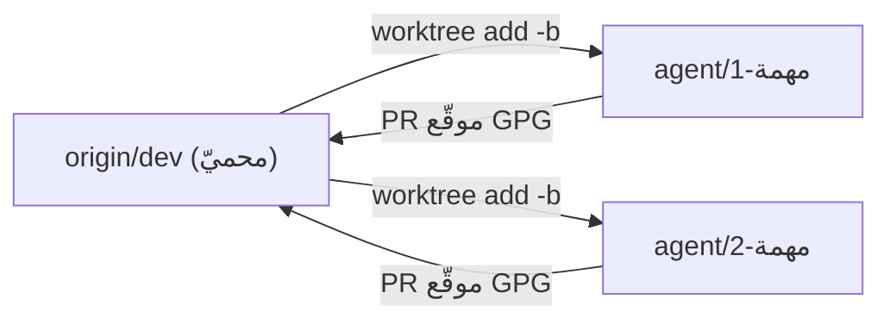

# سير عمل الفروع (dev · worktrees · PR)

> **ماذا ستتعلّم:** كيف تعمل على لغة ص بأمان عبر فروع معزولة، وتدمج في `dev` المحميّ.

## النموذج
العمل يتكامل في فرع **`dev`** (لا `graphic`). كلا الفرعين **محميّ على GitHub**
(Rulesets: `dev`=`17779574`، `graphic`=`16775713`) بقواعد متطابقة:
منع الحذف · منع force-push · تاريخ خطّيّ · **توقيع GPG إلزاميّ** · **PR إلزاميّ**.
المستودع: **`sadlang/s-programming-language`**.

> 🔑 **القاعدة الذهبية:** لا تُودِع/تدفع مباشرةً على `dev` أو `graphic` — كل تغيير عبر **PR**
> من فرع `agent/*` معزول في **git worktree**.

## لماذا worktrees؟
كل وكيل/مهمّة يأخذ **مجلدًا فرعيًّا = فرعًا** يشارك نفس `.git` (لا استنساخ). تبديل فرع
المستودع الرئيسيّ لا يمسّ عملك المعزول. الموطن: `C:/s_lang/temp-brunch/`.



## الخطوات
```bash
# 1) فرع معزول من dev
cd /c/s_lang/s-programming-language
git fetch origin
git worktree add /c/s_lang/temp-brunch/<مهمة> -b agent/<مهمة> origin/dev

# 2) العمل + الإيداع (موقّع GPG تلقائيًّا)
cd /c/s_lang/temp-brunch/<مهمة>
git add -A && git commit -m "وصف"

# 3) دفع + PR إلى dev (بعد اجتياز DoD)
git push -u origin agent/<مهمة>
gh pr create --base dev --head agent/<مهمة> --title "<عنوان>" --body "<وصف + قائمة الملفّات + نتائج runner>"
gh pr merge --merge

# 4) تنظيف بعد الدمج
cd /c/s_lang/s-programming-language
git worktree remove /c/s_lang/temp-brunch/<مهمة> && git branch -D agent/<مهمة>
```

## التوقيع GPG (إلزاميّ على dev/graphic)
```bash
git config commit.gpgsign true
git config user.signingkey <KEY_ID>     # مفتاح GPG مُهيّأ
```
commit غير موقّع يُرفَض عند الدمج (`required_signatures`).

## ممنوعات
❌ `git push origin dev` مباشرةً (محظور) · ❌ العمل في المجلد الأساسي على `dev`/`graphic`
· ❌ commit غير موقّع · ❌ خلط مهمّتين في worktree واحد · ❌ نسيان تنظيف الworktree.

> مرجع الحماية: `.github/BRANCH_PROTECTION_POLICY.md` و`C:/s_lang/temp-brunch/README.md`.

---
**اقرأ بعده:** [معيار الإنجاز](definition-of-done.md).
