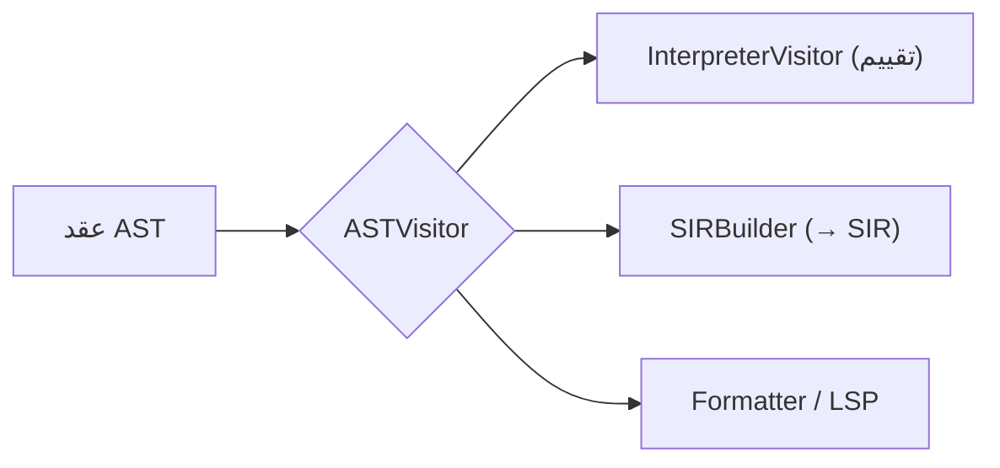

# شجرة AST

> **ماذا ستتعلّم:** كيف تُمثَّل البرامج كشجرة، ونمط الزائر (Visitor) الذي يستهلكها.

## الدور
`shared/ast/` يُعرّف عقد الشجرة المجرّدة التي يبنيها المحلل النحوي ويستهلكها المفسّر
والمترجم. القاعدة `ASTNode`، ومنها `Statement` (جمل) و`Expression` (تعابير).

## أنواع العقد (أمثلة)
- **جمل:** `IfStmt`, `WhileStmt`, `ForRangeStmt`, `ReturnStmt`, `BlockStmt`, `TryStmt`, `SwitchStmt`, `MatchStmt`, `ExprStmt`، تصريحات (`FunctionDecl`, `ClassDecl`, `VarDeclStmt`, `EnumDecl`, `StructDecl`, …).
- **تعابير:** `BinaryExpr`, `UnaryExpr`, `CallExpr`, `MethodCallExpr`, `MemberExpr`, `IndexExpr`, `LiteralExpr`, `VariableExpr`, `LambdaExpr`, `TernaryExpr`, `RangeExpr`, `ArrayExpr`, `MapExpr`, `NewExpr`, `ThisExpr`/`SuperExpr`, `AwaitExpr`، …

> العقدة المُنتَجة لكل قاعدة نحويّة مُوثَّقة في حقل `ast_node` بمصدر القواعد. → [grammar SoT](../sot/grammar-sot.md).

## نمط الزائر (Visitor)
العقد تُستهلَك عبر `ASTVisitor` (في `shared/ast/include/ast_visitor.h`): كل مستهلِك
(مفسّر، `SIRBuilder`، منسّق، LSP) يطبّق الزائر. هذا يحقّق **مبدأ المفتوح/المغلق**:
أضف مستهلِكًا جديدًا دون تعديل العقد.

## إضافة عقدة AST
1. عرّف الصنف في `shared/ast/include/` (ورث من `Statement`/`Expression`).
2. أضف تصريحها في `ast_visitor.h` ودالة الزيارة.
3. نفّذ الزيارة في المفسّر (`interpreter/include/visitors/`) و`compiler/src/frontend/`.
4. **التوافق الخلفيّ:** إضافة عقدة مسموحة — تغيير معنى عقدة موجودة ممنوع (CW-24).

## ملاحظات
- مرّر العقد الكبيرة بمرجع/مؤشّر ذكيّ؛ لا نسخ عميق إلا عبر `clone()` صريح (CW-29).
- `Value` (وقت التشغيل) منفصل عن عقد AST — راجع [نظام الأنواع](../systems/types.md).

---
**اقرأ بعده:** [المفسّر الشجري](../backend/interpreter.md).
