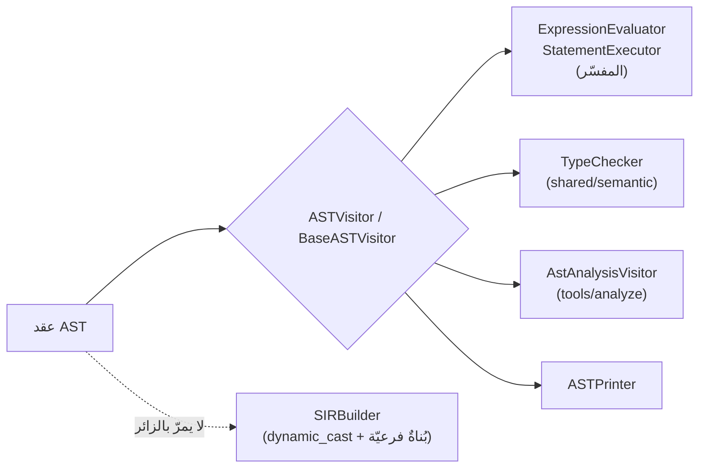

# شجرة AST

> **ماذا ستتعلّم:** كيف تُمثَّل البرامج كشجرة، ونمط الزائر (Visitor) الذي يستهلكها —
> ومَن يطبّقه فعلًا ومَن لا يطبّقه رغم أنّه يستهلك الشجرة.

> 📎 المصدر: [`shared/ast/include/ast_visitor.h`](https://github.com/sadlang/s-programming-language/blob/dev/shared/ast/include/ast_visitor.h)

## الدور
`shared/ast/` يُعرّف عقد الشجرة المجرّدة التي يبنيها المحلل النحوي ويستهلكها المفسّر
والمترجم. القاعدة `ASTNode`، ومنها `Statement` (جمل) و`Expression` (تعابير).

## أنواع العقد
الواجهة [`ASTVisitor`](https://github.com/sadlang/s-programming-language/blob/dev/shared/ast/include/ast_visitor.h#L158)
تصرّح **٩٥ دالّة زيارة** — واحدةً لكلّ نوع عقدة. فهذا العدد هو **إحصاء أنواع العقد
نفسه**، لا تقديرًا: العقدة التي لا دالّةَ لها لا تُزار.

> ⚠️ **٩٠ صرفة و٥ لها جسمٌ فارغ.** ليست الخمسُ والتسعون كلُّها `= 0`: خمسٌ منها
> (`visitEnumVariantExpr` · `visitAsmBlockStmt` · `visitUIStateDecl` ·
> `visitUIConditional` · `visitUILoop`) صُرِّحت بجسمٍ فارغ `{}` داخل `ASTVisitor`
> نفسِها. فالزائرُ الذي يُهملها **يُصرَّف بلا شكوى** — وهذا بالضبط بابُ السلوك
> الصامت الذي يحرسُه `= 0` في الباقي.

| العائلة | أمثلة |
|---|---|
| **تعابير** | `BinaryExpr` · `UnaryExpr` · `TernaryExpr` · `LiteralExpr` · `VariableExpr` · `AssignExpr` · `CallExpr` · `IndexExpr` · `MemberExpr` · `ArrayExpr` · `MapExpr` · `LambdaExpr` · `RangeExpr` · `SliceExpr` · `TupleExpr` |
| **ملكيّة وتزامن** | `BorrowExpr` (استعارة) · `AwaitExpr` · `WalrusExpr` |
| **أمان العدم** | `OptionalChainExpr` (`?.`) · `NullCoalesceExpr` (`??`) · `ErrorPropagateExpr` (`انشر`) |
| **استيعابات** | `ListComprehensionExpr` · `DictComprehensionExpr` · `SetComprehensionExpr` · `GeneratorExpr` |
| **توجيهات `@`** | `UnsafeBlockStmt` (`@غير_آمن`) · `ComptimeBlockStmt` (`@وقت_الترجمة`) · `SizeofExpr` (`@حجم`) · `AtomicExpr` (`@ذري`) · `VolatileVarDeclStmt` (`@متطاير`) · `AsmBlockStmt` (كتلة «تجميع … نهاية») · `InlineAsmExpr` |
| **كائنيّة** | `NewExpr` · `MemberAccessExpr` · `MemberAssignExpr` · `IndexAssignExpr` · `MethodCallExpr` · `ThisExpr` · `SuperExpr` · `ClassDeclStmt` |
| **جمل** | `ExprStmt` · `VarDeclStmt` · `IfStmt` · `WhileStmt` · `ForStmt` · `ForRangeStmt` · `SwitchStmt` · `MatchStmt` · `ReturnStmt` · `YieldStmt` · `BreakStmt` · `ContinueStmt` · `BlockStmt` · `TryStmt` · `RaiseStmt` · `WithStmt` · `DeferStmt` (تنظيفٌ مضمون) · `GoStmt` · `SelectStmt`/`SelectCase` |
| **تصريحات** | `FunctionDecl` · `ClassDecl` · `FieldDecl` · `MethodDecl` · `PropertyDecl` · `ConstructorDecl` · `DestructorDecl` · `EnumDecl` · `StructDecl` · `TestDecl` · `ImportStmt`/`FromImportStmt` · `ExportStmt`/`ExportDecl`/`ReExportStmt` |
| **قوالب وعموميّات** | `TemplateFunctionDecl` · `TemplateClassDecl` · `TemplateInstantiation` · `NamespaceDecl` · `OperatorDecl` · `TraitDecl` · `ImplDecl` · `ExtensionDecl` · `MacroDecl` · `TypeAliasDecl` · `TupleDestructureStmt` |
| **تعدادٌ بحمولة** | `EnumVariantExpr` — بناء عضو تعداد بحمولة (ADT) |
| **واجهة SadUI** | `UIDeclaration` · `UIWidgetExpr` · `UIModifier` · `UIEventHandler` · `UIStateDecl` · `UIConditional` · `UILoop` |
| **مزخرِفات** | `DecoratorExpr` |

> العقدة المُنتَجة لكل قاعدة نحويّة مُوثَّقة في حقل `ast_node` بمصدر القواعد. → [grammar SoT](../sot/grammar-sot.md).

## نمط الزائر (Visitor)
العقد تُستهلَك عبر `ASTVisitor` (الواجهة الصرفة) و`BaseASTVisitor` (يرثها ويعطي
تطبيقًا فارغًا لكلّ دالّة، فيَشتقّ منه الزائرُ ويعيد تعريف ما يحتاجه فقط). هذا يحقّق
**مبدأ المفتوح/المغلق**: أضف مستهلِكًا جديدًا دون تعديل العقد.

```mermaid
flowchart LR
  AST["عقد AST"] --> V{"ASTVisitor / BaseASTVisitor"}
  V --> EE["ExpressionEvaluator<br/>StatementExecutor<br/>(المفسّر)"]
  V --> TC["TypeChecker<br/>(shared/semantic)"]
  V --> AN["AstAnalysisVisitor<br/>(tools/analyze)"]
  V --> PR["ASTPrinter"]
  AST -.->|"لا يمرّ بالزائر"| SB["SIRBuilder<br/>(dynamic_cast + بُناةٌ فرعيّة)"]
```

**مَن يطبّق الزائر فعلًا** (مقيسٌ على `dev`):
`interpreter/include/visitors/expression_evaluator.h` · `.../statement_executor.h` ·
`shared/semantic/include/semantic/type_checker.h` · `tools/analyze/include/ast_analysis_visitor.h` ·
`ast_printer.h`.

> ⚠️ **`SIRBuilder` ليس زائرًا.** الواجهةُ الأماميّة للمترجم تستهلك الشجرة، لكنّها لا
> ترثُ `ASTVisitor`: [`class SIRBuilder : public SIRBuilderContext`](https://github.com/sadlang/s-programming-language/blob/dev/compiler/include/frontend/sir_builder.h#L182)،
> مدخلُها `buildModule(ProgramNode*)`، وتوزيعُها على أنواع العقد بـ`dynamic_cast`
> (٦٨٠ سطرًا تحوي `dynamic_cast` في ٣٧ ملفًّا تحت `compiler/src/frontend/`)
> عبر بُناةٍ فرعيّةٍ `friend`
> (`StatementBuilder` · `ExpressionBuilder` · `ClassBuilder` · `CallBuilder` · …).
> ولا يطبّقه منسّقٌ ولا LSP اليوم. أثرُ ذلك عمليٌّ: إضافةُ دالّة `visit` **لا** تصل
> المترجمَ من تلقائها — لا مترجمَ يشكو، وإنّما تسقط العقدةُ في `dynamic_cast` غيرِ
> مطابقٍ ⇒ سلوكٌ صامت.

## إضافة عقدة AST
1. عرّف الصنف في `shared/ast/include/` (ورث من `Statement`/`Expression`).
2. أضف تصريحها المسبق ودالّة `visit<Node>` **الصرفة** في `ASTVisitor`، وتطبيقًا فارغًا
   في `BaseASTVisitor` — وإلّا كسرتَ كلّ الزوّار دفعةً واحدة. ولا تُقلِّدها بالخمسِ
   ذواتِ الجسمِ الفارغ: هنّ استثناءٌ قائم، لا قدوة.
3. نفّذ الزيارة في زائرَي المفسّر (`interpreter/include/visitors/`) وفي `TypeChecker`.
4. أضف فرعَ `dynamic_cast` في بُناة `compiler/src/frontend/` — **يدويًّا**، فالمترجمُ
   لا يذكّرك بها (انظر التحذير أعلاه).
5. **التوافق الخلفيّ:** إضافة عقدة مسموحة — تغيير معنى عقدة موجودة ممنوع (CW-24).

## ملاحظات
- مرّر العقد الكبيرة بمرجع/مؤشّر ذكيّ؛ لا نسخ عميق إلا عبر `clone()` صريح (CW-29).
- `Value` (وقت التشغيل) منفصل عن عقد AST — راجع [نظام الأنواع](../systems/types.md).

---
**اقرأ بعده:** [المفسّر الشجري](../backend/interpreter.md).
