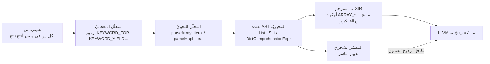
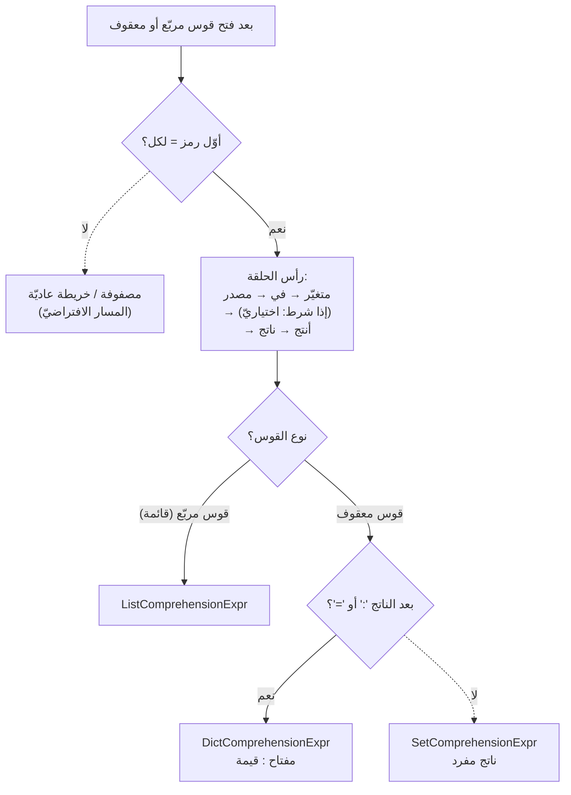
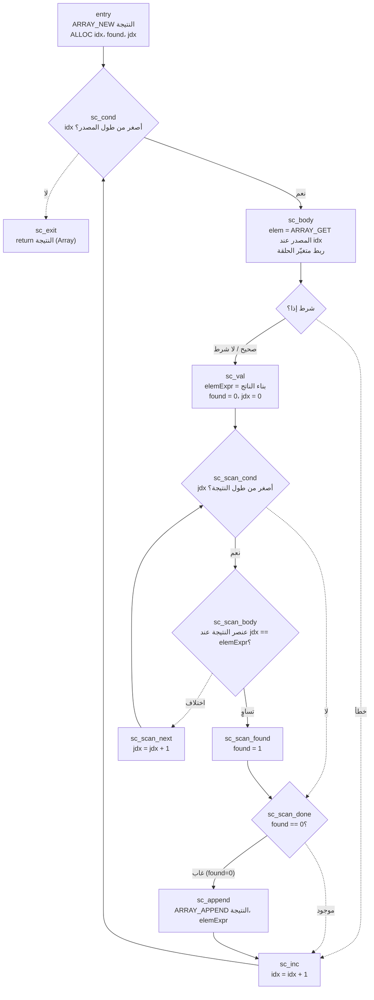
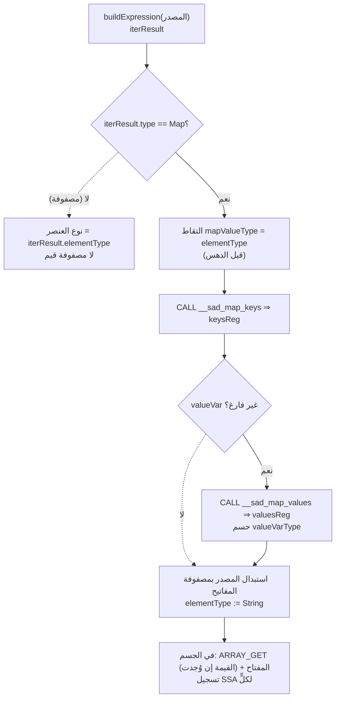

# دراسة حالة: الاستيعابات (من `أنتج` إلى SIR)

مثالٌ متكامل على تمرير ميزة لغويّة عبر خطّ الأنابيب: كيف تُحلَّل الاستيعابات (قوائم/
مجموعات/قواميس) بترتيب `أنتج` العربيّ، وتُبنى في AST، وتُنفَّذ في المحرّكين. المرجع
اللغويّ للمستخدم في [sadlang-docs](https://github.com/sadlang/sadlang-docs)؛ هذه
الصفحة للمساهم في **التنفيذ**.

الصيغة: `[لكل <متغيّر> في <مصدر> [إذا <شرط>] أنتج <ناتج>]` (والمعقوفة `{}` للمجموعة/
القاموس). أُقرّت في RFC 25 (م1ب).

> **المبدأ الأهمّ:** التغيير في **المحلّل فقط**. عقد AST لم تتغيّر (نفس الحقول)، فلم
> يُمَسّ المفسّر ولا المترجم في *بناء العقدة* — فقط **ترتيب القراءة** انقلب. هذا يقلّل
> سطح التغيير جذريًّا ويحافظ على تكافؤ المحرّكين.

## خطّ الأنابيب: عقدة AST هي المحور

عقدة الاستيعاب هي **نقطة الالتقاء** بين المحرّكين: المحلّل يبنيها مرّة، ثمّ يستهلكها
المفسّر (تقييم مباشر) والمترجم (توليد SIR) كلٌّ على حدة. ولأنّ التغيير لم يمسّ العقدة،
بقي الطرفان متكافئين تلقائيًّا — وهذا ما تفرضه اختبارات التكافؤ المزدوج.

---

## 1) المحلّل: كشف مبكّر + تمييز

الاستيعاب يُكتشَف **مبكّرًا** عبر `لكل` (KEYWORD_FOR) في أوّل المحتوى، قبل تحليل أيّ
تعبير — فلا لبس مع مصفوفة/خريطة عاديّة:

- القائمة:
  [`ParserCore::parseArrayLiteral`](https://github.com/sadlang/s-programming-language/blob/dev/shared/parser/src/statements/parser_advanced.cpp)
  — إن كان أوّل رمز `لكل`: `في` → مصدر → `[إذا شرط]` → `أنتج` → ناتج → `]`.
- المجموعة/القاموس:
  [`ParserCore::parseMapLiteral`](https://github.com/sadlang/s-programming-language/blob/dev/shared/parser/src/statements/parser_advanced.cpp)
  — بعد `أنتج` يُحلَّل الناتج الأوّل بـ`parseTernary` (لتجنّب التهام `:`)، ثمّ:
  **وجود `:` (أو `=`) ⇒ قاموس** (نُحلّل القيمة)، **غيابها ⇒ مجموعة**.

`أنتج` = `KEYWORD_YIELD` **السياقيّة الموجودة أصلًا** (تُستعمَل أيضًا للتوليد)، فلا
تعديل على [`keywords.yaml`](https://github.com/sadlang/s-programming-language/blob/dev/language-truth/keywords.yaml).
شرط القبول: `match(KEYWORD_YIELD) || matchContextual(KEYWORD_YIELD)` (في الكود حارسٌ
منفيّ: `if (!match(...) && !matchContextual(...)) error`).

الفائدة من الكشف المبكّر: **نظرة أمام برمز واحد** (`لكل` أوّلًا) تحسم أنّ ما بين
الأقواس استيعابٌ لا مصفوفة/خريطة — **بلا تراجُع** (backtracking) ولا تحليل تخمينيّ.
والتمييز بين قائمة ومجموعة وقاموس يتأخّر إلى نقطتين حاسمتين فقط: نوع القوس، ووجود
`:` بعد الناتج.

> **فخّ:** الترتيب البايثونيّ القديم (`[تعبير لكل …]`) لم يعد يُبنى كاستيعاب — يُحلَّل
> كمصفوفة عاديّة ثمّ يتعثّر عند `لكل`. حُذفت دالّتا `parseListComprehension`/
> `parseDictComprehension` القديمتان من **مسار المحلّل الحيّ** (`parser_helpers.cpp`).
> (تبقى نسخة بالترتيب القديم في `shared/parser/src/specs/flow/parser_comprehension.cpp`
> لكنّها نموذج ميت **غير مُترجَم** — لا إحالة إليه في CMake؛ يُنظَّف في طور لاحق.)

---

## 2) عقد AST (لم تتغيّر)

في [`shared/ast/include/expressions.h`](https://github.com/sadlang/s-programming-language/blob/dev/shared/ast/include/expressions.h)
(لا `comprehension_nodes.h` الميت):

| العقدة | الحقول |
|---|---|
| `ListComprehensionExpr` | `element`، `variable`، `valueVariable`، `iterable`، `condition` |
| `SetComprehensionExpr` | `expression`، `variable`، `valueVariable`، `iterable`، `condition` |
| `DictComprehensionExpr` | `key`، `value`، `variable`، `valueVariable`، `iterable`، `condition` |

الحقل `valueVariable` (افتراضيّ فارغ) أُضيف لدعم **فكّ الزوج** على الخرائط
(`لكل مفتاح، قيمة في خريطة`) — انظر قسم **«فكّ الزوج والتكرار على الخرائط»** أدناه.
يبقى فارغًا في الصيغة المفردة، فلا يتأثّر أيّ مستهلك قائم.

---

## 3) الواجهة الخلفيّة: التوليد في SIR

بانيات الاستيعاب في `compiler/src/frontend/builders/`:

- **القائمة والقاموس** —
  [`expression_comprehensions.cpp`](https://github.com/sadlang/s-programming-language/blob/dev/compiler/src/frontend/builders/expression_comprehensions.cpp):
  `buildExprListComp` يستعمل أوكواد المصفوفة المُلوَّنة في الخلفيّة
  (`ARRAY_NEW`/`ARRAY_LEN`/`ARRAY_GET`/`ARRAY_APPEND`)، و`buildExprDictComp` يستعمل
  `__sad_map_create` + `__sad_map_set_typed` (نفس مسار الخريطة الحرفيّة). هذا هو
  الإصلاح التاريخيّ لـISSUE-016/017 (بدل نداءات رموز وقت تشغيل غير معرَّفة).
- **المجموعة** —
  [`expression_comp2.cpp`](https://github.com/sadlang/s-programming-language/blob/dev/compiler/src/frontend/builders/expression_comp2.cpp):
  `buildExprSetComp`. المجموعة = **مصفوفة بعناصر فريدة** (كالمفسّر). يستعمل نفس أوكواد
  المصفوفة **زائد حلقة مسح داخليّة لإزالة التكرار**: يبني قيمة الناتج، يمسح مصفوفة
  النتيجة، ويضيف عبر `ARRAY_APPEND` **فقط إن غابت القيمة**. إزالة التكرار على **قيمة
  الناتج** (لا متغيّر الحلقة) — مطابقةً للمفسّر.

> **لماذا بانٍ منفصل للمجموعة؟** إزالة التكرار تُدخِل حلقة مسح داخليّة متداخلة
> (كتل `scan_cond`/`scan_body`/`scan_found`/`scan_next`/`scan_done`/`append`) تضاعف
> حجم البانِي، فلا تتقاسم بنية List/Dict المستقيمة؛ ويشارك الملفّ `buildExprGenerator`.

نقاط تنفيذ دقيقة في بانِي المجموعة:

- علَم «موجود» وعدّاد المسح الداخليّ يُخصَّصان بـ`ALLOC` **مرّة في كتلة الدخول** (قبل
  الحلقة الخارجيّة) — لا داخل الجسم — تفاديًا لتسريب مكدس (alloca متكرّر لكلّ عنصر).
- هيمنة SSA محفوظة: `elemExprResult` يُعرَّف في كتلة القيمة التي تُهيمِن على عنقود
  المسح والإضافة؛ `curIdxReg` يُعرَّف في كتلة الشرط التي تُهيمِن على الجسم والزيادة.

### الرسم البيانيّ للتحكّم (CFG) لبانِي المجموعة

حلقتان متداخلتان: **خارجيّة** تمرّ على المصدر (`sc_cond` → `sc_body` → … → `sc_inc`)،
و**داخليّة** تمسح مصفوفة النتيجة لكلّ عنصر (`sc_scan_*`) وتضيف عبر `ARRAY_APPEND`
فقط إن غابت القيمة. التعقيد O(ن²) في أسوأ حالة (مقبول لأحجام الاستيعاب المعتادة، ومطابق
لدلالة «أضِف-إن-غاب» في المفسّر). العلَم `found` والعدّاد `jdx` يُخصَّصان في `entry`
(لا في الحلقة) فلا تسريب مكدس:

> **حدّ معروف:** مقارنة إزالة التكرار (`EQ`) **عدديّة** (كبقيّة بنية الاستيعابات
> عدديّة النوع)، فالمجموعات الصحيحة الإزالة للأعداد؛ مجموعات النصوص/العشريّ تتباعد
> صامتًا حتى يُعمَّم النوع في الاستيعابات الثلاثة.

> **فخّ متبقٍّ:** `buildExprGenerator` في نفس الملفّ ما زال بالنهج المكسور (`CALL
> __sad_len`/`__sad_array_push` غير المعرَّفة) — سينهار الربط متى استُخدم مولِّد؛ خارج
> نطاق م1ب، يُتابَع بنفس نمط الإصلاح.

---

## فكّ الزوج والتكرار على الخرائط (RFC 25 التعارض 1أ)

توسعة تجعل **مصدر الاستيعاب خريطةً** لا مصفوفةً، وتضيف صيغة فكّ الزوج
`[لكل مفتاح، قيمة في خريطة أنتج ناتج]`. تمرّ عبر الطبقات الخمس، وتبني على إصلاحٍ
تأسيسيّ لتكرار الخرائط في المترجم.

### أ) الأساس: تكرار الخريطة في حلقة `لكل` بالمترجم

قبل هذه التوسعة كان المترجم يعامل الخريطة في حلقة `لكل` **كأنّها مصفوفة**: يطبّق
`ARRAY_GET` على بنية الخريطة `{count, cap, keys*, values*, types*}` مباشرةً ⇒ قمامة
(مؤشّرات خام تُطبع أعدادًا)، بينما المفسّر صحيح. الإصلاح في
[`statement_for_range.cpp`](https://github.com/sadlang/s-programming-language/blob/dev/compiler/src/frontend/builders/statement_for_range.cpp):
عند `iterableResult.type == SadTypeKind::Map` نستبدل المصدر بمصفوفة مفاتيح الخريطة
عبر `__sad_map_keys` (تُرجع `SadArray {len, cap, data}` عبر `getOrCreateMapCollect`
في [`map_ops.cpp`](https://github.com/sadlang/s-programming-language/blob/dev/compiler/src/backend/llvm/builders/collections/map_ops.cpp))،
ونجلب القيم عبر `__sad_map_values` لمتغيّر القيمة إن وُجد. اسما الدالّتين ثابتان
موحَّدان في [`sir_constants.h`](https://github.com/sadlang/s-programming-language/blob/dev/compiler/include/frontend/sir_constants.h)
(`kRuntimeMapKeys`/`kRuntimeMapValues`) يتقاسمهما مسار الحلقة وبانِي الاستيعاب.

### ب) الطبقات الخمس

| الطبقة | التغيير |
|---|---|
| **AST** | حقل `valueVariable` (افتراضيّ فارغ) في العقد الثلاث |
| **المحلّل** | بعد المتغيّر الأوّل، `matchComma()` اختياريّ ⇒ متغيّر قيمة ثانٍ (نفس نمط حلقة `لكل` في `parseForStmt`) في `parseArrayLiteral` و`parseMapLiteral` |
| **المفسّر** | الزائرات الثلاث تقبل `isMap()`؛ تمرّ على `toMapRef()` وتربط `variable`=المفتاح و`valueVariable`=القيمة |
| **المترجم** | مساعِد مشترك `lowerMapComprehensionIterable` يستدعيه البانون الثلاثة |
| **SoT** | القواعد الثلاث في [`60_advanced.yaml`](https://github.com/sadlang/s-programming-language/blob/dev/language-truth/grammar/60_advanced.yaml) تضيف `[ '،' Identifier ]` (نفس نمط حلقة `لكل`، قاعدة `gr.stmt.for`) |

### ج) المساعِد المشترك في المترجم

بدل تكرار منطق الخريطة في البانين الثلاثة، يجمعه
`ExpressionBuilder::lowerMapComprehensionIterable`
([`expression_comprehensions.cpp`](https://github.com/sadlang/s-programming-language/blob/dev/compiler/src/frontend/builders/expression_comprehensions.cpp)):
إن كان المصدر خريطةً استبدله بمصفوفة مفاتيحها ويُصدِر مصفوفة قيمها، ويحسم نوعَي
المفتاح والقيمة. ثمّ يربط كلّ بانٍ متغيّر القيمة بتسجيل SSA (`registerName = valElemReg`)
مُهيمَن عليه من كتلة الجسم.

**تصنيف النوع دقيق** (يطابق تمثيل التخزين الفعليّ في `buildExprMap`):

- **المفتاح دائمًا `String`**: الخريطة تُخزّن المفاتيح بـ`strdup` وتحوّل المفاتيح
  العدديّة إلى نصّ (ISSUE-044).
- **القيمة** تُشتقّ من `elementType` الذي يعقّبه بانِي الخريطة الحرفيّة (يُلتقَط **قبل**
  دهسه): `Integer`/`Boolean` ⇒ نفسها؛ `String`/`Float` ⇒ `String` (العشريّ يُخزَّن
  نصًّا داخليًّا)؛ مختلط (`Void`) ⇒ `Integer`.

### د) إغلاق قيد الإخراج النصّيّ

المفاتيح نصّيّة، فطبعها كان يكشف قيدًا **كونيًّا** (يمسّ حتّى `اطبع(["أ","ب"])`): نتيجة
الاستيعاب كانت `elementType = Void` فالوصول المفهرَس يطبع مؤشّرًا؛ ومساعِد الطبع
`__sad_array_to_string` غير موسوم فيطبع كلّ عنصر بـ`%lld`. الإصلاح شقّان:

1. **تمرير نوع العنصر**: البانون يمرّرون `elemExprResult.type` إلى `elementType`
   لنتيجة القائمة/المجموعة ⇒ الوصول المفهرَس النصّيّ يعمل (كالمصفوفة الحرفيّة).
2. **طبع كامل موسوم**: أُضيف `elementType` إلى `SIROperand`، يمرّره بانِي الطبع
   ([`builtins_core.cpp`](https://github.com/sadlang/s-programming-language/blob/dev/compiler/src/frontend/builders/builtins_core.cpp))؛
   وفي الخلفيّة
   ([`io_builtins_ops.cpp`](https://github.com/sadlang/s-programming-language/blob/dev/compiler/src/backend/llvm/builders/builtins/io_builtins_ops.cpp))
   يوزَّع على مساعِد نصّيّ `__sad_array_to_string_str` (تمريرتان: `strlen` للحجم ثمّ
   `sprintf("%s")`، يخصّص مخزنه) عند `elementType == String`. غير النصّيّة تبقى على
   المسار العدديّ الأصليّ — توافق تامّ.

> **ترتيب المدخلات غير محدَّد.** المفسّر يستعمل `std::unordered_map` والمترجم ترتيب
> الخانات؛ فترتيب المرور غير مضمون (كحلقة `لكل` على الخرائط). اختبارات التكافؤ تستعمل
> خرائط بمفتاح واحد أو تجميعًا لا-ترتيبيًّا لتفادي هشاشة المقارنة الحرفيّة.

---

## 4) الاختبار (طبقتان)

- **سلوك (تكافؤ مزدوج)** — `tests/behavior/rules_matrix/60_advanced/gr.adv.{list,set,
  dict}_comprehension/`، مولَّدة بـ`_generators/gen_comprehension_tests.py` (يحاكي
  الدلالة في بايثون ⇒ `@expected` حتميّ). **حسّاس:** اختبارات المجموعة تستعمل خرائط
  **غير حقنيّة** (`س % 3`) + probe قيمة بالفهرسة — وإلّا فخريطة حقنيّة تجعل الطول
  مستقلًّا عن التحويل، فيمرّ محرّك يتجاهل `أنتج` أو يزيل التكرار على المصدر **زائفًا**.
- **وحدة (C++)** — [`tests/unit/parser/test_comprehensions_antaj.cpp`](https://github.com/sadlang/s-programming-language/blob/dev/tests/unit/parser/test_comprehensions_antaj.cpp)
  (إطار `sad_test.h`): يتحقّق من عقد AST + تمييز قاموس/مجموعة + رفض الترتيب القديم +
  بنية `BinaryExpr` للناتج. مُسجَّل في CTest كـ`ComprehensionAntajTests` (وسم `Unit`)
  عبر [`cmake/tests.cmake`](https://github.com/sadlang/s-programming-language/blob/dev/cmake/tests.cmake).

> **تغطية فكّ الزوج:** يضيف ملفّ الوحدة قسم `PairUnpack` (يتحقّق أنّ `valueVariable`
> يُملأ بالفاصلة ويبقى فارغًا بدونها، والحالة السلبيّة «فاصلة بلا اسم»)؛ وتضيف مجلّدات
> السلوك حالات فكّ زوج بإخراج **صحيح** أو **فهرسة** (لتفادي عدم تحديد الترتيب) — قائمة
> ومجموعة وقاموس. القِيَم النصّيّة تُختبَر عبر الفهرسة والطبع الكامل بعد إصلاح الإخراج
> النصّيّ (القسم د أعلاه).

---

## انظر أيضًا

- [المحلل النحوي (Parser)](parser.md) · [شجرة AST](ast.md) · [التمثيل الوسيط SIR](../backend/sir.md)
- [قواعد المحلل كمصدر موحّد](../sot/grammar-sot.md) — قواعد `gr.adv.*_comprehension` في `language-truth/grammar/`.
