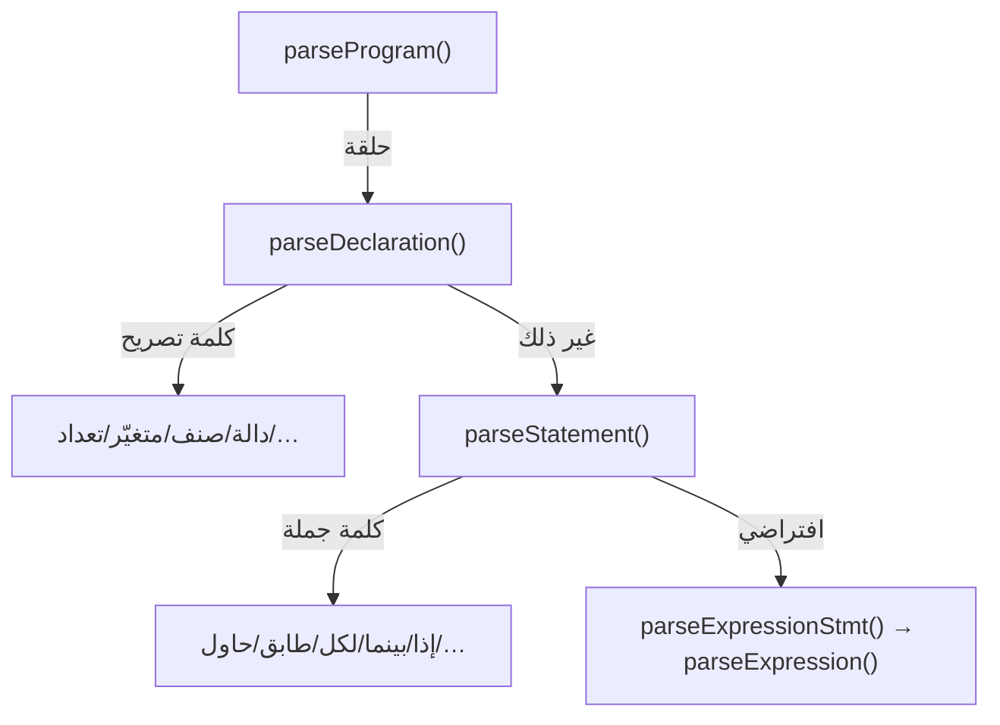

# المحلل النحوي (Parser)

> **ماذا ستتعلّم:** بنية المحلل النزوليّ التعاوديّ، نقطة الدخول، الموزِّعات، وسلسلة أسبقيّة التعابير.

## الدور والبنية
`Sad::Parser::ParserCore` محلل **نزوليّ تعاوديّ (recursive descent)** يحوّل تيار
الرموز إلى AST. كل قاعدة نحويّة ≈ دالة `parseXxx()`. المصدر موزّع على
`shared/parser/src/{core,statements,declarations,specs,ui}/`، والواجهة في
`shared/parser/include/parser_core.h`.

## نقطة الدخول والموزِّعات

- `parseProgram()` — يكرّر `parseDeclaration()` حتى نهاية الملف (مع حماية من الحلقة اللانهائيّة).
- `parseDeclaration()` — موزّع التصريحات (يفحص الرمز الحاليّ + نظر مسبق).
- `parseStatement()` — موزّع الجمل التنفيذيّة.

## سلسلة أسبقيّة التعابير
من الأدنى ربطًا إلى الأعلى — كل دالة تستدعي الأعلى أسبقيّةً:
```
parseExpression → parsePipeline → parseAssignment → parseTernary → parseNullCoalesce
→ parseLogicalOr → parseLogicalAnd → parseBitwiseOr → parseBitwiseXor → parseBitwiseAnd
→ parseEquality → parseComparison → parseRange → parseTerm → parseFactor → parseUnary
→ parsePower → parsePostfix → parsePrimary
```
هذا الترتيب **يُعرّف أسبقيّة العوامل** (مصدره `operators.yaml`).

## الكلمات السياقيّة (التحقّق المزدوج)
كثير من «الكلمات» (سمة/نفّذ/امتداد/ماكرو/حالة/أجّل/أطلق/اختر) ليست محجوزة؛ يتعرّف
عليها المحلل بنمط:
```cpp
if (check(TT::KEYWORD_TRAIT) ||
    (check(TT::IDENTIFIER) && current_.getValue() == "سمة")) { ... }
```
مع نظرٍ مسبق على الرمز التالي لفضّ الغموض.

## السكر النحوي (Desugaring)
بعض القواعد تُحوِّل الصياغة وقت التحليل: `أ |> د` ← `د(أ)`؛ `س += ص` ← `س = س + ص`.

## التوثيق الكامل للقواعد
قواعد المحلل **موثّقة كمصدر موحّد** مع مخطّطات ومسارات حتى AST — راجع
[قواعد المحلل SoT](../sot/grammar-sot.md) و`docs/parser_rule/_generated/`.

---
**اقرأ بعده:** [شجرة AST](ast.md).
