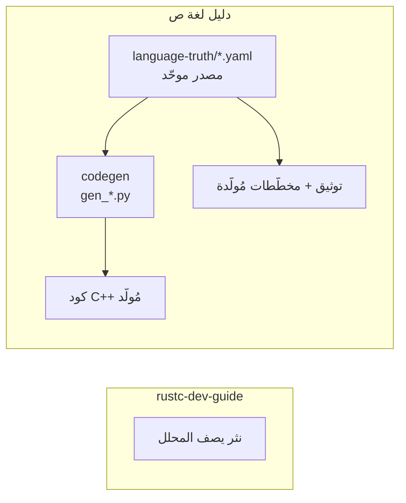

# مقدّمة الدليل

> **الهدف:** أن تفهم كيف تعمل لغة ص **من الداخل** وكيف تُسهم في تطويرها بثقة —
> من نقطة دخول المصدر حتى توليد ملفّ تنفيذيّ أو تفسيره.

هذا الدليل لمن يطوّر **لغة ص نفسها** (المفسّر، المترجم `sadc`، الأنظمة الداخلية)،
لا لمن يكتب برامج بها. إن كنت تكتب `.ص` فهذا الدليل ليس لك (راجع مرجع اللغة).

## لمن هذا الدليل؟
- مساهم جديد يريد **خريطة ذهنيّة** سريعة قبل لمس الكود.
- مطوّر يضيف **كلمة مفتاحيّة / دالة مضمنة / رمز خطأ / ميزة نحويّة** ويحتاج معرفة كل الطبقات المتأثّرة.
- مراجِع يريد فهم **عقود الأنظمة** والحدود بينها.

## كيف تقرأه؟
الدليل مُقسَّم **أجزاءً مُرقّمة** تتدرّج من العامّ للخاصّ:

1. **البدء** — تُبني المشروع وتُجري أوّل مساهمة.
2. **المعمارية** — الطبقات وخطّ الأنابيب والتشابك.
3. **مصدر الحقيقة الموحّد** ⭐ — الفلسفة المميِّزة للغة ص.
4. **الواجهة الأماميّة** — معجمي → نحوي → AST.
5. **الواجهة الخلفيّة** — مفسّر، SIR، LLVM، VM.
6. **أنظمة اللغة** — أنواع، أخطاء، دوال مضمنة.
7. **المساهمة والحوكمة** — سير العمل ومعيار الإنجاز.

> 💡 كل فصل يبدأ بـ«ماذا ستتعلّم» وينتهي بـ«اقرأ بعده» لتنقّل سلس.

## فلسفة لغة ص الداخلية في سطور
- **معماريّة طبقيّة صارمة:** `Lexer → Parser → AST → (Interpreter | SIR → LLVM)`. كل طبقة تعتمد فقط على ما تحتها.
- **مدفوعة بالبيانات (data-driven):** بيانات اللغة (كلمات، عوامل، أنواع، أخطاء، دوال مضمنة، **وقواعد نحويّة**) تعيش في `language-truth/` كمصدر موحّد (YAML)، ويُولَّد منها كود C++ والتوثيق. **هذا الجوهر الذي يجعل الدليل «أكثر تطوّرًا».**
- **عربيّة أصيلة:** الكلمات المفتاحيّة والمعرّفات بالعربية، UTF-8، والكتل تُغلَق بـ«نهاية».
- **تنفيذ مزدوج:** كل ميزة تعمل في المفسّر **والمترجم** (أو تُعفى صراحةً).

## كيف يختلف عن `rustc-dev-guide`؟
استلهمنا أفضل ما فيه (mdBook، التتبّع للكود، فصل المساهمة) وأضفنا:

- **مصدر حقيقة موحّد** لقواعد اللغة وبياناتها (rustc لا يملك هذا لقواعده).
- **توثيق مُولَّد آليًّا** من المصدر (لا يتقادم).
- **مخطّطات Mermaid** منهجيّة لكل تدفّق.
- **سير مساهمة حديث:** worktrees معزولة + فرع `dev` محميّ + PR موقّع GPG.

---
**اقرأ بعده:** [إعداد البيئة والبناء](getting-started/setup.md).
