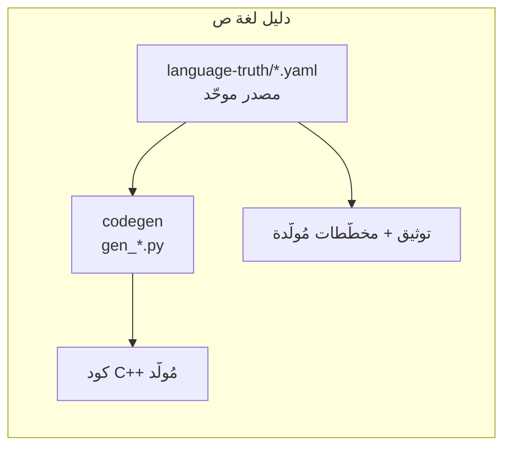

  <h1>دليل مطوّري لغة ص</h1>
  
الأنظمة الداخلية — من المصدر إلى التنفيذ

  
كيف تعمل لغة ص من الداخل، وكيف تُسهم في تطويرها بثقة: معجمي → نحوي → AST → مفسّر/مترجم، فوق مصدر حقيقة موحّد.

> **لمن هذا الدليل؟** لمن يطوّر **لغة ص نفسها** (المفسّر، المترجم `sadc`، الأنظمة الداخلية) —
> لا لمن يكتب برامج *بها*. إن كنت تكتب `.ص` فهذا الدليل ليس لك.

## ابدأ من هنا

  <a class="card" href="getting-started/setup.html">
    ⚙️البدء
    إعداد البيئة، البناء، وأوّل مساهمة.
  </a>
  <a class="card" href="architecture/overview.html">
    🗺️المعمارية
    الطبقات وخطّ الأنابيب والتشابك.
  </a>
  <a class="card" href="sot/philosophy.html">
    ⭐مصدر الحقيقة يميّزنا
    النظام المدفوع بالبيانات (data-driven).
  </a>
  <a class="card" href="frontend/lexer.html">
    🔤الواجهة الأماميّة
    المعجمي · النحوي · AST.
  </a>
  <a class="card" href="backend/interpreter.html">
    ⚡الواجهة الخلفيّة
    المفسّر · SIR · LLVM · VM.
  </a>
  <a class="card" href="contributing/workflow.html">
    🌿المساهمة
    فروع dev · worktrees · PR موقّع.
  </a>

## فلسفة لغة ص الداخلية في سطور
- **معماريّة طبقيّة صارمة:** `Lexer → Parser → AST → (Interpreter | SIR → LLVM)`. كل طبقة تعتمد فقط على ما تحتها.
- **مدفوعة بالبيانات (data-driven):** بيانات اللغة **وقواعدها النحويّة** تعيش في `language-truth/` كمصدر موحّد (YAML)، ويُولَّد منها كود C++ والتوثيق. **هذا جوهر تميّزنا.**
- **عربيّة أصيلة:** الكلمات المفتاحيّة والمعرّفات بالعربية، UTF-8، والكتل تُغلَق بـ«نهاية».
- **تنفيذ مزدوج:** كل ميزة تعمل في المفسّر **والمترجم** (أو تُعفى صراحةً).

## كيف يختلف عن `rustc-dev-guide`؟
استلهمنا أفضل ما فيه (mdBook، التتبّع للكود، فصل المساهمة) وأضفنا طبقةً لا يملكها:

مصدر حقيقة موحّد للقواعد والبيانات · توثيق مُولَّد لا يتقادم · مخطّطات Mermaid منهجيّة ·
سير مساهمة حديث (worktrees + فرع `dev` محميّ + PR موقّع GPG).

---
**اقرأ بعده:** [إعداد البيئة والبناء](getting-started/setup.md) · أو تصفّح [حالة الدليل](status.md).
