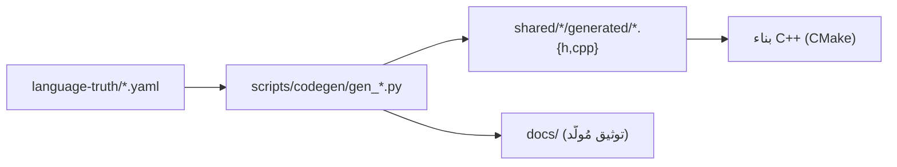

# توليد الكود (codegen)

> **ماذا ستتعلّم:** كيف تتحوّل ملفّات YAML إلى كود C++ وتوثيق، وأين المولّدات.

## الخطّ

## المولّدات (`scripts/codegen/`)
| المولّد | المصدر → الناتج |
|--------|------------------|
| `gen_keywords.py` | `keywords.yaml` → `keywords_generated.{h,cpp}` |
| `gen_types.py` | `types.yaml` → كود الأنواع المُولَّد |
| `gen_builtins_registry.py` / `gen_all_builtins_yaml.py` | `builtins/` → `builtin_registry_generated.h` |
| `gen_error_messages.py` / `gen_sadinfo_errors.py` | `errors/` → رسائل/تشخيص مُولَّد |
| `gen_parser_grammar_docs.py` | `grammar/*.yaml` → `docs/parser_rule/_generated/` |
| `check_grammar_conformance.py` | يفحص تغطية القواعد وتماسك وسوم الاختبارات |

> اكتشف الواجهة بـ`python scripts/codegen/<gen>.py --help`. بعضها يعمل عبر CMake عند البناء.

## قواعد ذهبيّة
- **لا تحرّر `generated/` يدويًّا** — عدّل YAML ثم أعد التوليد.
- **ضمّن المُولَّد في الـcommit** مع YAML (متطابقين) — هو جزء من «قائمة الملفّات».
- **فحص CI:** مولّدات `--check` (مثل `gen_parser_grammar_docs.py --check`) تفشل إن تباعد المُولَّد عن المصدر.

## نمط مولّد التوثيق (مثال متقدّم)
`gen_parser_grammar_docs.py` يقرأ قواعد الإنتاج (`grammar/*.yaml`) ويُنتج لكل قاعدة:
BNF + المسار إلى دالة المحلل (`maps_to`) ⇒ عقدة AST + **مخطّط Mermaid آليّ** + روابط
«يستدعي/مُستدعى». ثم `--check` يضمن بقاء التوثيق محدَّثًا في CI. → [قواعد المحلل SoT](grammar-sot.md).

---
**اقرأ بعده:** [قواعد المحلل كمصدر موحّد](grammar-sot.md).
