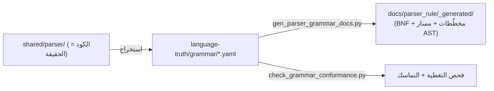

# قواعد المحلل كمصدر موحّد (Grammar SoT) ⭐

> **ماذا ستتعلّم:** كيف وُثِّقت قواعد نحو لغة ص كمصدر موحّد قابل للتحقّق، وكيف
> يُولَّد منها توثيق غنيّ — وهي الطبقة التي تميّز لغة ص عن معظم المُصرِّفات.

## الفكرة
المحلل في لغة ص **مكتوب يدويًّا** (recursive descent). بدل ترك القواعد ضمنيّةً في
الكود، نُدوِّنها كـ**قواعد إنتاج صوريّة** في `language-truth/grammar/`، مع **خريطة
تتبُّع (`maps_to`)** لكل دالة تحليل فعليّة. النتيجة: مواصفة معياريّة + جسر يمنع تباعد
المواصفة عن التنفيذ (يفحصه CI).



## الطبقات (تطابق `shared/parser/src/`)
| ملف | معرّفات | يغطّي |
|-----|---------|------|
| `00_program.yaml` | `gr.program.*` | البرنامج/التصريح/الجملة/الكتلة |
| `10_statements.yaml` | `gr.stmt.*` | إذا/بينما/لكل/طابق/حالة/حاول/… |
| `20_declarations.yaml` | `gr.decl.*` | متغيّر/دالة/معاملات/استيراد/تصدير/خارجي |
| `30_oop.yaml` | `gr.oop.*` | صنف/بنية/تعداد/سمة/تنفيذ/امتداد/أعضاء |
| `40_expressions.yaml` | `gr.expr.*` | سلسلة الأسبقية الكاملة + لامدا/f-string |
| `50_patterns.yaml` | `gr.pattern.*` | أنماط المطابقة |
| `60_advanced.yaml` | `gr.adv.*` | أنواع/قوالب/عمر/تزامن/استيعاب/ماكرو/FFI/واجهة |
| `70_lexical.yaml` | `gr.lex.*` | الطرفيات (جسر للمعجمي) |

## شكل قاعدة الإنتاج
كل قاعدة (مخطّط `_schemas/grammar_production.schema.json`):
- `id` بصيغة `gr.<area>.<name>` (فريد، مرجِع).
- `ebnf` (مقروء) + `alternatives` (تمثيل منظَّم آليًّا، **المرجِع الدلاليّ**: رموز
  terminal/nonterminal/optional/repeat/group/alt).
- `references` (روابط `keywords.yaml`/`operators.yaml`).
- **`maps_to`** (ملف:دالة المحلل) — جسر التتبُّع.
- `ast_node` (العقدة المُنتَجة) + `conformance.test_budget`.

```yaml
- id: gr.stmt.if
  lhs: { nonterminal: IfStatement, name_ar: "جملة إذا", name_en: if_statement }
  ebnf: "IfStatement = 'إذا' '(' Expression ')' Block { 'وإلا' ... } [ 'وإلا' Block ] ;"
  maps_to: [{ file: shared/parser/src/statements/parser_statements.cpp, function: "ParserCore::parseIfStmt" }]
  ast_node: "IfStmt"
```

## التوليد والتحقّق
```bash
python scripts/codegen/gen_parser_grammar_docs.py          # ينتج docs/parser_rule/_generated/
python scripts/codegen/gen_parser_grammar_docs.py --check  # CI: هل التوثيق محدَّث؟
python scripts/codegen/check_grammar_conformance.py        # تغطية الاختبارات + تماسك الوسوم
```

التوثيق المُولَّد يحوي لكل قاعدة: BNF + تفصيل البدائل + **مخطّط مسار الدوال حتى AST**
(مُشتقّ من `maps_to` ومراجع nonterminal) + مخطّط البنية النحويّة + روابط «يستدعي/مُستدعى».

## التحقّق من الانجراف (الكود هو الحقيقة)
- كل `maps_to.function` يجب أن توجد فعلًا في المحلل (فحص CI).
- كل عقدة `ast_node` يجب أن توجد في `shared/ast/` (أو نوع إرجاع معروف).
- كل `references`/`nonterminal ref` صالح.

> 📎 المرجع الحيّ: `language-truth/grammar/README.md` و`docs/parser_rule/_generated/INDEX.md` في المستودع الرئيسيّ.

---
**اقرأ بعده:** [المحلل المعجمي](../frontend/lexer.md).
