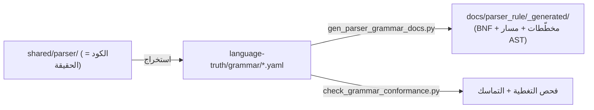

# قواعد المحلل كمصدر موحّد (Grammar SoT) ⭐

> **ماذا ستتعلّم:** كيف وُثِّقت قواعد نحو لغة ص كمصدر موحّد قابل للتحقّق، وكيف
> يُولَّد منها توثيق غنيّ — وهي الطبقة التي تميّز لغة ص عن معظم المُصرِّفات.

## الفكرة
المحلل في لغة ص **مكتوب يدويًّا** (recursive descent). بدل ترك القواعد ضمنيّةً في
الكود، نُدوِّنها كـ**قواعد إنتاج صوريّة** في `language-truth/grammar/`، مع **خريطة
تتبُّع (`maps_to`)** لكل دالة تحليل فعليّة. النتيجة: مواصفة معياريّة + جسر يمنع تباعد
المواصفة عن التنفيذ (يفحصه CI).


```mermaid
flowchart LR
  PARSER["shared/parser/ (الكود = الحقيقة)"] -->|استخراج| Y["language-truth/grammar/*.yaml"]
  Y -->|gen_parser_grammar_docs.py| DOC["docs/parser_rule/_generated/<br/>(BNF + مخطّطات + مسار AST)"]
  Y -->|check_grammar_conformance.py| CI["فحص التغطية + التماسك"]
```

## الطبقات (تطابق `shared/parser/src/`)
| ملف | معرّفات | يغطّي |
|-----|---------|------|
| `00_program.yaml` | `gr.program.*` | البرنامج/التصريح/الجملة/الكتلة |
| `10_statements.yaml` | `gr.stmt.*` | إذا/بينما/لكل/طابق/حالة/حاول/… |
| `20_declarations.yaml` | `gr.decl.*` | متغيّر/دالة/معاملات/استيراد/تصدير/خارجي |
| `30_oop.yaml` | `gr.oop.*` | صنف/بنية/تعداد/سمة/تنفيذ/امتداد/أعضاء |
| `40_expressions.yaml` | `gr.expr.*` | سلسلة الأسبقية الكاملة + لامدا/f-string |
| `50_patterns.yaml` | `gr.pattern.*` | أنماط المطابقة |
| `60_advanced.yaml` | `gr.adv.*` | أنواع/قوالب/عمر/تزامن/استيعاب/ماكرو/FFI/واجهة |
| `70_lexical.yaml` | `gr.lex.*` | الطرفيات (جسر للمعجمي) |

ومعها في المجلّد نفسِه ستّةُ ملفّاتٍ ليست قواعدَ إنتاج:

| ملفّ | دوره |
|-----|------|
| `_notation.yaml` | **الميتا-قواعد**: كيف تُقرأ ملفّات القواعد (علاقة `ebnf` بـ`alternatives`) |
| `lowers_to.yaml` | ربطُ كلّ قاعدةٍ بأوپكودات SIR — **مُشتقٌّ بالتشغيل** (انظر أدناه) |
| `README.md` | دليلُ المجلّد |
| `CONFORMANCE_REPORT.md` · `CONFORMANCE_REPORT_detail.md` · `DISCOVERED_ISSUES.md` | مخرجاتُ فحص المطابقة وما كشفه |

## `lowers_to.yaml` — الجسر إلى الخلفيّات

لا يكفي أن تُوثَّق القاعدةُ نحويًّا؛ السؤالُ العمليّ: **إلى أيّ أوپكودات تنزل، وأيّ
معماريّةٍ تخفضها كلَّها؟** يجيب [`lowers_to.yaml`](https://github.com/sadlang/s-programming-language/blob/dev/language-truth/grammar/lowers_to.yaml)،
وهو مُولَّدٌ آليًّا بـ`gen_grammar_lowers_to.py` — والاشتقاقُ **تجريبيّ لا تحليليّ**:
تُترجَم اختباراتُ القاعدة بـ`--أظهر-sir` وتُجمَع أوپكوداتُها الفعليّة.

| الحقل | معناه |
|---|---|
| `lowers_to` | كلّ أوپكودات القاعدة (عليها يقوم الحكم) |
| `beyond_baseline` | ما تضيفه القاعدةُ فوق سقالةِ أيّ دالّة |
| `native_ok` | المعماريّات التي تخفض أوپكوداتِها كلَّها في [الخلفيّة الأصليّة](../backend/native.md) |
| `native_missing_<قوس>` | الأوپكودات المانعة لكلّ معماريّة |
| `evidence` | ملفّات الاختبار التي اشتُقّ منها |
| `status: not_derived` | **لم يُترجَم — لا يُفترَض نجاحه** |

الإحصاء المسجَّل في الملفّ: **١٠٧ قواعد**، منها **١٠٥ مشتقّةٌ** و**٢ `not_derived`**؛
والتغطية الأصليّة **١٠٢ لـx86-64 و١٠٢ لـarm64 و٢٦ لـriscv64** (٣ عيّناتٍ لكلّ قاعدة).
فهذا الملفّ هو المكان الذي تُقرأ فيه فجوةُ RISC-V كمًّا، لا انطباعًا.

> 🔑 **`not_derived` إعلانٌ لا صمت.** القاعدةُ التي لم تُترجَم تُوسَم صراحةً بدل أن
> تسقط من الإحصاء — فغيابُ البرهان مذكورٌ، لا مسكوتٌ عنه.

## شكل قاعدة الإنتاج
كل قاعدة (مخطّط `_schemas/grammar_production.schema.json`):
- `id` بصيغة `gr.<area>.<name>` (فريد، مرجِع).
- `ebnf` (مقروء) + `alternatives` (تمثيل منظَّم آليًّا، **المرجِع الدلاليّ**: رموز
  terminal/nonterminal/optional/repeat/group/alt).
- `references` (روابط `keywords.yaml`/`operators.yaml`).
- **`maps_to`** (ملف:دالة المحلل) — جسر التتبُّع.
- `ast_node` (العقدة المُنتَجة) + `conformance.test_budget`.

```yaml
- id: gr.stmt.if
  lhs: { nonterminal: IfStatement, name_ar: "جملة إذا", name_en: if_statement }
  ebnf: "IfStatement = 'إذا' '(' Expression ')' Block { 'وإلا' ... } [ 'وإلا' Block ] ;"
  maps_to: [{ file: shared/parser/src/statements/parser_statements.cpp, function: "ParserCore::parseIfStmt" }]
  ast_node: "IfStmt"
```

## التوليد والتحقّق
```bash
python scripts/codegen/gen_parser_grammar_docs.py          # ينتج docs/parser_rule/_generated/
python scripts/codegen/gen_parser_grammar_docs.py --check  # CI: هل التوثيق محدَّث؟
python scripts/codegen/check_grammar_conformance.py        # تغطية الاختبارات + تماسك الوسوم
```

التوثيق المُولَّد يحوي لكل قاعدة: BNF + تفصيل البدائل + **مخطّط مسار الدوال حتى AST**
(مُشتقّ من `maps_to` ومراجع nonterminal) + مخطّط البنية النحويّة + روابط «يستدعي/مُستدعى».

## التحقّق من الانجراف (الكود هو الحقيقة)
- كل `maps_to.function` يجب أن توجد فعلًا في المحلل (فحص CI).
- كل عقدة `ast_node` يجب أن توجد في `shared/ast/` (أو نوع إرجاع معروف).
- كل `references`/`nonterminal ref` صالح.

> 📎 المرجع الحيّ: `language-truth/grammar/README.md` و`docs/parser_rule/_generated/INDEX.md` في المستودع الرئيسيّ.

---
**اقرأ بعده:** [المحلل المعجمي](../frontend/lexer.md).
