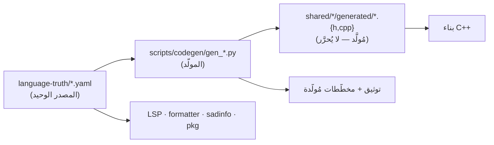

# الفلسفة: لماذا «مصدر الحقيقة» أولًا

> **ماذا ستتعلّم:** المبدأ المعماريّ الأهمّ في لغة ص — البيانات تقود الكود، لا العكس.

## المشكلة التي يحلّها
في المُصرِّفات التقليديّة، تتوزّع «حقائق اللغة» (الكلمات المفتاحيّة، العوامل وأسبقيّتها،
الأنواع، رسائل الأخطاء، الدوال المضمنة) عبر عشرات الملفّات المكتوبة يدويًّا. النتيجة:
**تباعد** — يُضاف عاملٌ في المعجمي ويُنسى في المنسّق أو LSP أو التوثيق.

## الحلّ: مصدر موحّد مدفوع بالبيانات
لغة ص تعتمد **`language-truth/`** كمصدر **واحد** (YAML) لكل بيانات اللغة، ويُولَّد منه
كود C++ والتوثيق آليًّا:

## القاعدة الذهبية (SoT-First)
> **أي تغيير في بيانات اللغة يبدأ من YAML — لا من كود C++ المُولَّد.**

- الملفّات تحت `*/generated/` **مُولَّدة آليًّا** — تحريرها يدويًّا يُمحى عند البناء التالي.
- لكنها **متتبَّعة في git** (ليست build-only) — ضمّنها في نفس الـcommit مع YAML (يجب أن يتطابقا).

## لماذا هذا «أكثر تطوّرًا» من rustc؟
- **rustc**: قواعده وبياناته موصوفة نثرًا في الدليل + موزّعة في الكود.
- **لغة ص**: مصدر **منظَّم وقابل للتحقّق آليًّا** (مخطّطات JSON في `_schemas/`)، يولّد
  الكود والتوثيق، ويُفحَص تماسكه في CI. يمتدّ حتى **قواعد النحو** نفسها (راجع
  [قواعد المحلل SoT](grammar-sot.md)) — طبقة لا يملكها معظم المُصرِّفات.

## ماذا يغطّي `language-truth/`؟
كلمات مفتاحيّة · عوامل (وأسبقيّاتها) · أنواع · توجيهات `@` · رموز أخطاء ورسائلها ·
دوال مضمنة ووحدات · **قواعد إنتاج النحو** · تراكيب اللغة. → [التفصيل](language-truth.md).

---
**اقرأ بعده:** [‏`language-truth/`](language-truth.md).
