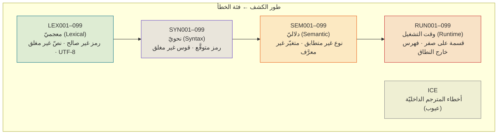
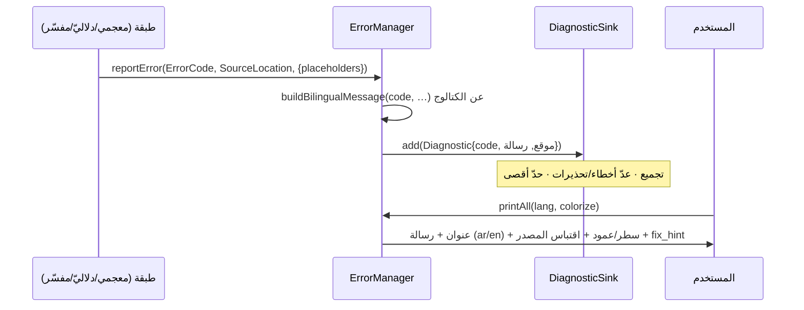
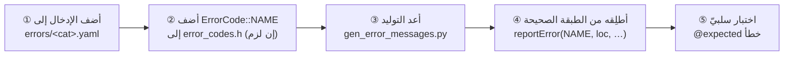

# نظام الأخطاء والتشخيص

> **ماذا ستتعلّم:** كيف تُكتلَج الأخطاء كمصدر حقيقة موحَّد (رمز · رسالة ثنائيّة اللغة ·
> تلميح إصلاح)، وكيف تُطلَق من كل طبقة، وكيف يجمعها `ErrorManager` ويعرضها بالعربيّة
> والإنجليزيّة مع الموقع واقتباس المصدر — وكيف تضيف رمزًا جديدًا.

> 📎 المصدر: [`shared/errors/include/error_codes.h`](https://github.com/sadlang/s-programming-language/blob/dev/shared/errors/include/error_codes.h) · [`error_manager.h`](https://github.com/sadlang/s-programming-language/blob/dev/shared/errors/include/error_manager.h) · [`language-truth/errors/`](https://github.com/sadlang/s-programming-language/tree/dev/language-truth/errors)

## المبدأ: الأخطاء بيانات لا نصوص

خطأٌ مكتوبٌ نصًّا حرًّا في الكود يَتعفّن: لا يُترجَم، لا يُختبَر، لا يُوحَّد. لذا أخطاء ص
**مكتلَجة كمصدر حقيقة (SoT)**: لكلّ خطأٍ رمزٌ ورسالةٌ ثنائيّة اللغة وتلميحُ إصلاح يعيش في
`language-truth/errors/`، ويُولَّد منه كود C++ والتشخيص. الإطلاق يُشير إلى **رمز**، لا إلى
جملة.

```mermaid
flowchart LR
  YAML["language-truth/errors/*.yaml<br/>(مصدر V5)"] -->|gen_error_messages.py| GEN["error_messages_generated.{h,cpp}"]
  YAML --> SCHEMA["_schemas/error.schema.json<br/>(تحقّق)"]
  EC["error_codes.h<br/>enum ErrorCode"] --> GEN
  GEN --> EM["ErrorManager<br/>(جمع + عرض)"]
  RAISE["طبقات اللغة<br/>المعجمي/النحوي/الدلالي/التشغيل"] -->|reportError(code, …)| EM
  EM -->|printAll| OUT["عرض ثنائيّ اللغة + موقع + اقتباس"]
  EM -->|toJSON| JSON["تشخيص آليّ (IDE/أدوات)"]
```

## ① الكتالوج: بنية إدخال الخطأ

كلّ ملفّ فئةٍ (`runtime.yaml`، `semantic.yaml`، …) قائمةُ أخطاء؛ الإدخال الواحد:

```yaml
- code: RUN_DIVISION_BY_ZERO      # المعرّف الرمزيّ (مفتاح enum)
  id: RUN001                      # المعرّف المرقَّم (الفئة + الرقم)
  category: runtime
  title:   { ar: القسمة على صفر,            en: Division by zero }
  brief:   { ar: "محاولة قسمة {a} على صفر",  en: "Attempting to divide {a} by zero" }
  placeholders: [ a ]             # القوالب التي تُملأ وقت الإطلاق
  fix_hint:  { ar: "تحقّق من المقام…",       en: "Check denominator…" }
  detailed:  { ar: "القسمة على صفر…",        en: "Division by zero is…" }
```

| الحقل | الدور |
|-------|-------|
| `code` / `id` | المفتاح الرمزيّ + المرقَّم (يربطان YAML بـ`enum ErrorCode`) |
| `title` | عنوانٌ قصير ثنائيّ اللغة |
| `brief` + `placeholders` | الرسالة التي تُملأ قوالبُها (`{a}`) وقت الإطلاق |
| `fix_hint` | **كيف تُصلِحه** — يميّز ص: لا يكتفي بالشكوى |
| `detailed` | شرحٌ تعليميّ موسَّع (يَظهر حسب مستوى التفصيل) |

## ② التصنيف والنطاقات: `ErrorCode`

التعداد `ErrorCode` مقسَّمٌ بنطاقاتٍ حسب طور الكشف — كلّ طورٍ نطاقُ أرقامٍ خاصّ:



فئاتٌ إضافيّة لها ملفّاتُها: `import` · `io` · `ownership` (يربط [نظام الذاكرة](memory.md)) ·
`internal` (ICE).

## ③ دورة حياة الخطأ: من الإطلاق إلى العرض

الطبقة تُطلِق رمزًا + قوالبَ + موقعًا؛ يجمعها `ErrorManager` في `DiagnosticSink`، ثم يُبنى
العرض ثنائيّ اللغة عند الطباعة:



> ⚠️ **يُمنع النصّ الحرّ:** لا `throw std::runtime_error("…")` ولا `runtime_throw.h` —
> هذا نمطٌ مهجور. أطلِق دومًا `ErrorCode::<NAME>` عبر `reportError` / `reportFromCatalog`.
> نمطُ المعالجة موحَّدٌ لكل طبقة: `reportError` في codegen · استثناءات في المحلل النحوي ·
> رموز في FFI (CW‑22).

## ④ `ErrorManager` — الجامع والعارض

[`ErrorManager`](https://github.com/sadlang/s-programming-language/blob/dev/shared/errors/include/error_manager.h) واجهةٌ آمنة الخيوط (`std::mutex`) فوق `DiagnosticSink`:

| الوظيفة | الواجهة |
|---------|---------|
| الإطلاق | `reportError(code, loc, …)` · `reportWarning(…)` · `reportFromCatalog(code, …)` |
| البناء | `buildBilingualMessage(code, …)` — يدمج الكتالوج بالقوالب |
| العرض | `printAll(lang, colorize)` · `toJSON()` · `saveToFile()` |
| الضبط | `setLanguage` · `setColorize` · `setMaxErrors` · `setExplanationLevel` |
| الذكاء | `setSmartErrorsEnabled` — تشخيصٌ أذكى (اقتراحات سياقيّة) |
| المصدر | `setSourceCode(source, filename)` — لاقتباس السطر المخطئ |

`DiagnosticSink` يَعُدّ الأخطاء والتحذيرات (`getErrorCount` / `hasErrors`) ويدعم حدًّا
أقصى (`truncateTo`) كي لا تَغرق الشاشة بآلاف الأخطاء المتتالية.

> 💡 **ثنائيّة اللغة ليست ترجمةً لاحقة:** الرسالتان (ar/en) تَسكنان الكتالوج جنبًا إلى جنب،
> فيختار المستخدم لغته (`setLanguage`) دون فقدان الدقّة.

## ⑤ إضافة رمز خطأ جديد



1. أضف الرمز/الرسالة/التلميح إلى `language-truth/errors/<cat>.yaml` (تحقَّق بـ`error.schema.json`).
2. أضف `ErrorCode::<NAME>` إلى [`error_codes.h`](https://github.com/sadlang/s-programming-language/blob/dev/shared/errors/include/error_codes.h) إن لزم.
3. أعد التوليد ([`gen_error_messages.py`](https://github.com/sadlang/s-programming-language/blob/dev/scripts/codegen/gen_error_messages.py) أو عبر البناء).
4. أطلِقه من الطبقة الصحيحة بـ`ErrorCode::<NAME>` + placeholders.
5. اكتب اختبارًا سلبيًّا (`@expected` خطأ) — وإلّا فالرمز غير محميّ من الانحدار.

> راجع بنى YAML للأخطاء والهجرة V4→V5 في مهارة `sad-lang-dev`
> (`references/error-yaml-structures.md`).

---
**اقرأ بعده:** [الدوال المضمنة](builtins.md).
