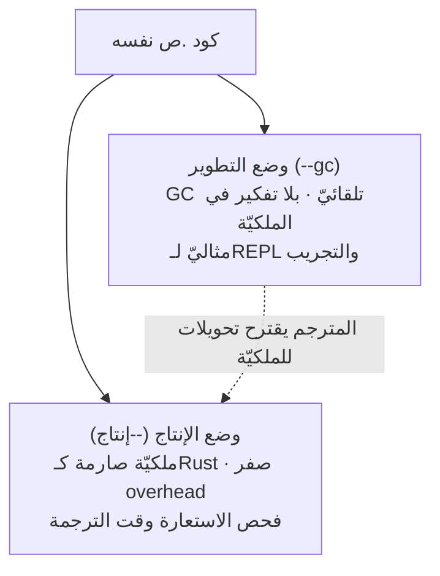
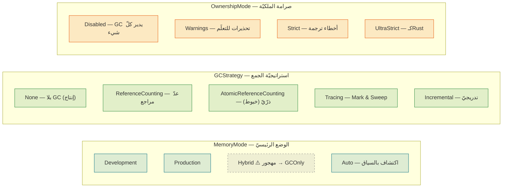
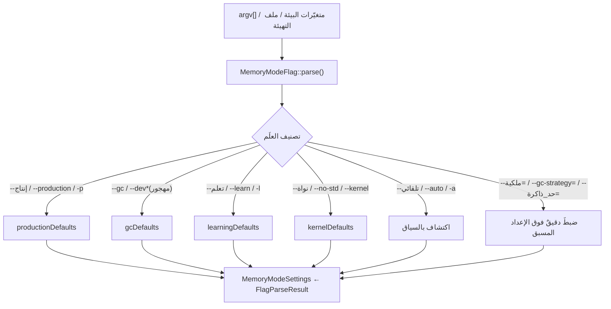

# نظام الذاكرة (ذاكرة ص الذكية)

> **ماذا ستتعلّم:** كيف تُدير لغة ص الذاكرة عبر نظامٍ **مزدوج** — جامع قمامة (GC)
> سهلٌ للتطوير، وملكيّةٌ صارمة بصفر تكلفة للإنتاج — وكيف يُختار الوضع، وما الإعدادات
> المسبقة، وكيف يصل العلَم من سطر الأوامر إلى سلوك الذاكرة.

> 📎 المصدر: [`shared/memory_policy/include/memory/policy/gc_mode.h`](https://github.com/sadlang/s-programming-language/blob/dev/shared/memory_policy/include/memory/policy/gc_mode.h) · [`memory_mode_flag.h`](https://github.com/sadlang/s-programming-language/blob/dev/shared/memory_policy/include/memory/policy/memory_mode_flag.h) · [`memory_mode_flag.cpp`](https://github.com/sadlang/s-programming-language/blob/dev/shared/memory_policy/src/memory_mode_flag.cpp)

## الفكرة الجوهريّة: ذاكرةٌ مزدوجة

أغلب اللغات تختار مرّةً واحدة: إمّا GC (سهلٌ، لكن بتكلفة وقت تشغيل) أو ملكيّة يدويّة
(سريعٌ، لكن منحنى تعلّم حادّ). لغة ص تَجمع الطريقين في **وضعين قابلين للتبديل**، فالكود
نفسه يُجرَّب بـGC ثم يُشحَن بملكيّة صارمة:

> 💡 الميزة الفريدة: المترجم **يُحلِّل كود وضع التطوير ويقترح تحويلات تلقائيّة للملكيّة**
> (`enableOwnershipSuggestions`)، فينقلك من التجريب السريع إلى الإنتاج الصارم تدريجيًّا.

## ثلاثة تعدادات تَحكم كل شيء

السلوك كلّه ينضبط بثلاثة محاور مستقلّة (في [`gc_mode.h`](https://github.com/sadlang/s-programming-language/blob/dev/shared/memory_policy/include/memory/policy/gc_mode.h)):

| المحور | التعداد | القيم |
|--------|---------|-------|
| الوضع | `MemoryMode` | `Development` · `Production` · `Hybrid` (مهجور) · `Auto` |
| الجمع | `GCStrategy` | `None` · `ReferenceCounting` · `AtomicReferenceCounting` · `Tracing` · `Incremental` |
| الملكيّة | `OwnershipMode` | `Disabled` · `Warnings` · `Strict` · `UltraStrict` |

> ⚠️ **`Hybrid` مهجور:** يُعامَل كـ`GCOnly` عند مصادفته. لا تُصمِّم على أساسه.

## الإعدادات المجمَّعة: `MemoryModeSettings`

البنية `MemoryModeSettings` تربط المحاور الثلاثة مع خياراتٍ إضافيّة (`enableCycleDetection`،
`gcMemoryLimitMB = 256`، `teacherMode`، …)، وتُقدَّم عبر **إعداداتٍ مسبقة** جاهزة:

| الإعداد المسبق | `mode` | `gcStrategy` | `ownershipMode` | اقتراحات | كشف دورات | مُعلِّم |
|----------------|--------|--------------|-----------------|:--------:|:---------:|:------:|
| `gcDefaults()` (`--gc`) | Development | **Tracing** | Disabled | ✗ | ✓ | ✗ |
| `developmentDefaults()` | Development | ReferenceCounting | Warnings | ✓ | ✓ | ✓ |
| `productionDefaults()` (`--إنتاج`) | Production | **None** | **UltraStrict** | ✗ | ✗ | ✗ |
| `learningDefaults()` (`--تعلم`) | Development | ReferenceCounting | Warnings | ✓ | ✓ | ✓ |
| `kernelDefaults()` (`--نواة`) | Production | None | UltraStrict | ✗ | ✗ | حدّ=0 |

> 📌 **النواة (`no_std`):** عند `#![بلا_مكتبة_قياسية]` يُفرَض `kernelDefaults` — لا GC إطلاقًا
> (`gcMemoryLimitMB = 0`)، ملكيّة `UltraStrict`، بلا اقتراحات ولا كشف دورات. ملكيّةٌ صرفة
> كما يليق ببرمجة الأنظمة.

## من العلَم إلى السلوك: `MemoryModeFlag`

[`MemoryModeFlag::parse()`](https://github.com/sadlang/s-programming-language/blob/dev/shared/memory_policy/include/memory/policy/memory_mode_flag.h) يقرأ `argv` ويبني `MemoryModeSettings`.
الأعلام مسجَّلة في `flagHandlers_` ([`initializeFlags()`](https://github.com/sadlang/s-programming-language/blob/dev/shared/memory_policy/src/memory_mode_flag.cpp#L142))، ولكلّ علَمٍ عربيٍّ مرادفاتٌ إنجليزيّة ومختصرة:

**جدول الأعلام الرئيسيّة** (عربيّ ← مرادفات):

| العربيّ | المرادفات | الأثر |
|---------|-----------|-------|
| `--إنتاج` | `--production` · `--prod` · `--release` · `-p` | ملكيّة صارمة، بلا GC |
| `--gc` | `--dev`*، `--development`*، `--تطوير`*، `-d`* | GC (يحلّ محلّ `--dev` المهجور) |
| `--تعلم` | `--learn` · `--learning` · `-l` | GC + تحذيرات + رسائل تعليميّة |
| `--نواة` | `--no-std` · `--kernel` · `--freestanding` · `--بلا-مكتبة-قياسية` | ملكيّة صرفة `no_std` |
| `--ملكية=` | `--ownership=` | يضبط `OwnershipMode` يدويًّا |
| `--gc-strategy=` | — | يختار `GCStrategy` |
| `--حد_ذاكرة=` | `--gc-memory-limit=` | حدّ ذاكرة الـGC بالميغابايت |

> 🔁 `--dev`/`--تطوير`/`--mixed` تُحوَّل جميعها إلى `--gc` (تنبيهُ إهجار) — انظر جدول
> الإهجار في [`memory_mode_flag.cpp`](https://github.com/sadlang/s-programming-language/blob/dev/shared/memory_policy/src/memory_mode_flag.cpp#L281).

## ترتيب الأولويّة في حسم الإعداد

الإعداد النهائيّ يُحسَم بأولويّةٍ تصاعديّة (الأخصّ يَغلب):

## أين يَظهر هذا في خطّ الأنابيب؟

- **المفسّر** (وضع GC الافتراضيّ): القيم الكائنيّة تُحمَل عبر `shared_ptr<ObjectInstance>`
  ([عدّ مراجع](#) ضمنيّ) — انظر [نظام الأنواع](types.md).
- **المترجم** (وضع الإنتاج): يولّد تخصيص/تحرير الذاكرة مباشرةً وفق الملكيّة عبر
  [`memory_codegen`](https://github.com/sadlang/s-programming-language/blob/dev/compiler/include/backend/llvm/builders/memory/memory_codegen.h) — انظر [توليد LLVM](../backend/llvm.md).
- **`no_std`**: المخصِّصات الحرّة [`sad_allocator.h`](https://github.com/sadlang/s-programming-language/blob/dev/runtime/freestanding/sad_allocator.h) و[`sad_bump_allocator.h`](https://github.com/sadlang/s-programming-language/blob/dev/runtime/freestanding/sad_bump_allocator.h).

> 🧭 القاعدة الذهبيّة: **الوضع سياسة، لا بنية**. الكود لا يتغيّر بين التطوير والإنتاج؛
> يتغيّر `MemoryModeSettings` فقط، فينتقل البرنامج من سهولة الـGC إلى صرامة الملكيّة دون
> إعادة كتابة.

---
**اقرأ بعده:** [نظام الأنواع (فاحص الأنواع)](types.md).
