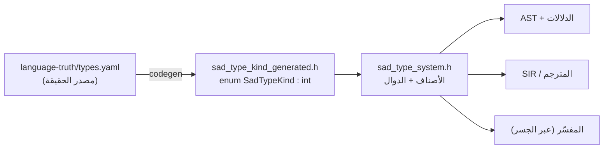
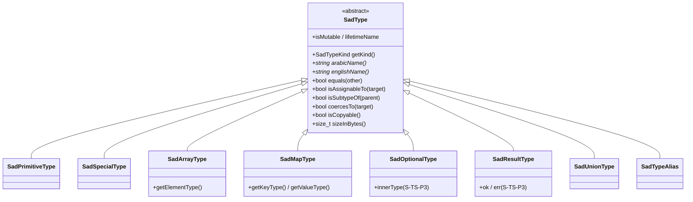
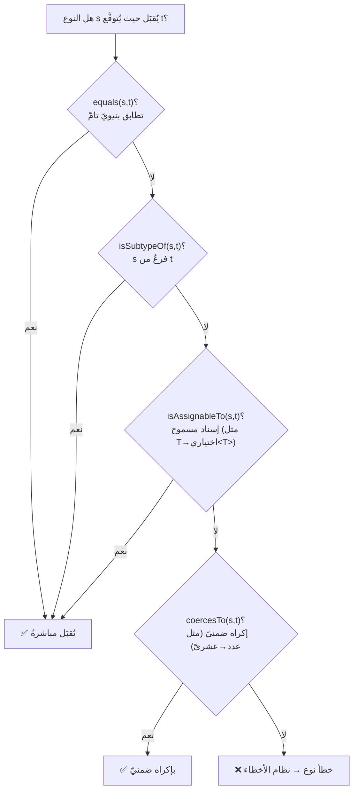
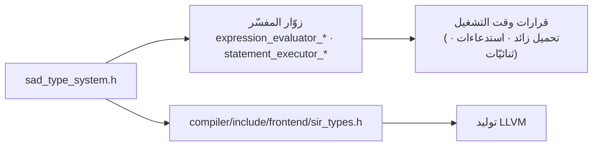

# نظام الأنواع وفاحص الأنواع (SadType / Value)

> **ماذا ستتعلّم:** كيف تُمثَّل الأنواع في لغة ص — من تعداد `SadTypeKind` المولَّد عن
> مصدر الحقيقة، إلى هرم أصناف `SadType`، إلى علاقات الفحص (تطابق · إسناد · نوع‑فرعيّ ·
> إكراه)، والجسر بين النوع الثابت والقيمة وقت التشغيل.

> 📎 المصدر: [`shared/types/include/sad_type_system.h`](https://github.com/sadlang/s-programming-language/blob/dev/shared/types/include/sad_type_system.h) · [`sad_type_kind_generated.h`](https://github.com/sadlang/s-programming-language/blob/dev/shared/types/generated/sad_type_kind_generated.h) · [`type_bridge.h`](https://github.com/sadlang/s-programming-language/blob/dev/shared/types/include/type_bridge.h) · [`value.h`](https://github.com/sadlang/s-programming-language/blob/dev/shared/types/include/value.h)

## النوع الثابت مقابل القيمة الحيّة

تمييزان لا يلتبسان:

| | يمثّل | أين | المصدر |
|--|------|-----|--------|
| **`SadTypeKind` / `SadType`** | النوع **الثابت** (وقت الترجمة/الفحص) | المحلّل + الدلالات + SIR | `sad_type_system.h` |
| **`Value`** | القيمة **الحيّة** (وقت التشغيل) | المفسّر | `value.h` |

النوع يُجيب «ما الذي يَصلُح؟»، والقيمة تُجيب «ما الموجود الآن؟». الجسر بينهما (`type_bridge`)
هو ما يحوّل أحدهما للآخر.

## ① مصدر الحقيقة: `SadTypeKind` (مولَّد)

التعداد `SadTypeKind` **يُولَّد آليًّا** من [`language-truth/types.yaml`](../sot/language-truth.md) (52 قيمة) —
لا يُحرَّر يدويًّا. أيّ نوعٍ جديد يُضاف إلى الكتالوج ثم يُعاد التوليد:

القيم موزَّعة على عائلات: **أوّليّة** (Void · Integer · Float · Boolean · String · Byte · Char) ·
**مركّبة** (Array · Map · Tuple · Slice) · **معرَّفة مستخدِمًا** (Class · Struct · Enum · Trait) ·
**قابلة للاستدعاء** (Function · Closure) · **جبريّة** (Union · Intersection · Optional · Result) ·
**عامّة** (Generic · TypeParameter · TypeAlias) · **مراجع** (Pointer · Reference · MutableRef) ·
**خاصّة** (Any · Never · Unknown · Error · Null) · **تزامن** (Future · Generator · Comprehension) ·
**واجهة/رسوميّات** (Color · Widget · Window · Event · Vector · Point · Rect).

> 💡 العربيّة/الإنجليزيّة ليست تعليقًا فحسب: `sadTypeKindToArabic()` و`sadTypeKindToEnglish()`
> تُرجعان الاسمين رسميًّا — فالنوع يُطبَع بلغة المستخدم.

## ② هرم الأصناف: `SadType`

الصنف المجرَّد [`SadType`](https://github.com/sadlang/s-programming-language/blob/dev/shared/types/include/sad_type_system.h) (يرث `enable_shared_from_this`) جذرٌ لكلّ
نوعٍ غنيّ يحفظ معاملاته (عنصر المصفوفة، مفتاح/قيمة الخريطة…). يُتداول دومًا كـ`SadTypePtr`
(`shared_ptr<SadType>`):

كلّ صنفٍ يَفحص **التساوي البنيويّ** صحيحًا: `مصفوفة<عدد>` تساوي `مصفوفة<عدد>` لا
`مصفوفة<نص>` (يقارن `getElementType()`، لا الـ`kind` وحده).

## ③ التصنيفات السريعة

دوال `inline` على `SadTypeKind` تُسرِّع الفحص دون إنشاء كائن — تستخدمها الدلالات بكثافة:

| الدالة | تصدُق على |
|--------|-----------|
| `isPrimitiveKind(k)` | الأوّليّات (عدد، عشريّ، منطقيّ، نصّ، بايت، حرف، فراغ) |
| `isNumericKind(k)` | العدديّة (Integer · Float · Byte) |
| `isCompositeKind(k)` | المركّبة (Array · Map · Tuple · Struct · Class…) |
| `isCallableKind(k)` | القابلة للاستدعاء (Function · Closure) |

وعلى مستوى الكائن: `isNullable()` · `isCopyable()` (تَفصِل القيميّ عن المرجعيّ) · `isMutable()` ·
`lifetimeName()` (للملكيّة — يربط نظام الأنواع بـ[نظام الذاكرة](memory.md)).

## ④ علاقات الفحص — قلب «فاحص الأنواع»

عند فحص إسنادٍ أو تمرير وسيطٍ أو إرجاع، يسأل الفاحص أربعة أسئلة متدرّجة الصرامة:

- **`equals`** — تطابقٌ تامّ (يقارن `kind` والمعاملات).
- **`isSubtypeOf`** — العلاقة الفرعيّة (الافتراضيّ `equals`، تُوسَّع للأصناف/السمات).
- **`isAssignableTo`** — هل يَصِحّ الإسناد؟ (مثلًا `T` إلى `اختياري<T>`، أو أيّ نوعٍ إلى `Any`).
- **`coercesTo`** — التحويل الضمنيّ المسموح (مثل عدد → عشريّ). الفشل هنا ⇒ **خطأ نوع**
  يُبلَّغ عبر [نظام الأخطاء](errors.md).

## ⑤ الجسر: `type_bridge` — من النوع إلى القيمة والعكس

[`type_bridge.h`](https://github.com/sadlang/s-programming-language/blob/dev/shared/types/include/type_bridge.h) يصِل النوع الثابت بالقيمة الحيّة عبر ثلاث طبقات:

| القسم | التحويل | الاستعمال |
|-------|---------|-----------|
| ① | `SadTypeKind ↔ ValueType` (تعداد ↔ تعداد) | سريع وخفيف، بلا تخصيص |
| ② | `SadTypePtr ↔ ValueType` (نوع ذكيّ ↔ تعداد) | `sadTypeToValueType` / `sadTypeFromValueType` |
| ③ | `Value → SadTypePtr` (قيمة كاملة ← نوع) | استنتاج نوع قيمةٍ حيّة |

> ⚙️ **توحيدٌ مهمّ (S-TS-P2.5b):** التمثيل الأفقر `DataType` **أُزيل بالكامل** بعد ترحيل
> الـAST والمحلّل والدلالات إلى `SadTypeKind`. لا تُدخِل `toDataType/fromDataType` —
> صفر مستهلك، والنظام الموحَّد هو `SadTypeKind` وحده.

## ⑥ أين يُستهلَك الفاحص؟

`sad_type_system.h` يُضمَّن عبر المفسّر والمترجم معًا:

- **المفسّر:** التحميل الزائد للعوامل (`expression_evaluator_overloads`)، الاستدعاءات
  (`..._calls_*`)، والعمليّات الثنائيّة (`..._binary_ops`) كلّها تتشاور مع `SadType`.
- **المترجم:** [SIR](../backend/sir.md) يبني أنواعه على `SadTypeKind` نفسه ⇒ سلوكٌ موحَّد
  بين التفسير والترجمة.

## ملاحظات للمطوّر

- الأنواع المدمجة (`رقم`/`نص`/…) **مُعرّفات سياقيّة** لا كلماتٌ محجوزة — انظر
  [المحلل المعجمي](../frontend/lexer.md).
- القسمة `/` تُعطي عشريًّا دائمًا — استخدم `رقم(ن/م)` للقسمة الصحيحة.
- لإضافة نوعٍ جديد: **حرِّر `types.yaml` ثم أعد التوليد** — لا تَلمس `sad_type_kind_generated.h`.

## مرجع SoT

الأنواع مُكتلَجة في [`language-truth/types.yaml`](../sot/language-truth.md)؛ تفاصيل أنواع المترجم في
[`sir_types.h`](https://github.com/sadlang/s-programming-language/blob/dev/compiler/include/frontend/sir_types.h) → [SIR](../backend/sir.md).

---
**اقرأ بعده:** [نظام الأخطاء](errors.md).
