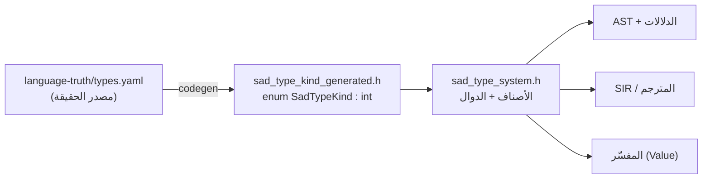
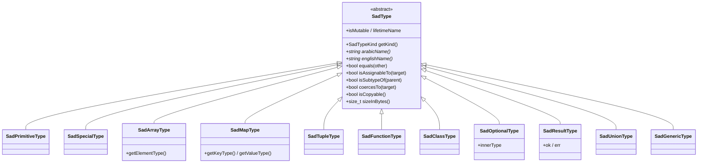
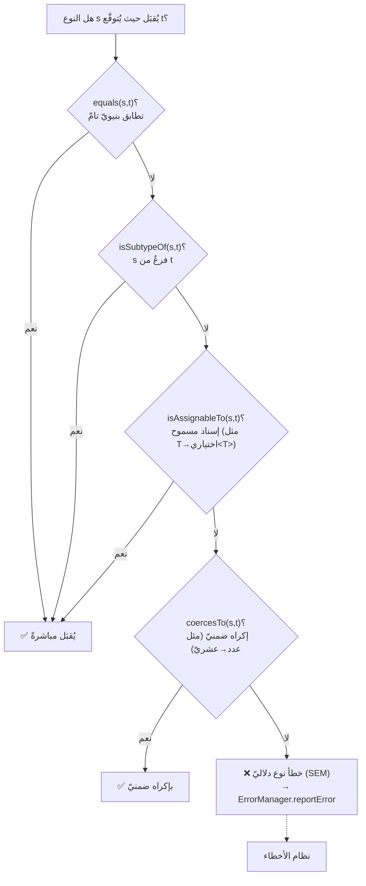
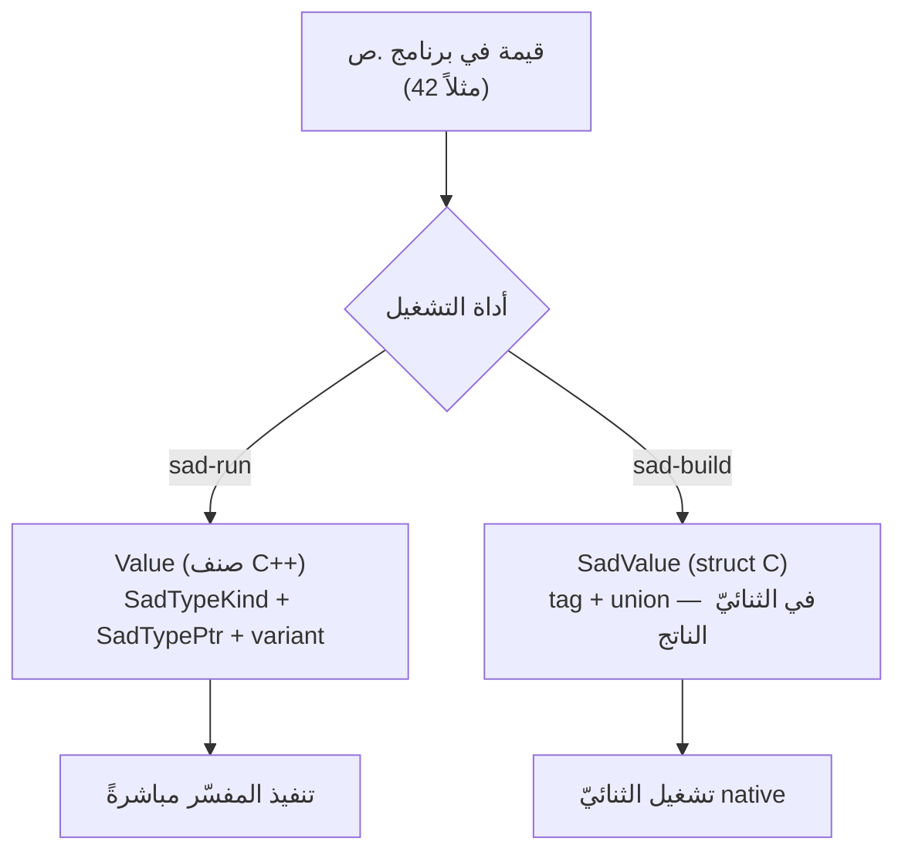
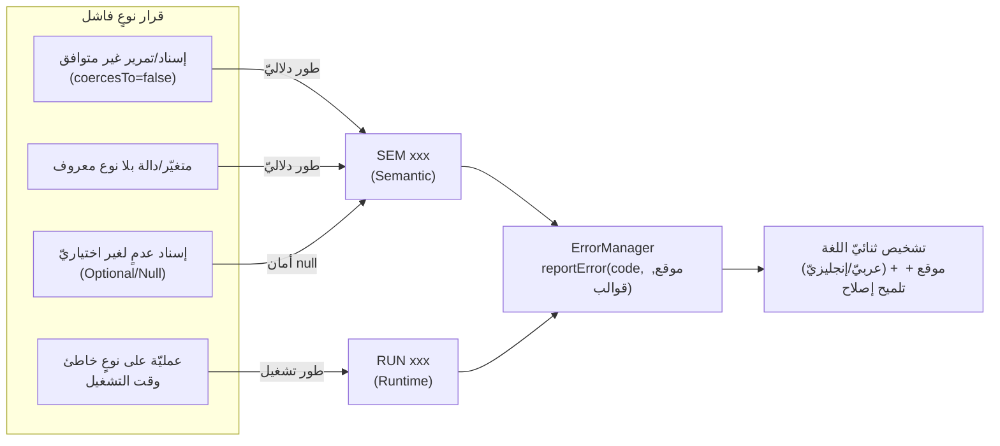

# نظام الأنواع وفاحص الأنواع (SadType / Value)

> **ماذا ستتعلّم:** كيف تُمثَّل الأنواع في لغة ص — من تعداد `SadTypeKind` المولَّد عن
> مصدر الحقيقة، إلى هرم أصناف `SadType`، إلى علاقات الفحص (تطابق · إسناد · نوع‑فرعيّ ·
> إكراه)، وكيف تُمثَّل القيمة الحيّة عبر عالَمَي التنفيذ، **وكيف يتشابك نظام الأنواع مع
> بقيّة الأنظمة — وعلى رأسها نظام الأخطاء.**

> 📎 المصدر: [`sad_type_system.h`](https://github.com/sadlang/s-programming-language/blob/dev/shared/types/include/sad_type_system.h) · [`sad_type_kind_generated.h`](https://github.com/sadlang/s-programming-language/blob/dev/shared/types/generated/sad_type_kind_generated.h) · [`value.h`](https://github.com/sadlang/s-programming-language/blob/dev/shared/types/include/value.h) · [`sir_types.h`](https://github.com/sadlang/s-programming-language/blob/dev/compiler/include/frontend/sir_types.h)

## نظام واحد، لا جسر

> ✅ **بعد التوحيد (RFC sadlang/rfcs#8):** نظام النوع **واحد** هو `SadTypeKind`/`SadType`.
> أُزيلت السقالة الانتقالية بالكامل: `type_bridge` و`SadValue` المهجور و`ValueType`
> التوافقيّ و`DataType` — لا تبحث عنها. القيمة الحيّة `Value` تعتمد `SadType` مباشرةً.

تمييزٌ واحد لا يلتبس:

| | يمثّل | أين | المصدر |
|--|------|-----|--------|
| **`SadTypeKind` / `SadType`** | النوع **الثابت** (وقت الترجمة/الفحص) | المحلّل + الدلالات + SIR + المفسّر | `sad_type_system.h` |
| **`Value`** | القيمة **الحيّة** (وقت التشغيل) — تحمل `SadTypeKind`+`SadTypePtr` بداخلها | المفسّر | `value.h` |

النوع يُجيب «ما الذي يَصلُح؟»، والقيمة تُجيب «ما الموجود الآن؟» — وكلاهما يدور حول محورٍ واحد.

## ① مصدر الحقيقة: `SadTypeKind` (مولَّد)

التعداد `SadTypeKind` **يُولَّد آليًّا** من [`language-truth/types.yaml`](../sot/language-truth.md) (52 قيمة) —
لا يُحرَّر يدويًّا. أيّ نوعٍ جديد يُضاف إلى الكتالوج ثم يُعاد التوليد:



القيم موزَّعة على عائلات: **أوّليّة** (Void · Integer · Float · Boolean · String · Byte · Char) ·
**مركّبة** (Array · Map · Tuple · Slice) · **معرَّفة مستخدِمًا** (Class · Struct · Enum · Trait) ·
**قابلة للاستدعاء** (Function · Closure) · **جبريّة** (Union · Intersection · Optional · Result) ·
**عامّة** (Generic · TypeParameter · TypeAlias) · **مراجع** (Pointer · Reference · MutableRef) ·
**خاصّة** (Any · Never · Unknown · Error · Null) · **تزامن** (Future · Generator · Comprehension) ·
**واجهة/رسوميّات** (Color · Widget · Window · Event · Vector · Point · Rect).

> 💡 العربيّة/الإنجليزيّة ليست تعليقًا فحسب: `sadTypeKindToArabic()` و`sadTypeKindToEnglish()`
> تُرجعان الاسمين رسميًّا — فالنوع يُطبَع بلغة المستخدم، وهذا بذاته يغذّي **نظام الأخطاء**
> برسائلَ نوعٍ ثنائيّة اللغة.

## ② هرم الأصناف: `SadType`

الصنف المجرَّد [`SadType`](https://github.com/sadlang/s-programming-language/blob/dev/shared/types/include/sad_type_system.h) (يرث `enable_shared_from_this`) جذرٌ لكلّ
نوعٍ غنيّ يحفظ معاملاته (عنصر المصفوفة، مفتاح/قيمة الخريطة…). يُتداول دومًا كـ`SadTypePtr`
(`shared_ptr<SadType>`):



كلّ صنفٍ يَفحص **التساوي البنيويّ** صحيحًا: `مصفوفة<عدد>` تساوي `مصفوفة<عدد>` لا
`مصفوفة<نص>` (يقارن `getElementType()`، لا الـ`kind` وحده). و`SadTypeRegistry` (Singleton)
يَختزن (interning) الأنواع المركّبة فتصير مقارنة المؤشّر `==` صحيحةً للمتماثلة بنيويًّا.

## ③ التصنيفات السريعة

دوال `inline` على `SadTypeKind` تُسرِّع الفحص دون إنشاء كائن — تستخدمها الدلالات بكثافة:

| الدالة | تصدُق على |
|--------|-----------|
| `isPrimitiveKind(k)` | الأوّليّات (عدد، عشريّ، منطقيّ، نصّ، بايت، حرف، فراغ) |
| `isNumericKind(k)` | العدديّة (Integer · Float · Byte) |
| `isCompositeKind(k)` | المركّبة (Array · Map · Tuple · Struct · Class…) |
| `isCallableKind(k)` | القابلة للاستدعاء (Function · Closure) |

وعلى مستوى الكائن: `isNullable()` · `isCopyable()` (تَفصِل القيميّ عن المرجعيّ) · `isMutable()` ·
`lifetimeName()` (للملكيّة — يربط نظام الأنواع بـ[نظام الذاكرة](memory.md)).

## ④ علاقات الفحص — قلب «فاحص الأنواع»

عند فحص إسنادٍ أو تمرير وسيطٍ أو إرجاع، يسأل الفاحص أربعة أسئلة متدرّجة الصرامة، وآخر
المطاف عند الفشل هو **نظام الأخطاء**:



- **`equals`** — تطابقٌ تامّ (يقارن `kind` والمعاملات).
- **`isSubtypeOf`** — العلاقة الفرعيّة (الافتراضيّ `equals`، تُوسَّع للأصناف/السمات).
- **`isAssignableTo`** — هل يَصِحّ الإسناد؟ (مثلًا `T` إلى `اختياري<T>`، أو أيّ نوعٍ إلى `Any`).
- **`coercesTo`** — التحويل الضمنيّ المسموح (مثل عدد → عشريّ). الفشل هنا ⇒ **خطأ نوع**.

## ⑤ القيمة الحيّة عبر عالَمَي التنفيذ

النوع واحد، لكن **القيمة** لها تمثيلان لأن للّغة عالَمَي تنفيذ منفصلين — وهذا فصلٌ مقصود لا ازدواج:



| | `Value` | `SadValue` (وقت تشغيل الثنائيّ) |
|--|---------|-------------------------------|
| العالَم | المفسّر (`sad-run`) | الثنائيّ المُترجَم |
| اللغة | صنف C++ (`shared/types/value.h`) | `struct` C (`compiler/.../llvm_runtime.h`) |
| النوع | `SadTypeKind` + `SadTypePtr` | وسم `tag` |

> ⚠️ لا يلتقيان في الذاكرة: برنامجٌ بالمفسّر لا يلمس `SadValue`، وثنائيٌّ مُترجَم لا يلمس
> `Value`. الاسمان متشابهان والكيانان منفصلان (تصادُم اسمٍ لا أكثر).

## ⑥ علاقة نظام الأنواع ببقيّة الأنظمة

نظام الأنواع محورٌ تتشابك حوله أغلب الأنظمة. هذه خريطة العلاقات:

```mermaid
flowchart TB
  TS(("نظام الأنواع<br/>SadTypeKind / SadType")):::core

  SOT["مصدر الحقيقة<br/>types.yaml"] -->|يولّد| TS
  LEX["المحلّل المعجمي"] -->|مُعرّفات نوع سياقيّة<br/>(رقم/نص…)| TS
  PARSE["المحلّل النحوي + AST"] -->|عُقد تحمل SadTypeKind| TS
  TS -->|قرارات الفحص| SEM["الدلالات / فاحص الأنواع"]
  SEM -->|فشل فحص ⇒ SEM xxx| ERR["نظام الأخطاء"]:::err
  TS -->|isCopyable / lifetimeName| MEM["نظام الذاكرة (الملكيّة)"]
  MEM -->|انتهاكات ⇒ ownership xxx| ERR
  TS -->|نوع موحَّد| INT["المفسّر (Value)"]
  TS -->|نوع موحَّد| SIR["SIR → LLVM"]
  INT -->|أخطاء نوع وقت التشغيل ⇒ RUN xxx| ERR
  TS --> BUILTIN["الدوال المضمنة<br/>(تواقيع + إكراه الوسائط)"]
  BUILTIN -->|وسيط غير متوافق ⇒ خطأ| ERR

  classDef core fill:#1864ab22,stroke:#1864ab,stroke-width:2px;
  classDef err fill:#c92a2a22,stroke:#c92a2a,stroke-width:2px;
```

| النظام | كيف يتعلّق بنظام الأنواع |
|--------|---------------------------|
| [مصدر الحقيقة](../sot/language-truth.md) | يولّد تعداد الأنواع كلّه — لا نوع خارج `types.yaml` |
| [المحلّل المعجمي](../frontend/lexer.md) | أسماء الأنواع (`رقم`/`نص`…) **مُعرّفات سياقيّة** لا كلماتٌ محجوزة |
| [المحلّل النحوي/AST](../frontend/ast.md) | عُقد التصريحات تحمل `SadTypeKind` مباشرةً (لا تمثيل وسيط) |
| [نظام الأخطاء](errors.md) | **الوجهة النهائيّة لكل فشل نوعٍ** — انظر §⑦ |
| [نظام الذاكرة](memory.md) | `isCopyable`/`lifetimeName`/`isMutable` تقود الملكيّة وحركة القيم |
| [المفسّر](../backend/interpreter.md) | `Value` تحمل النوع؛ التحميل الزائد والاستدعاءات تتشاور مع `SadType` |
| [SIR/المترجم](../backend/sir.md) | يبني أنواعه على `SadTypeKind` نفسه ⇒ سلوك موحَّد بين التفسير والترجمة |
| [الدوال المضمنة](builtins.md) | تواقيعها تُفحَص وتُكرَه وسائطها عبر `SadType` |

## ⑦ نظام الأنواع ⟷ نظام الأخطاء (العلاقة المحوريّة)

كل فشل نوعٍ ينتهي **رمزَ خطأٍ مكتلَجًا** يُطلَق عبر `ErrorManager` — لا نصًّا حرًّا. والطورُ
الذي يُكتشَف فيه الفشل يحدّد **نطاق الرمز**:



- **النوع يصف، الخطأ يبلِّغ:** يستعمل التشخيص أسماء الأنواع (`arabicName()`/`englishName()`)
  لبناء رسالةٍ مفهومةٍ بلغة المستخدم (مثل «متوقَّع `نص` لكن وُجد `رقم`»).
- **الطور يحدّد النطاق:** فشلٌ يُكتشَف في الدلالات ⇒ `SEM`؛ يُكتشَف وقت التشغيل ⇒ `RUN`.
  (راجع نطاقات `ErrorCode` في [نظام الأخطاء](errors.md#②-التصنيف-والنطاقات-errorcode).)
- **أمان null جزءٌ من العلاقة:** أنواع `Optional`/`Null` تُحوِّل «الوصول لعدمٍ محتمل» إلى
  تشخيصٍ مبكّر بدل انهيارٍ صامت.
- **لا نصّ حرّ:** يُمنع `throw std::runtime_error("…")` لأخطاء النوع — أطلِق `ErrorCode` دومًا.

## ملاحظات للمطوّر

- الأنواع المدمجة (`رقم`/`نص`/…) **مُعرّفات سياقيّة** لا كلماتٌ محجوزة — انظر
  [المحلل المعجمي](../frontend/lexer.md).
- القسمة `/` تُعطي عشريًّا دائمًا — استخدم `رقم(ن/م)` للقسمة الصحيحة.
- لإضافة نوعٍ جديد: **حرِّر `types.yaml` ثم أعد التوليد** — لا تَلمس `sad_type_kind_generated.h`.
- لا تَبحث عن `type_bridge`/`ValueType`/`DataType`/`SadValue`(C++): أُزيلت بالتوحيد
  (RFC sadlang/rfcs#8). المحور الوحيد `SadTypeKind`.

## مرجع SoT

الأنواع مُكتلَجة في [`language-truth/types.yaml`](../sot/language-truth.md)؛ تفاصيل أنواع المترجم في
[`sir_types.h`](https://github.com/sadlang/s-programming-language/blob/dev/compiler/include/frontend/sir_types.h) → [SIR](../backend/sir.md).

---
**اقرأ بعده:** [نظام الأخطاء](errors.md).
